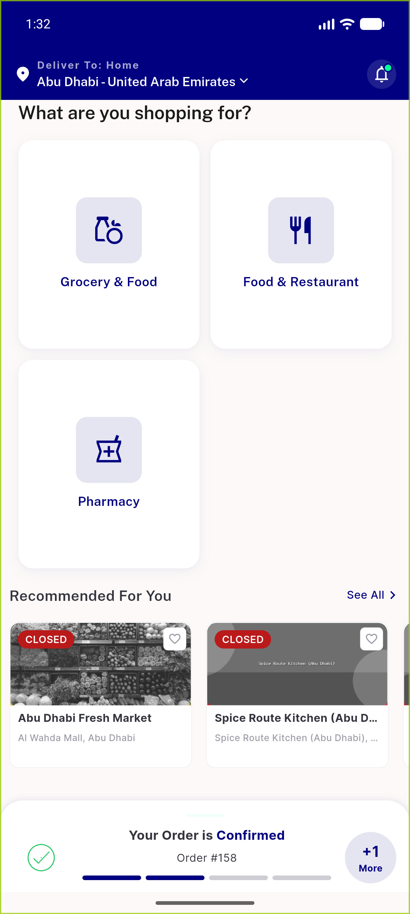
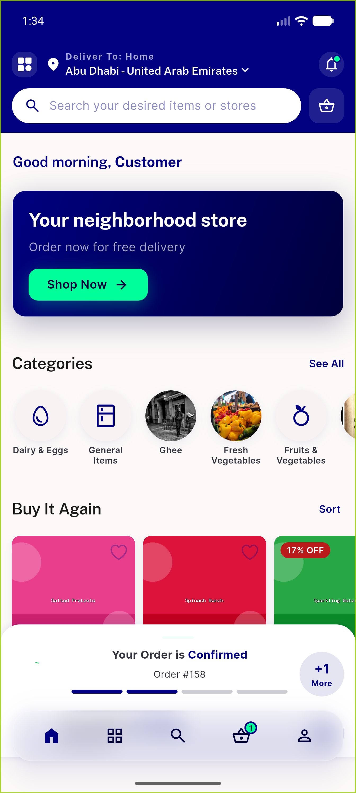
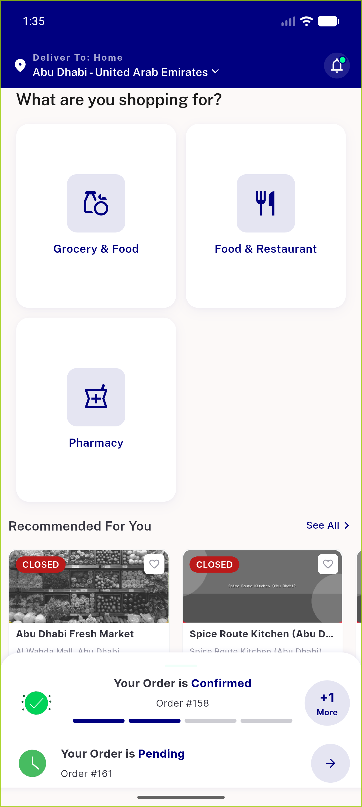
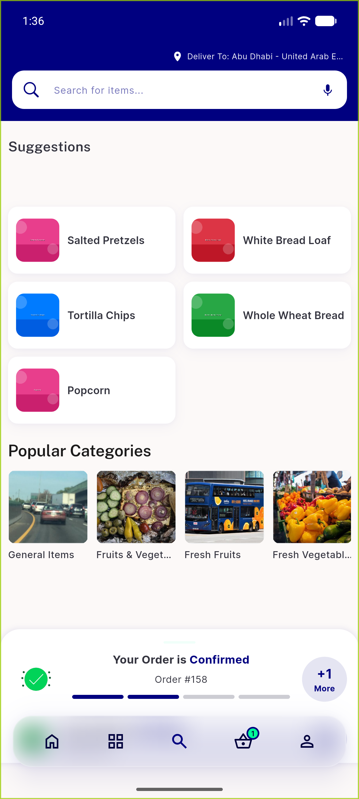
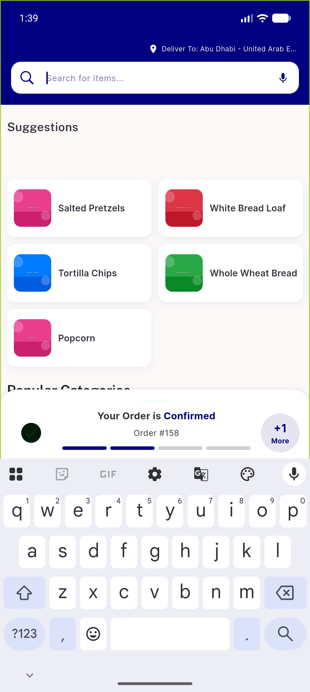
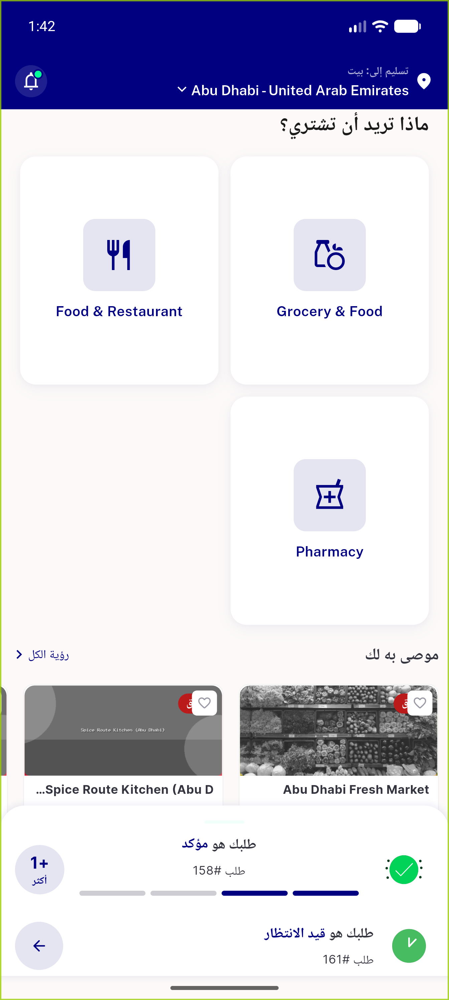
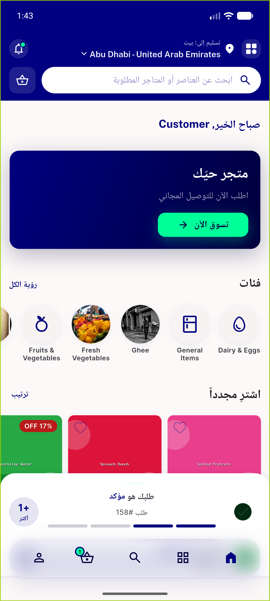

# QA Evidence — NEARS-590

**PASS — bottom nav hidden on module-selection landing, reactive restore on sector select, no banner phantom gap, RTL OK; emulator-5556 / feat/NEARS-590-hide-bottomnav-landing**

**7 screenshot(s).** Click any thumbnail for full resolution.

<table>
<tr>
<td align="center" width="33%"> ac1 landing nav absent</td>
<td align="center" width="33%"> ac2 after select nav present</td>
<td align="center" width="33%"> ac2reverse backout nav rehidden</td>
</tr>
<tr>
<td align="center" width="33%"> ac3 nonhome tab nav present</td>
<td align="center" width="33%"> ac5 keyboard open nav hidden</td>
<td align="center" width="33%"> ac8 rtl arabic landing nav absent</td>
</tr>
<tr>
<td align="center" width="33%"> ac8 rtl arabic select nav mirrored</td>
</tr>
</table>

---
*From `nears/docs/qa-evidence/NEARS-590/` · public-repo scrub policy (no live secrets; verified clean).*
