# QA Evidence — NEARS-591-preview-r3

**PREVIEW r3 — floating glass nav: content visible through glass + seamless empty surface (light+dark), no RenderFlex**

**16 screenshot(s).** Click any thumbnail for full resolution.

<table>
<tr>
<td align="center" width="33%"><a href="01-home-midscroll-glass.png">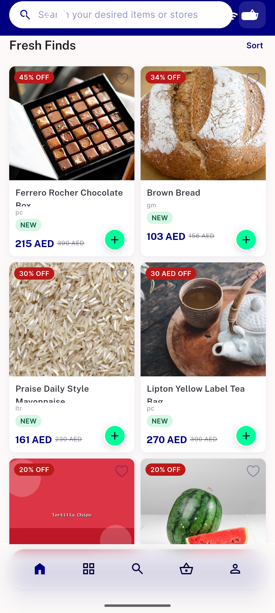</a> home midscroll glass</td>
<td align="center" width="33%"><a href="01b-home-glass-crop.png">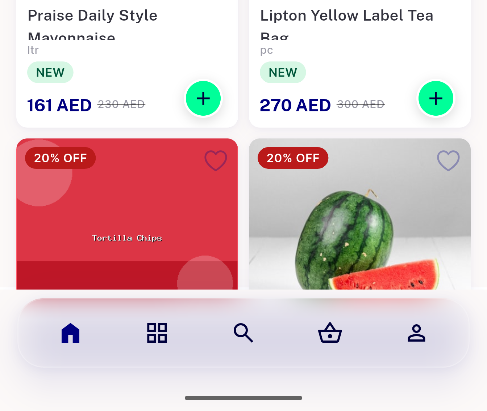</a> 01b home glass crop</td>
<td align="center" width="33%"><a href="02-home-bottom.png">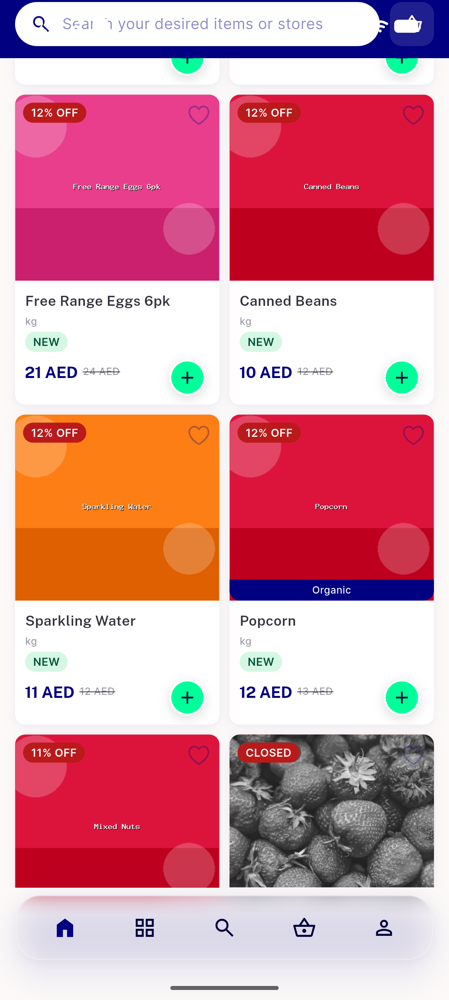</a> home bottom</td>
</tr>
<tr>
<td align="center" width="33%"><a href="02b-home-bottom-crop.png">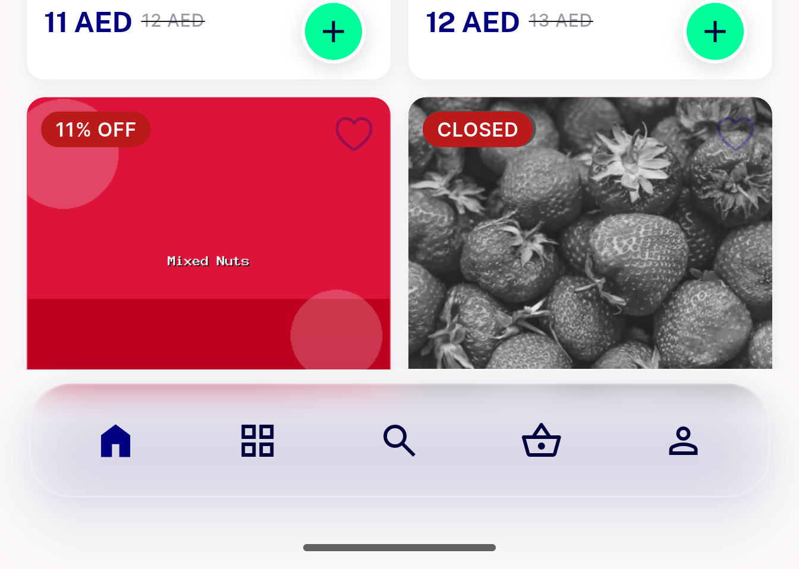</a> 02b home bottom crop</td>
<td align="center" width="33%"><a href="03-categories-midscroll.png">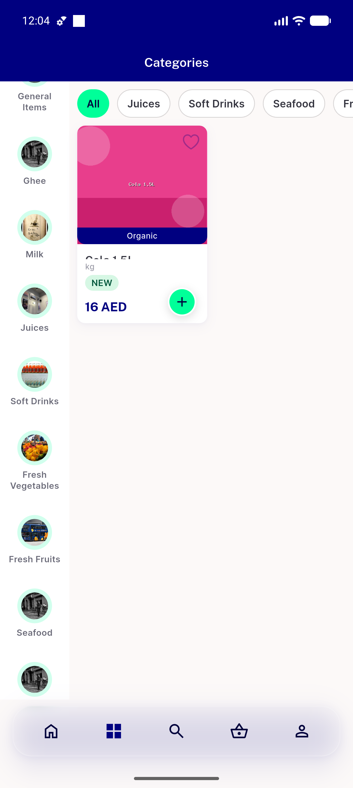</a> categories midscroll</td>
<td align="center" width="33%"><a href="03b-cat-glass-crop.png">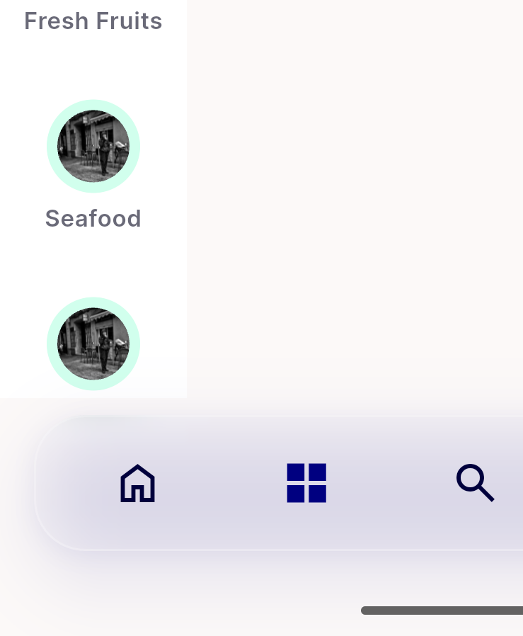</a> 03b cat glass crop</td>
</tr>
<tr>
<td align="center" width="33%"><a href="04-basket.png">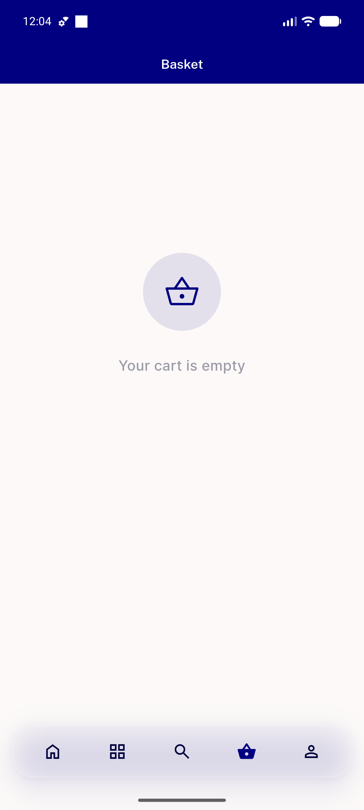</a> basket</td>
<td align="center" width="33%"><a href="04b-basket-glass-crop.png">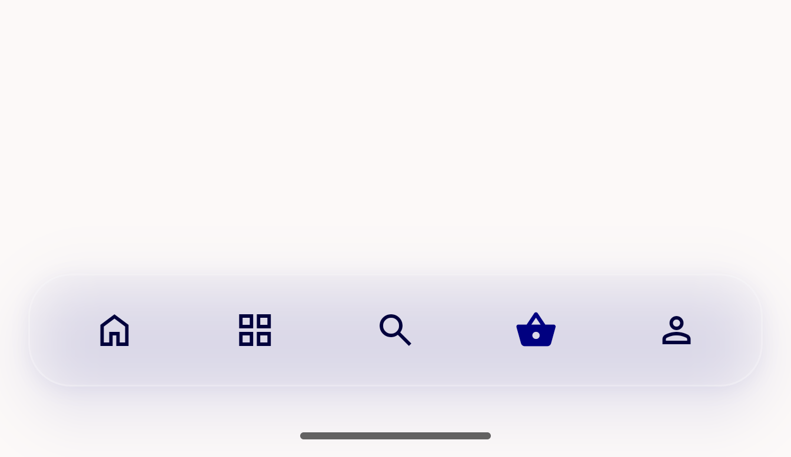</a> 04b basket glass crop</td>
<td align="center" width="33%"><a href="05-dark-home-midscroll.png">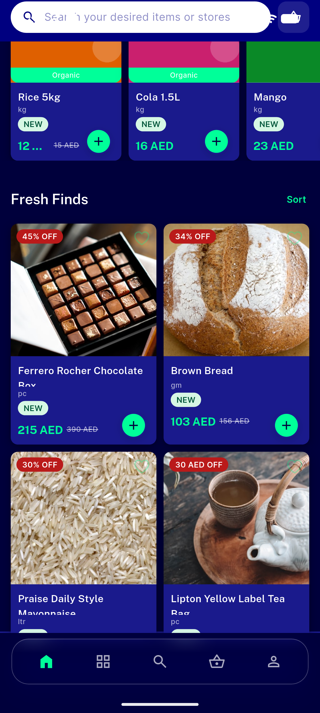</a> dark home midscroll</td>
</tr>
<tr>
<td align="center" width="33%"><a href="05b-dark-glass-crop.png">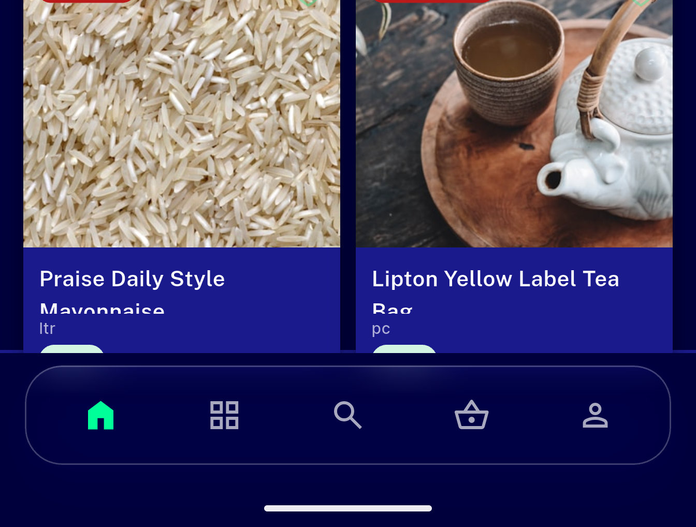</a> 05b dark glass crop</td>
<td align="center" width="33%"><a href="06-dark-home-top.png">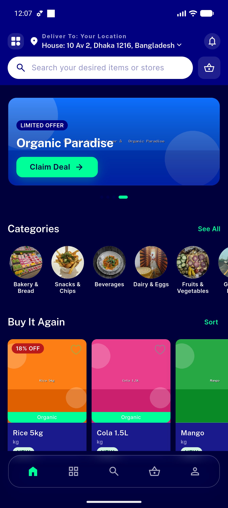</a> dark home top</td>
<td align="center" width="33%"><a href="baseline.png">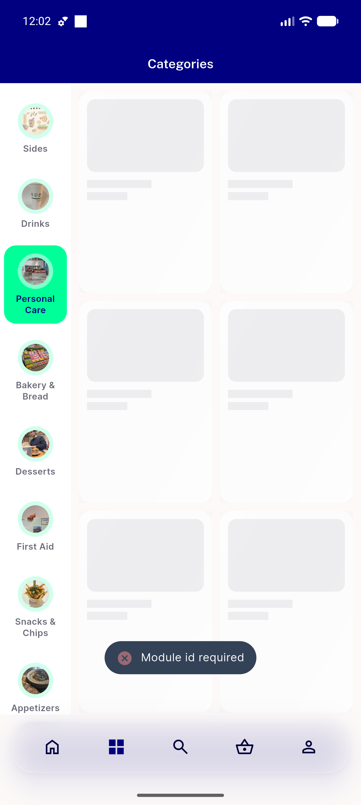</a> baseline</td>
</tr>
<tr>
<td align="center" width="33%"><a href="cat-initial.png">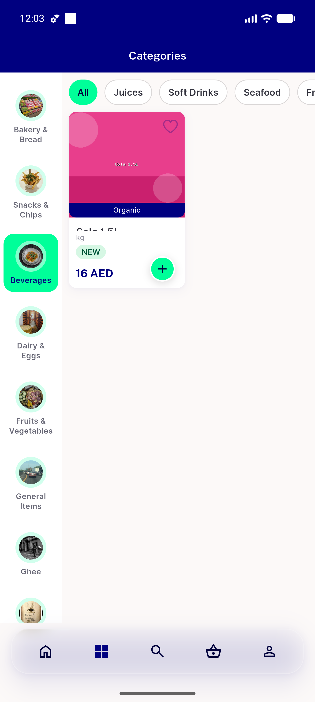</a> cat initial</td>
<td align="center" width="33%"><a href="cleanup-light-restored.png">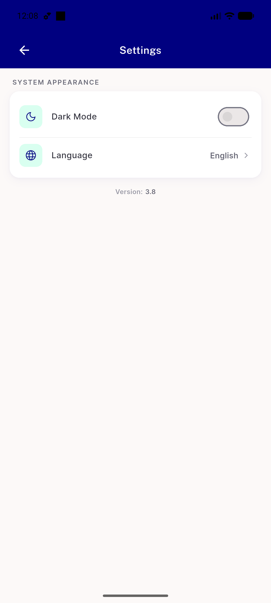</a> cleanup light restored</td>
<td align="center" width="33%"><a href="dark-settings.png">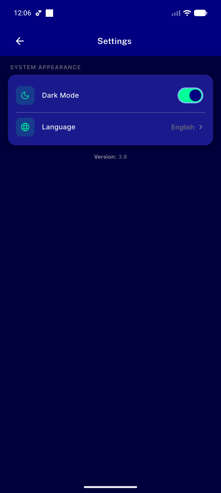</a> dark settings</td>
</tr>
<tr>
<td align="center" width="33%"><a href="home-top.png">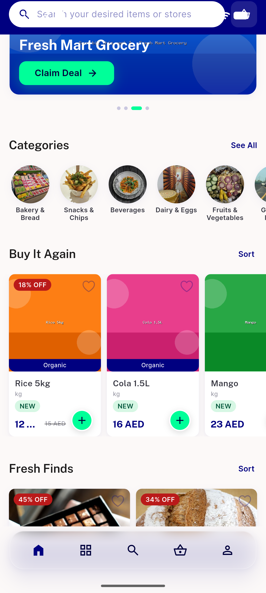</a> home top</td>
</tr>
</table>

---
*From `nears/docs/qa-evidence/NEARS-591-preview-r3/` · public-repo scrub policy (no live secrets; verified clean).*
