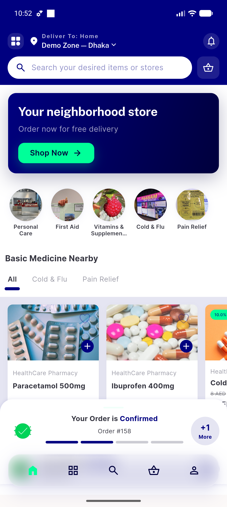
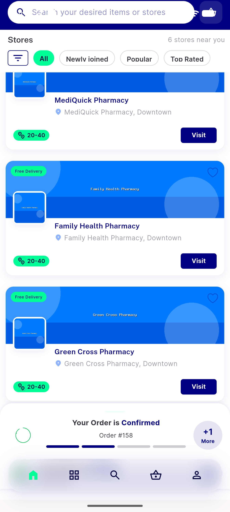
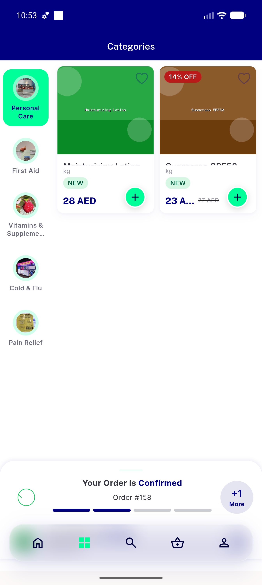
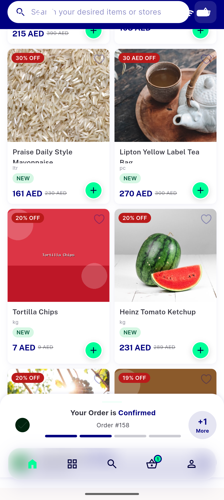
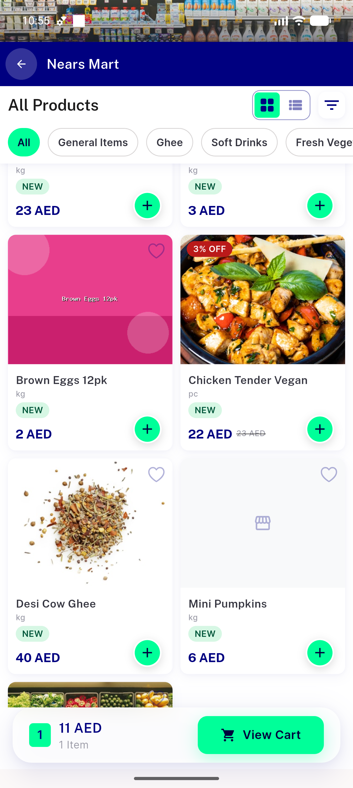
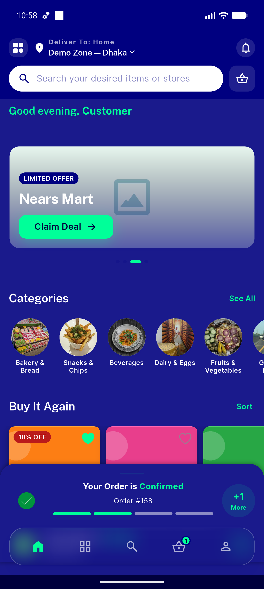
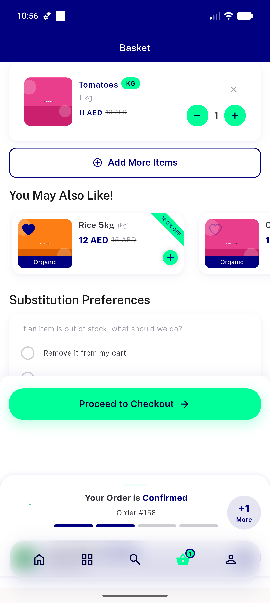

# QA Evidence — NEARS-591

**PREVIEW capture (not QA gate): NEARS-591 floating glass bottom nav — light + dark, clearance verified**

**8 screenshot(s).** Click any thumbnail for full resolution.

<table>
<tr>
<td align="center" width="33%"> light home floating bar</td>
<td align="center" width="33%"> light home scrolled bottom clearance</td>
<td align="center" width="33%"> light categories grid bottom clearance</td>
</tr>
<tr>
<td align="center" width="33%"> 03a light categories top</td>
<td align="center" width="33%"> light home glass over imagery</td>
<td align="center" width="33%"> light store page glass over images</td>
</tr>
<tr>
<td align="center" width="33%"> dark home transparent bar</td>
<td align="center" width="33%"> light basket checkout pill clearance</td>
</tr>
</table>

---
*From `nears/docs/qa-evidence/NEARS-591/` · public-repo scrub policy (no live secrets; verified clean).*
