# QA Evidence — NEARS-591

**Purest-glass v2 — floating bottom-nav shadow + border removed, defined by BackdropFilter blur alone (light mode)**

**20 screenshot(s).** Click any thumbnail for full resolution.

<table>
<tr>
<td align="center" width="33%"><a href="00-initial-state.png">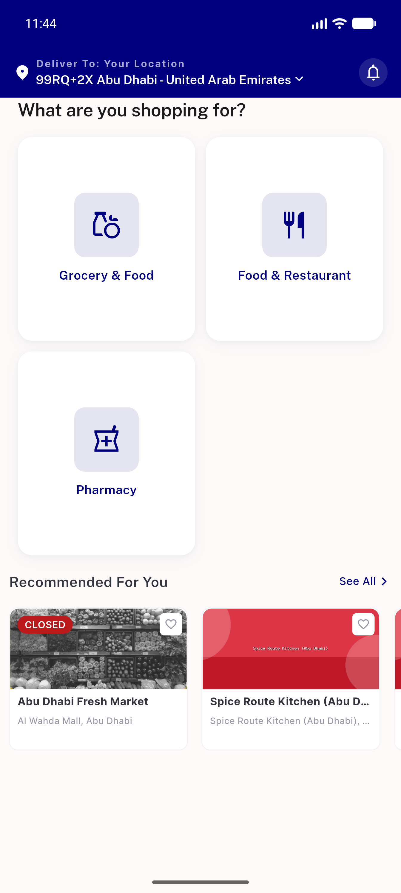</a> initial state</td>
<td align="center" width="33%"><a href="01-home-top-grocery.png">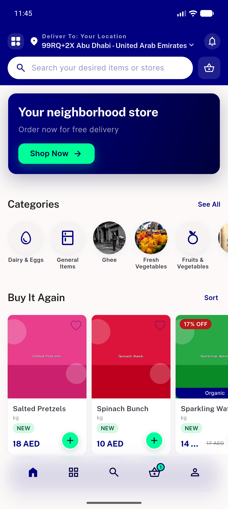</a> home top grocery</td>
<td align="center" width="33%"><a href="02-home-scrolled-content-under-bar.png">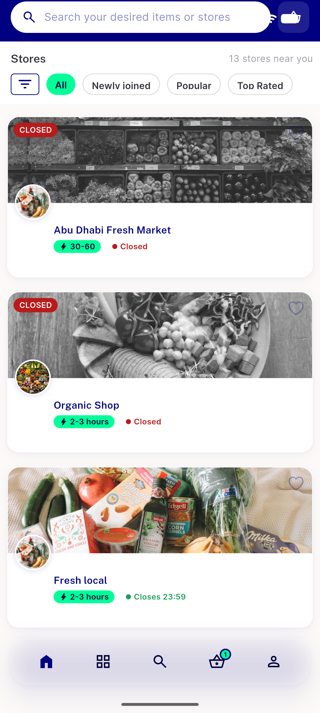</a> home scrolled content under bar</td>
</tr>
<tr>
<td align="center" width="33%"><a href="03-store-grid-images-under-bar.png">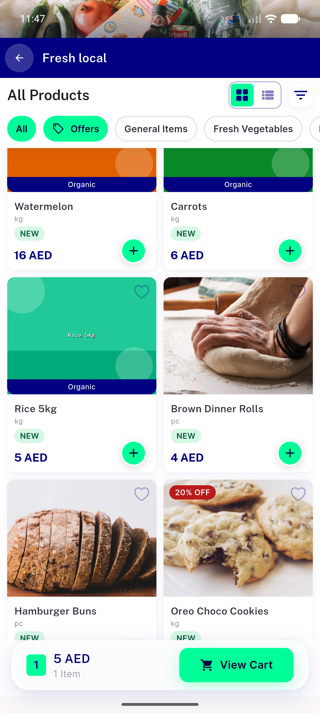</a> store grid images under bar</td>
<td align="center" width="33%"><a href="04-categories-tab-items-under-bar.png">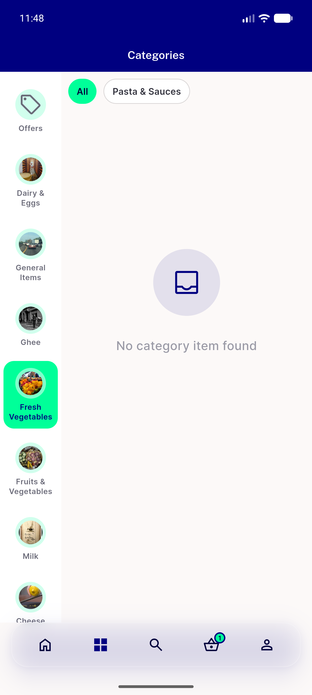</a> categories tab items under bar</td>
<td align="center" width="33%"><a href="05-category-grid-images-under-bar.png">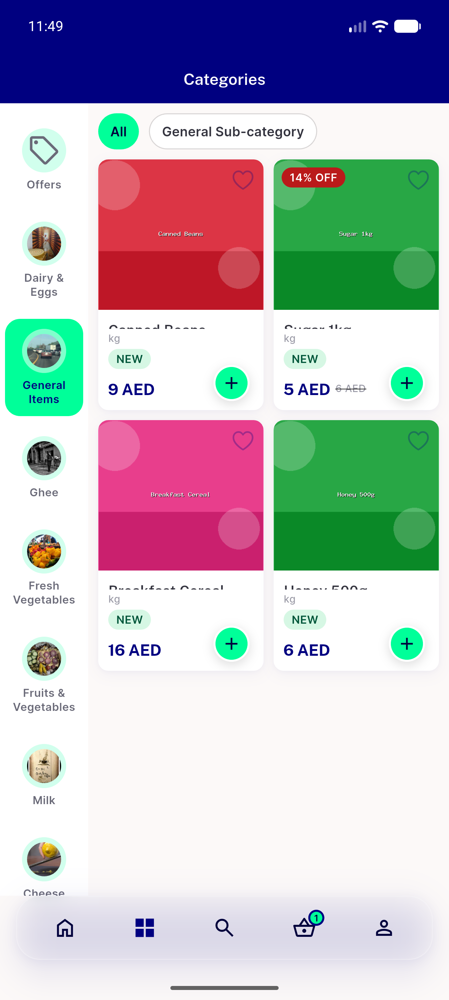</a> category grid images under bar</td>
</tr>
<tr>
<td align="center" width="33%"><a href="06-home-stores-scroll-a.png">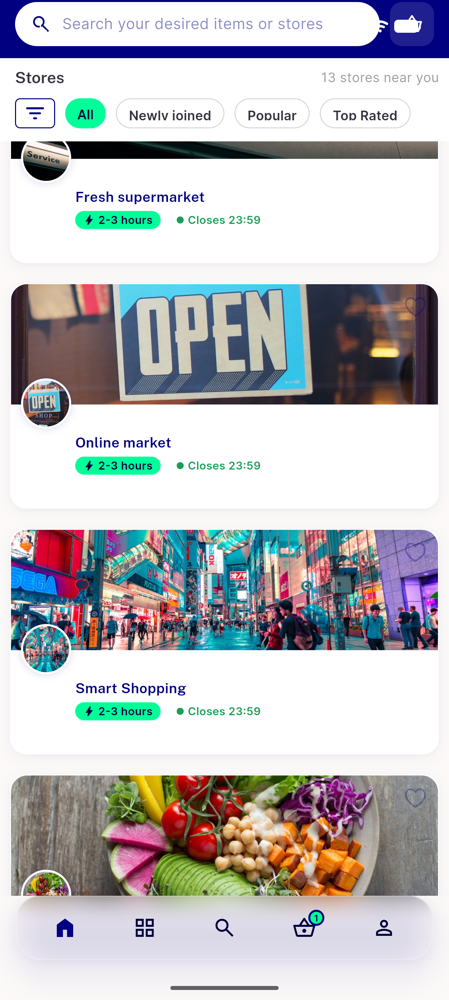</a> home stores scroll a</td>
<td align="center" width="33%"><a href="07-home-image-blurred-through-bar.png">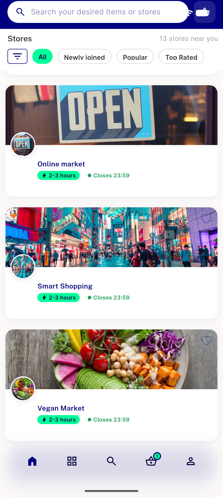</a> home image blurred through bar</td>
<td align="center" width="33%"><a href="08-home-produce-blurred-through-bar.png">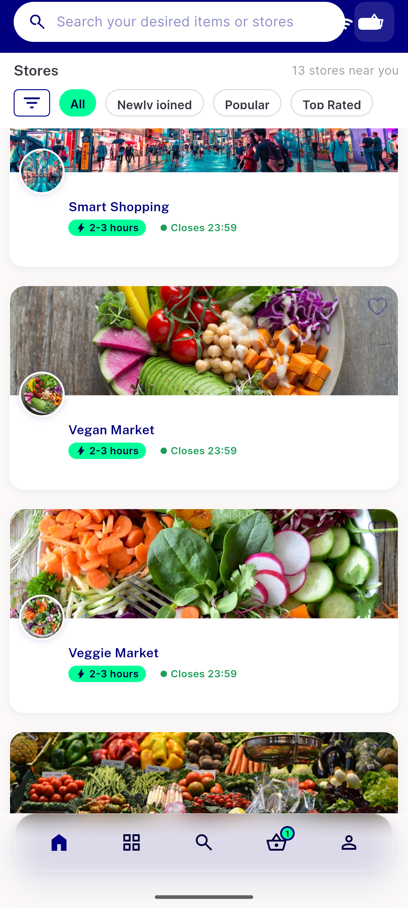</a> home produce blurred through bar</td>
</tr>
<tr>
<td align="center" width="33%"><a href="09-home-neon-entering-bar.png">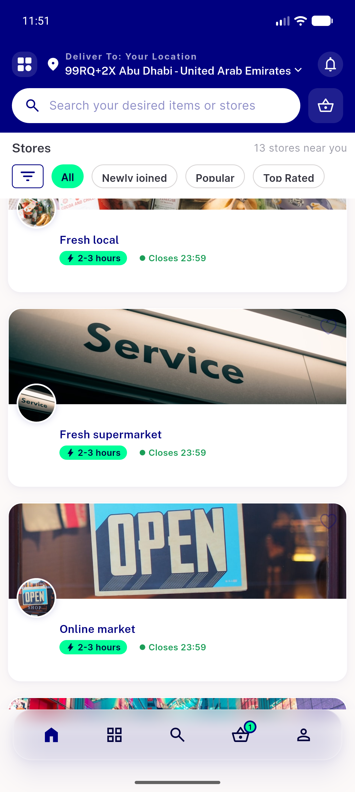</a> home neon entering bar</td>
<td align="center" width="33%"><a href="10-home-open-card-bar.png">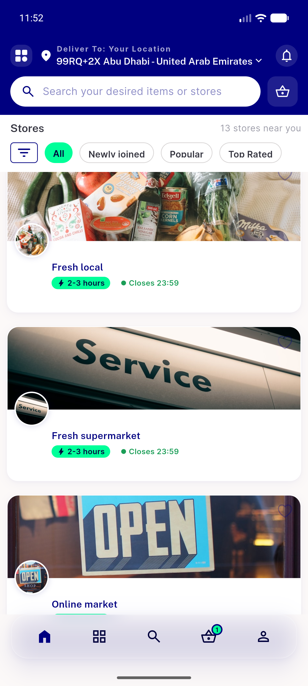</a> home open card bar</td>
<td align="center" width="33%"><a href="11-home-open-sign-dark-portion-under-bar.png">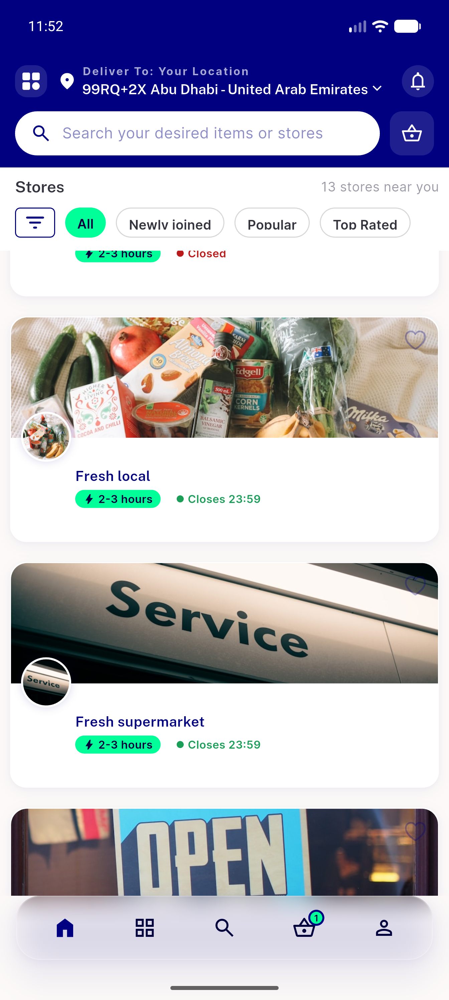</a> home open sign dark portion under bar</td>
</tr>
<tr>
<td align="center" width="33%"><a href="12-tab-search-active.png">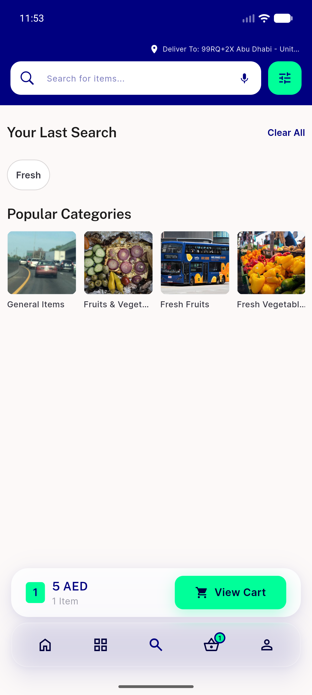</a> tab search active</td>
<td align="center" width="33%"><a href="13-tab-basket-active.png">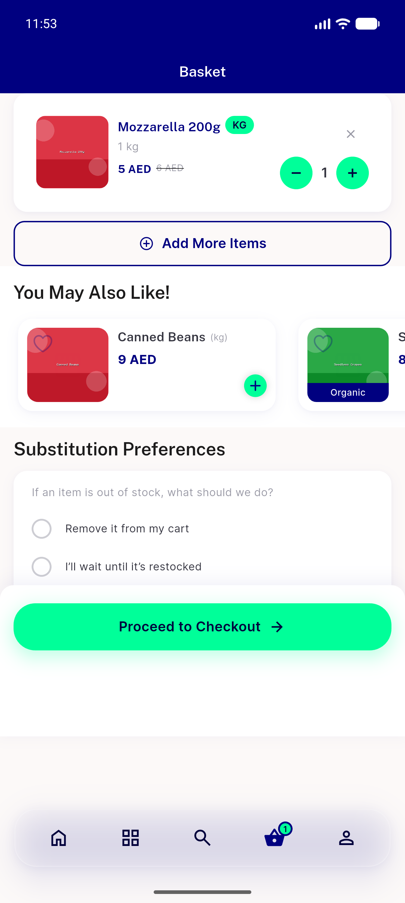</a> tab basket active</td>
<td align="center" width="33%"> tab profile active</td>
</tr>
<tr>
<td align="center" width="33%"><a href="15-profile-list-bottom-AC3.png">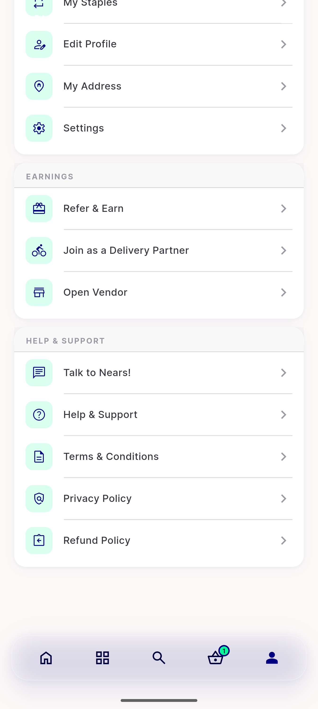</a> profile list bottom AC3</td>
<td align="center" width="33%"> v2 01 home light</td>
<td align="center" width="33%"><a href="v2-08-produce-through-bar.png">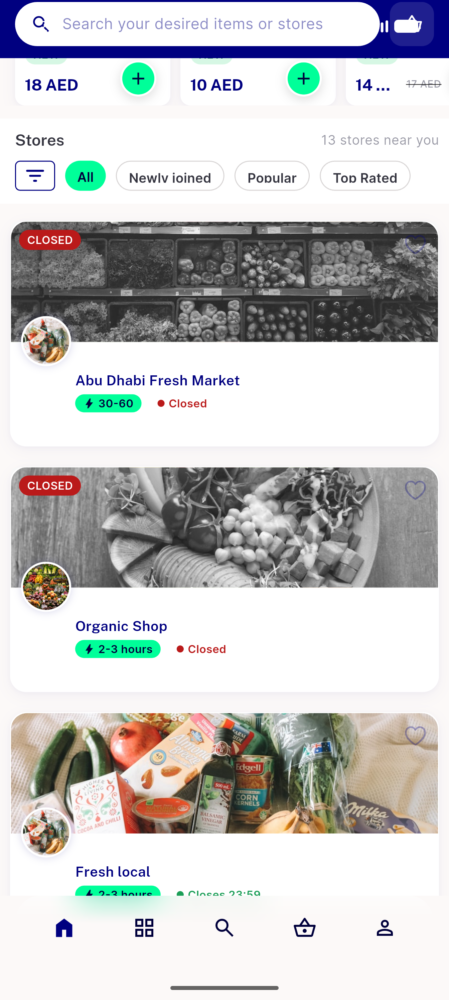</a> v2 08 produce through bar</td>
</tr>
<tr>
<td align="center" width="33%"><a href="v2-13-basket.png">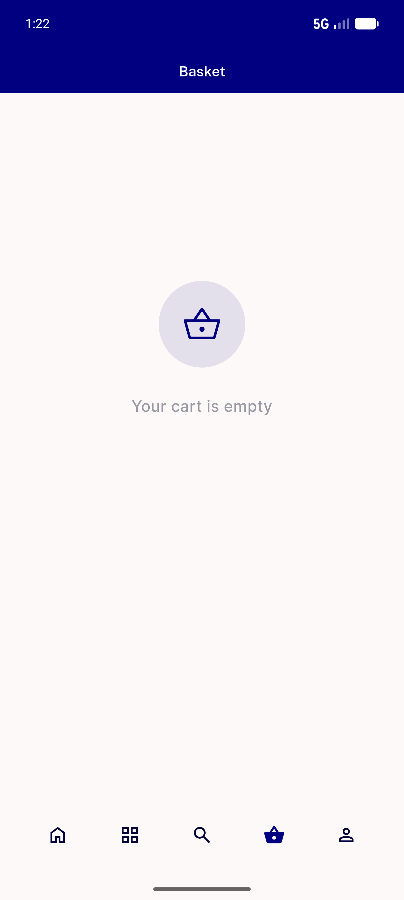</a> v2 13 basket</td>
<td align="center" width="33%"> v2 14 profile</td>
</tr>
</table>

---
*From `nears/docs/qa-evidence/NEARS-591/` · public-repo scrub policy (no live secrets; verified clean).*
