# QA Evidence — NEARS-596

**Cycle-1 re-QA PASS — childes gap fixed; closure retry preserves sub-chip; all regressions hold**

**22 screenshot(s).** Click any thumbnail for full resolution.

<table>
<tr>
<td align="center" width="33%"><a href="05-empty-category-nodata-online.png">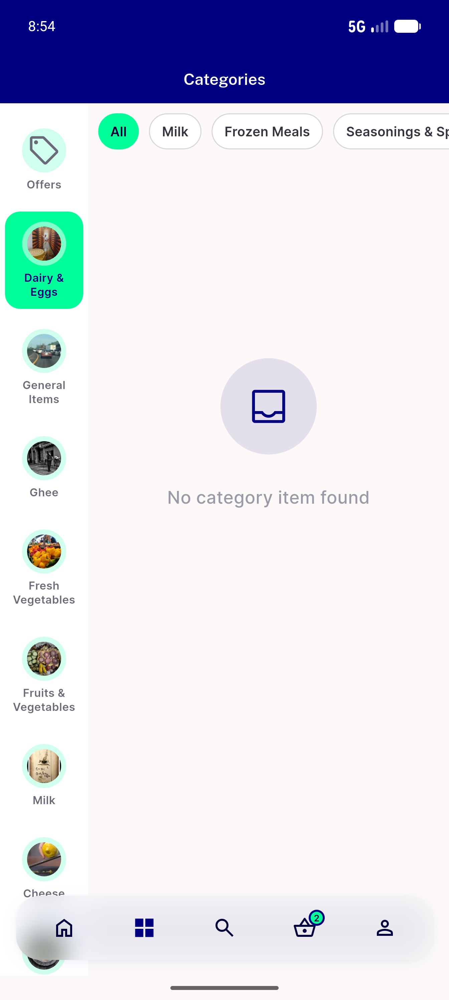</a> empty category nodata online</td>
<td align="center" width="33%"> offers grid online</td>
<td align="center" width="33%"><a href="05-realcategory-grid-online.png">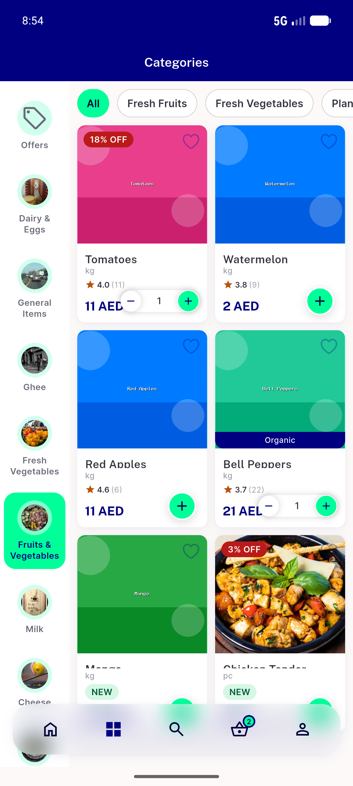</a> realcategory grid online</td>
</tr>
<tr>
<td align="center" width="33%"><a href="AC1-offers-error-retry.png">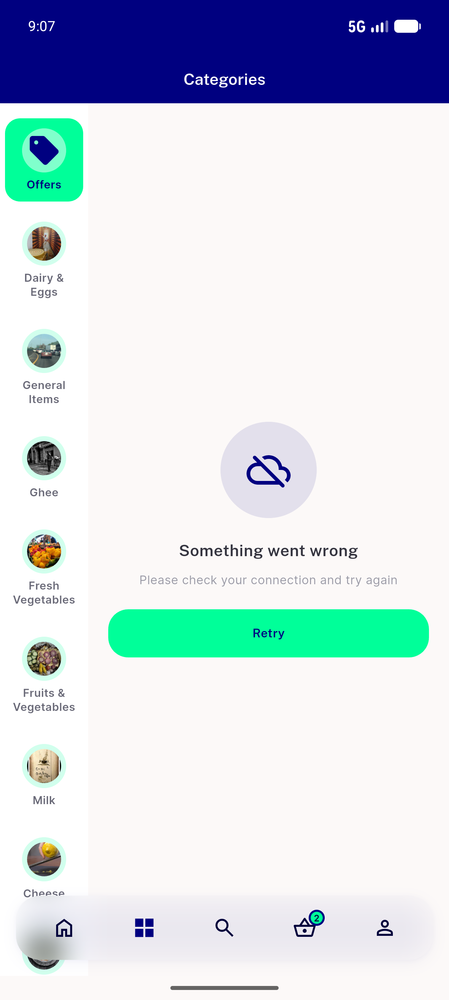</a> AC1 offers error retry</td>
<td align="center" width="33%"><a href="AC1-realcategory-error-retry.png">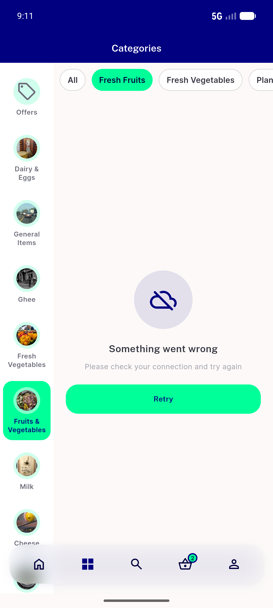</a> AC1 realcategory error retry</td>
<td align="center" width="33%"> AC2 retry offline error returns</td>
</tr>
<tr>
<td align="center" width="33%"><a href="AC2-retry-offline-reloading.png">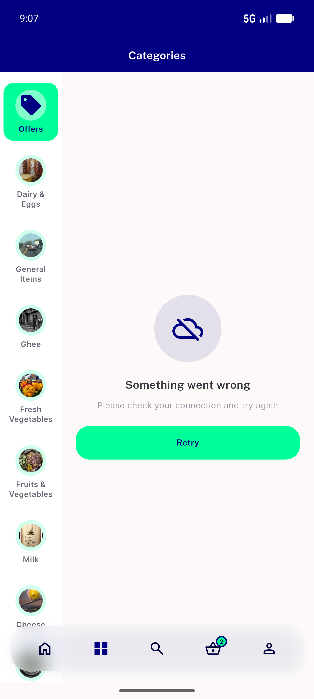</a> AC2 retry offline reloading</td>
<td align="center" width="33%"> AC2 retry offline shimmer</td>
<td align="center" width="33%"> AC3 offers recovered grid</td>
</tr>
<tr>
<td align="center" width="33%"><a href="AC3-realcategory-recovered-grid.png">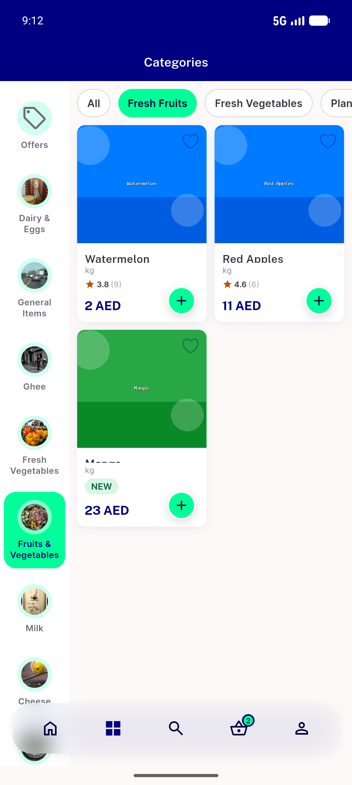</a> AC3 realcategory recovered grid</td>
<td align="center" width="33%"><a href="c1-AC1-childes-fail-error-retry.png">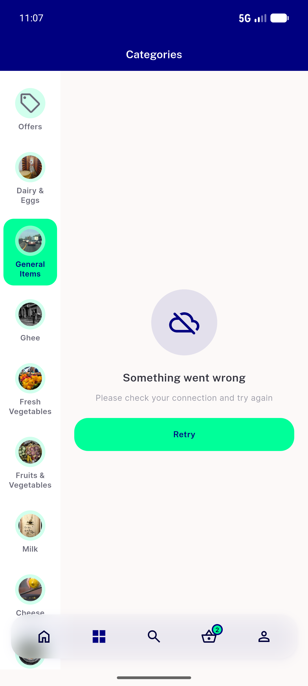</a> c1 AC1 childes fail error retry</td>
<td align="center" width="33%"> c1 AC2 childes retry offline error</td>
</tr>
<tr>
<td align="center" width="33%"><a href="c1-AC2-childes-retry-online-recovered.png">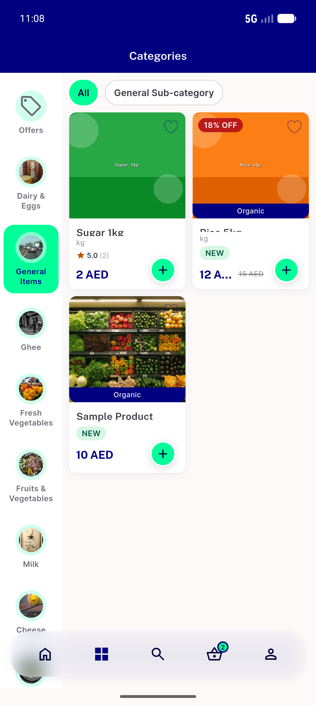</a> c1 AC2 childes retry online recovered</td>
<td align="center" width="33%"><a href="c1-AC3-subchip-fail-error.png">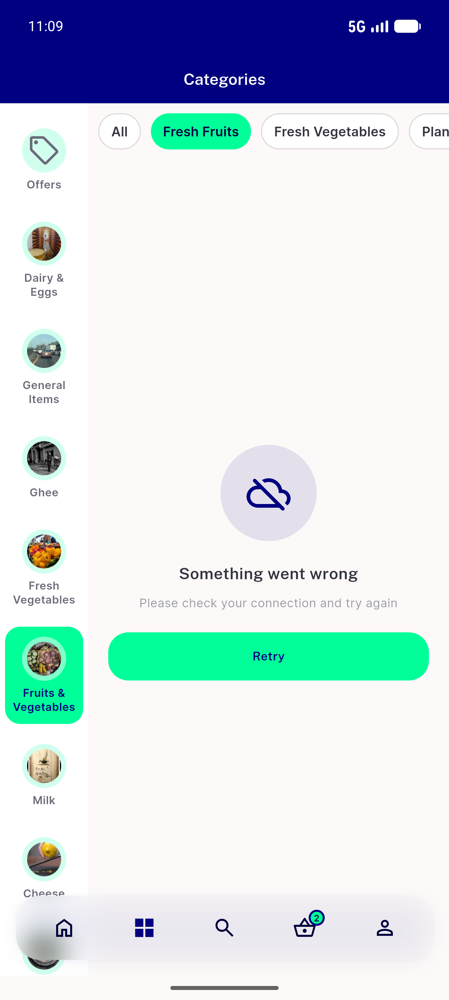</a> c1 AC3 subchip fail error</td>
<td align="center" width="33%"> c1 AC3 subchip retry preserved</td>
</tr>
<tr>
<td align="center" width="33%"> c1 AC5 offers offline error</td>
<td align="center" width="33%"><a href="c1-AC5-offers-online-grid.png">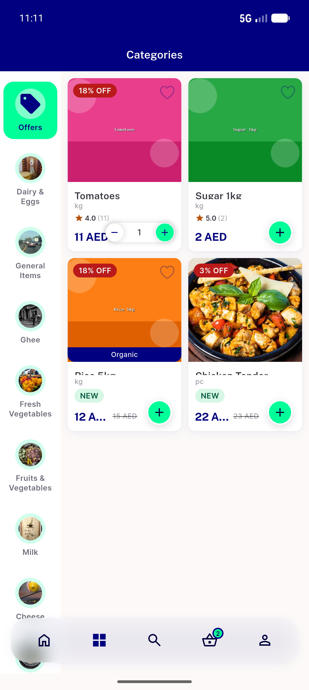</a> c1 AC5 offers online grid</td>
<td align="center" width="33%"> c1 AC5 offers retry recovered</td>
</tr>
<tr>
<td align="center" width="33%"> c1 AC6 empty category nodata</td>
<td align="center" width="33%"> c1 AC8 arabic childes error</td>
<td align="center" width="33%"> extra arabic rtl error retry</td>
</tr>
<tr>
<td align="center" width="33%"><a href="gap-freshcategory-offline-shimmer.png">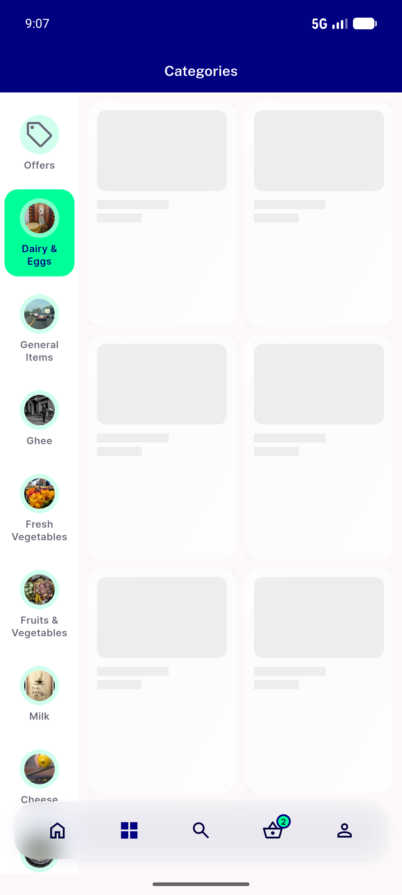</a> gap freshcategory offline shimmer</td>
</tr>
</table>

### Other artifacts
- [`bug-subcategory-childes-failure-shimmer.log`](bug-subcategory-childes-failure-shimmer.log)
- [`c1-childes-fail-now-error.log`](c1-childes-fail-now-error.log)

---
*From `nears/docs/qa-evidence/NEARS-596/` · public-repo scrub policy (no live secrets; verified clean).*
