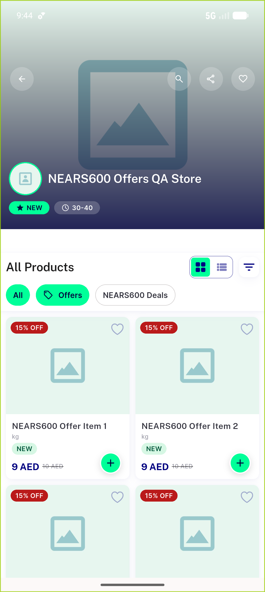
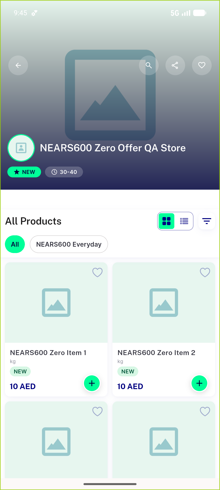
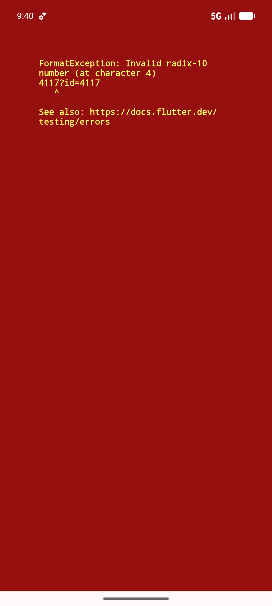

# QA Evidence — NEARS-600

**PASS — seeded store-offers fixture verified (4117=12 offers @15%, 4118=empty)**

**4 screenshot(s).** Click any thumbnail for full resolution.

<table>
<tr>
<td align="center" width="33%"> ac1 store4117 offers selected</td>
<td align="center" width="33%"> ac1 store4117 page offers chip</td>
<td align="center" width="33%"> ac2 store4118 no offers chip</td>
</tr>
<tr>
<td align="center" width="33%"> bug deeplink store id format exception</td>
</tr>
</table>

### Other artifacts
- [`api-evidence.log`](api-evidence.log)

---
*From `nears/docs/qa-evidence/NEARS-600/` · public-repo scrub policy (no live secrets; verified clean).*
