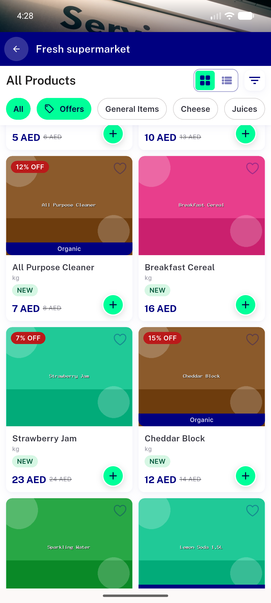
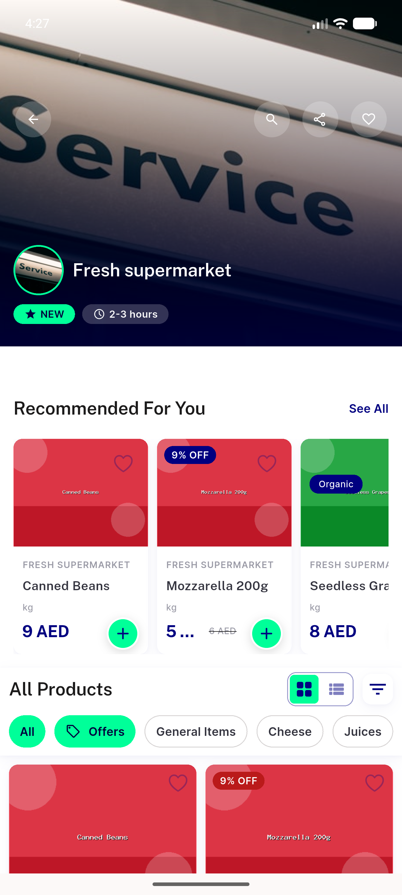
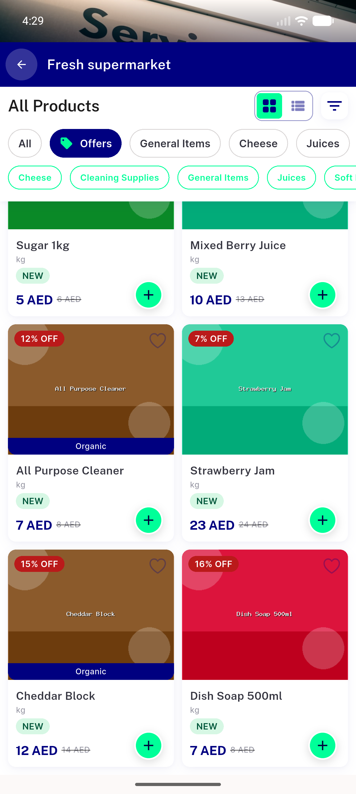
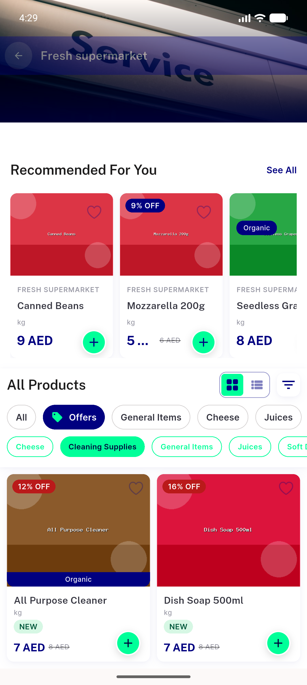
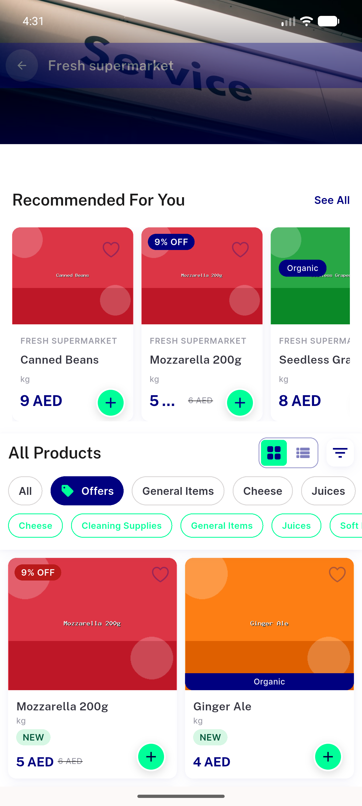
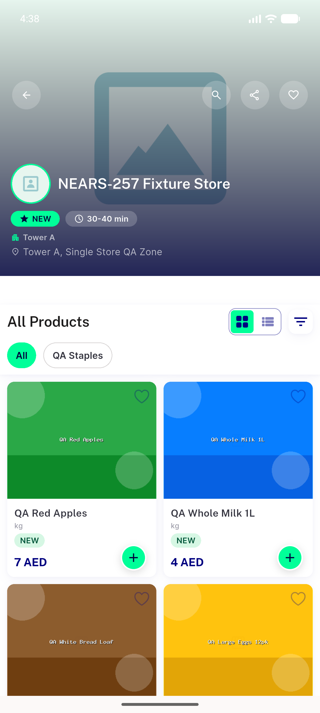
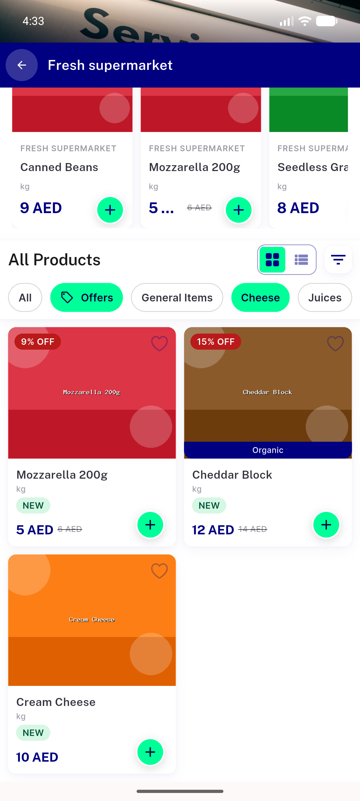
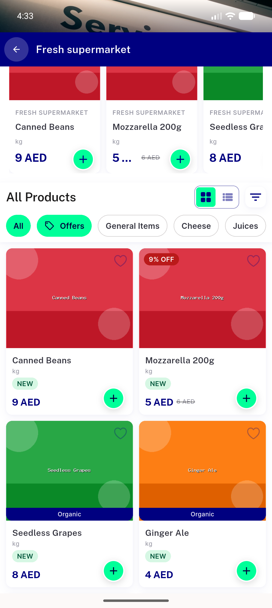
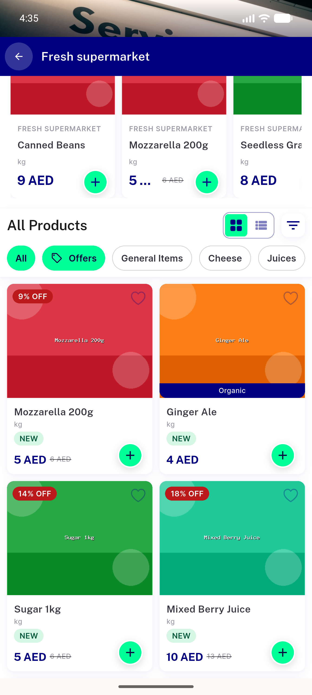
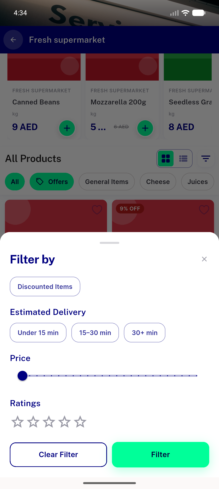

# QA Evidence — NEARS-602

**PASS - store offers chip + sub-chips, AC1-8 verified on emulator-5556 (zone 2 Abu Dhabi); AC4 page-2 guard proven via API+auto (data-limited live); 10/10 widget tests**

**12 screenshot(s).** Click any thumbnail for full resolution.

<table>
<tr>
<td align="center" width="33%"> AC1 pinned after scroll</td>
<td align="center" width="33%"> AC1 store detail chips top</td>
<td align="center" width="33%"> AC2 offers selected</td>
</tr>
<tr>
<td align="center" width="33%"> AC3 subchip cleaning</td>
<td align="center" width="33%"> AC4 bare offers bottom</td>
<td align="center" width="33%"> AC4 bare offers top</td>
</tr>
<tr>
<td align="center" width="33%"> AC5 no offers store</td>
<td align="center" width="33%"> AC5toggle A normalcat</td>
<td align="center" width="33%"> AC5toggle C all reset</td>
</tr>
<tr>
<td align="center" width="33%"> AC8 filter applied</td>
<td align="center" width="33%"> AC8 filter sheet</td>
<td align="center" width="33%"> REG addtocart discounted</td>
</tr>
</table>

### Other artifacts
- [`AC4-page2-api-probe.log`](AC4-page2-api-probe.log)
- [`bug-cartcount-overflow.log`](bug-cartcount-overflow.log)
- [`progress.md`](progress.md)

---
*From `nears/docs/qa-evidence/NEARS-602/` · public-repo scrub policy (no live secrets; verified clean).*
