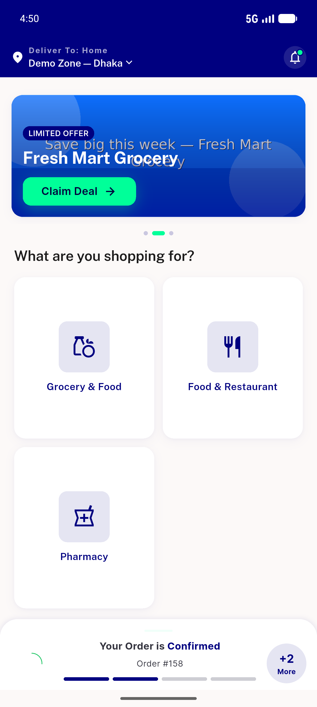
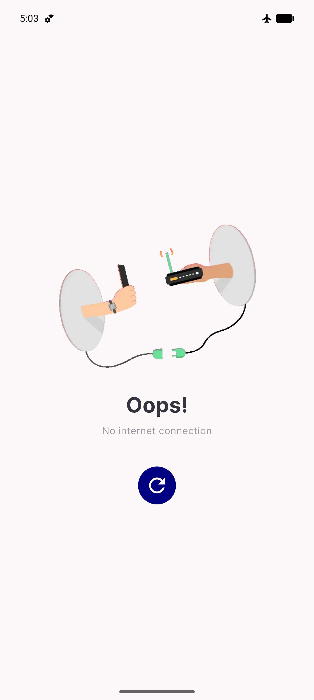
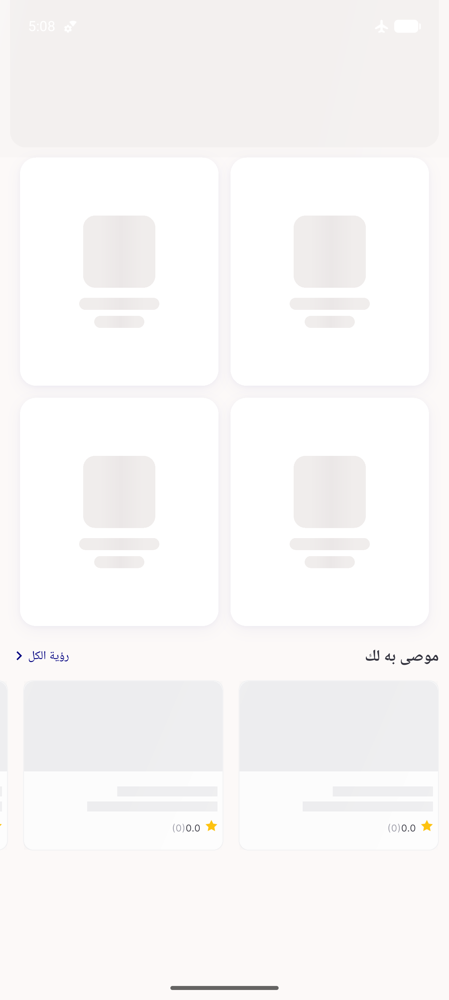
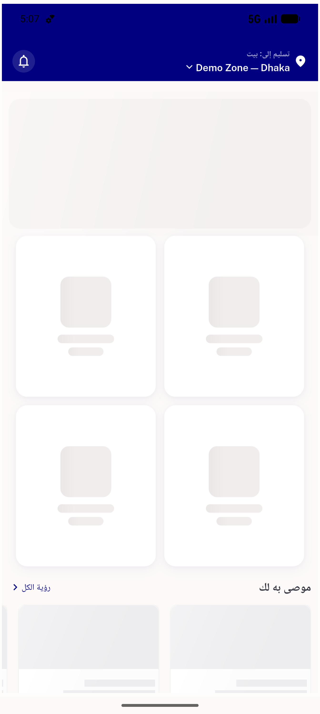

# QA Evidence — NEARS-603

**PASS — auto-select skeleton-hold (no stale-zone flash); AC2/AC3/RTL live; failure-edge+AC1 test-backed; suite 1658/0**

**7 screenshot(s).** Click any thumbnail for full resolution.

<table>
<tr>
<td align="center" width="33%"> ac2 autoselect zone1 allstores grid</td>
<td align="center" width="33%"> ac2 autoselect zone1 home</td>
<td align="center" width="33%"> ac3b switch zone2</td>
</tr>
<tr>
<td align="center" width="33%"> failedge nodata</td>
<td align="center" width="33%"> failedge recovered</td>
<td align="center" width="33%"> rtl nodata</td>
</tr>
<tr>
<td align="center" width="33%"> rtl skeleton 1</td>
</tr>
</table>

### Other artifacts
- [`ac1_autoselect.mp4`](ac1_autoselect.mp4)
- [`flutter_test_full.log`](flutter_test_full.log)
- [`progress.md`](progress.md)

---
*From `nears/docs/qa-evidence/NEARS-603/` · public-repo scrub policy (no live secrets; verified clean).*
