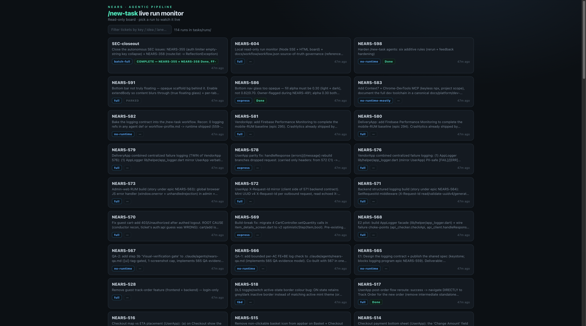
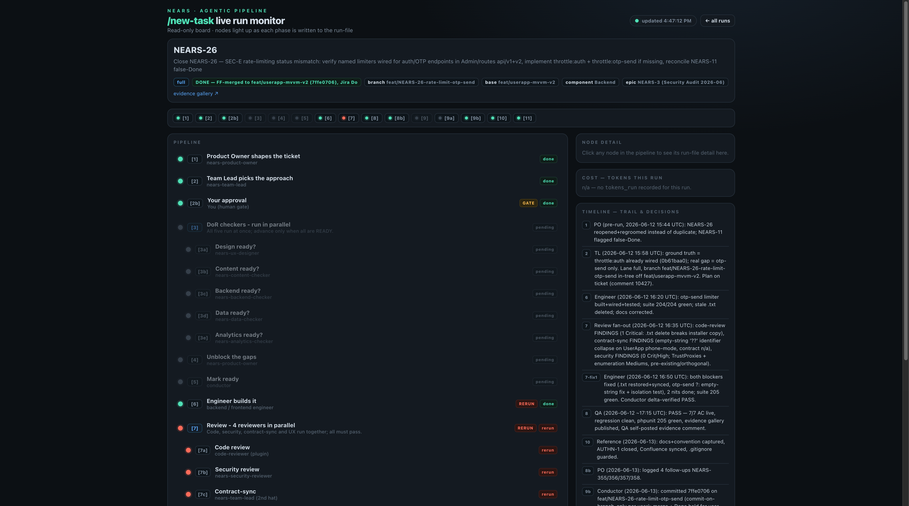
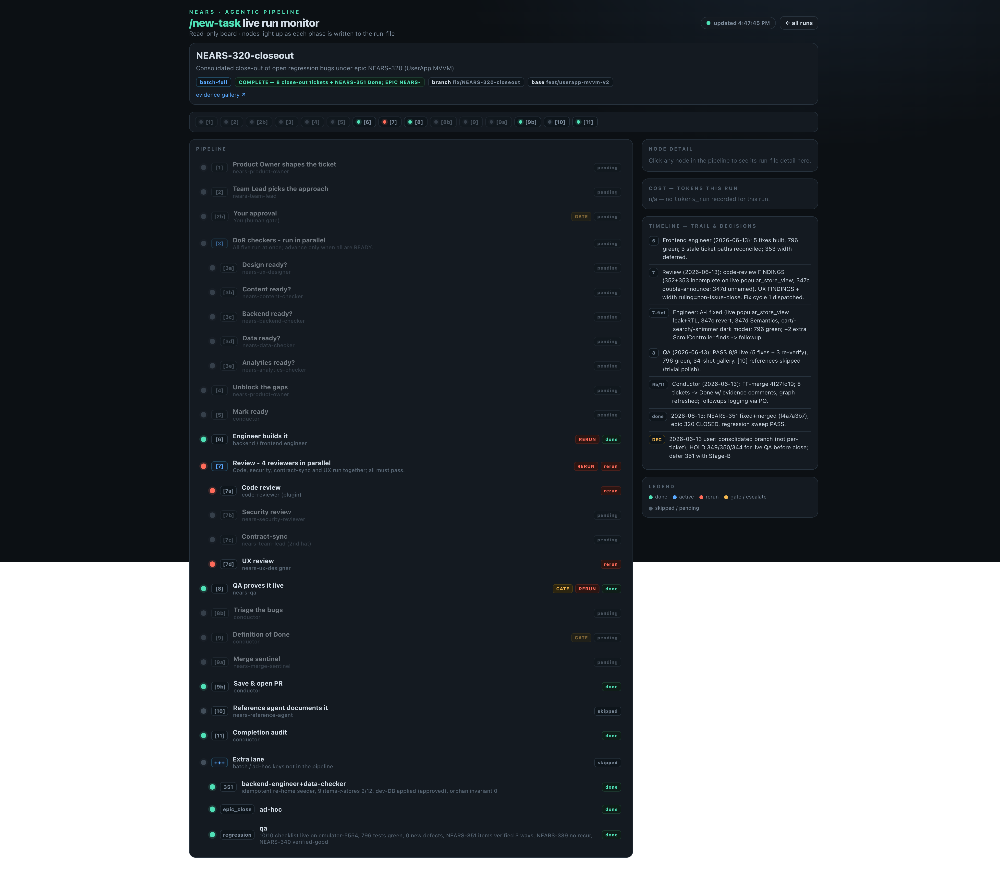
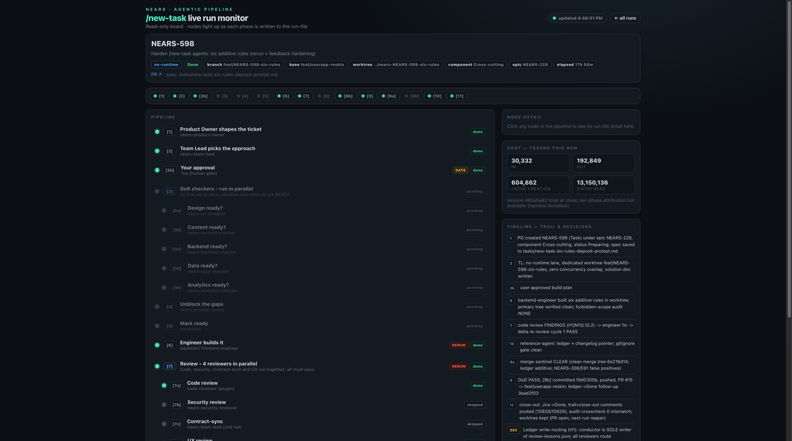
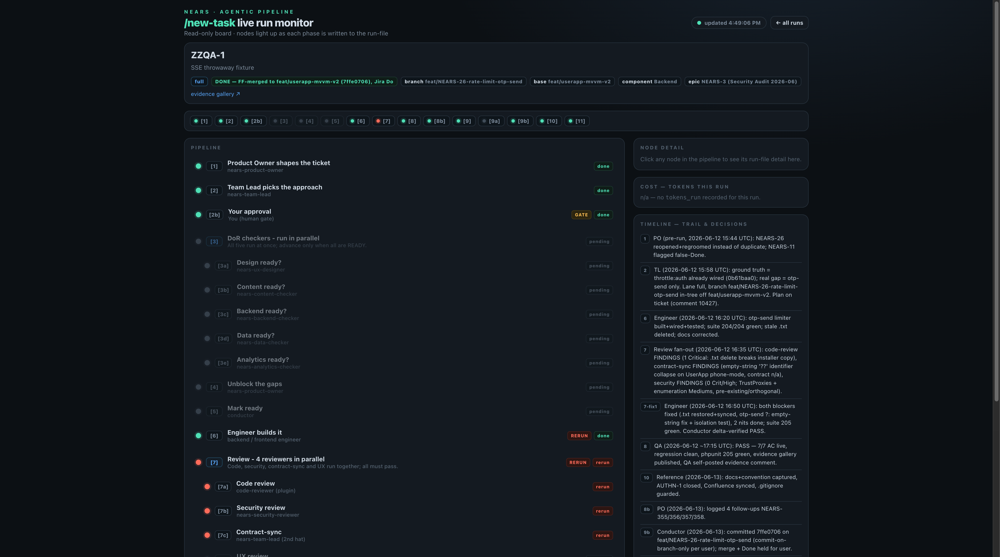
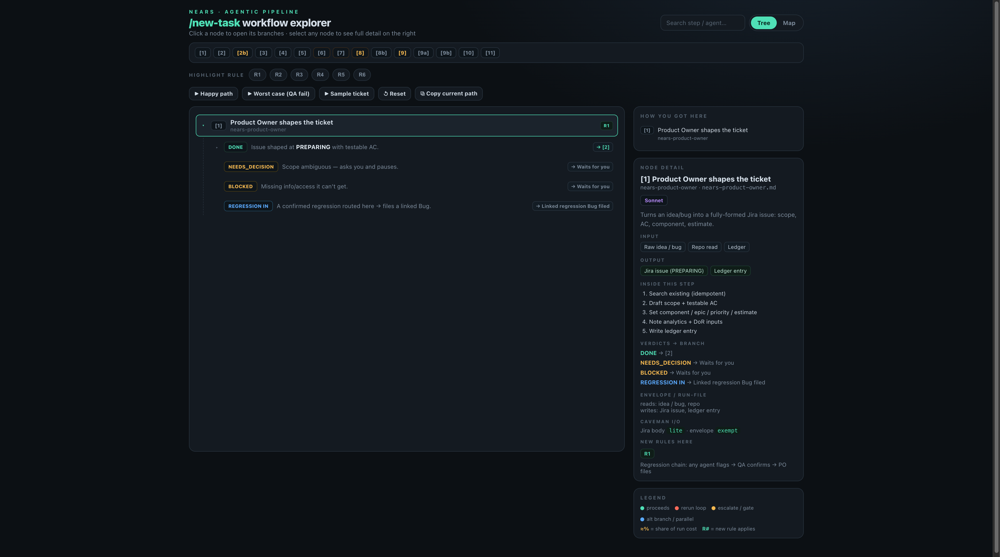
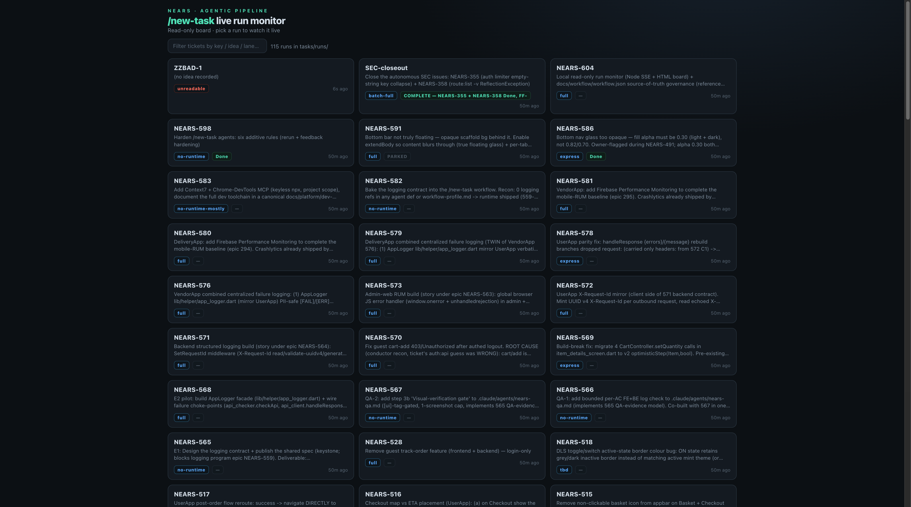

# QA Evidence — NEARS-604

**PASS — read-only run monitor: 114 runs listed, 3 sample shapes render error-free, SSE live, drift guard a/b/c, security smoke ok**

**7 screenshot(s).** Click any thumbnail for full resolution.

<table>
<tr>
<td align="center" width="33%"> ac1 landing</td>
<td align="center" width="33%"> ac2 nears26 board</td>
<td align="center" width="33%"> ac2 nears320 extra lane</td>
</tr>
<tr>
<td align="center" width="33%"> ac3 nears598 cost</td>
<td align="center" width="33%"> ac4 sse live update</td>
<td align="center" width="33%"> ac7 explorer reference</td>
</tr>
<tr>
<td align="center" width="33%"> reg malformed tolerated</td>
</tr>
</table>

---
*From `nears/docs/qa-evidence/NEARS-604/` · public-repo scrub policy (no live secrets; verified clean).*
