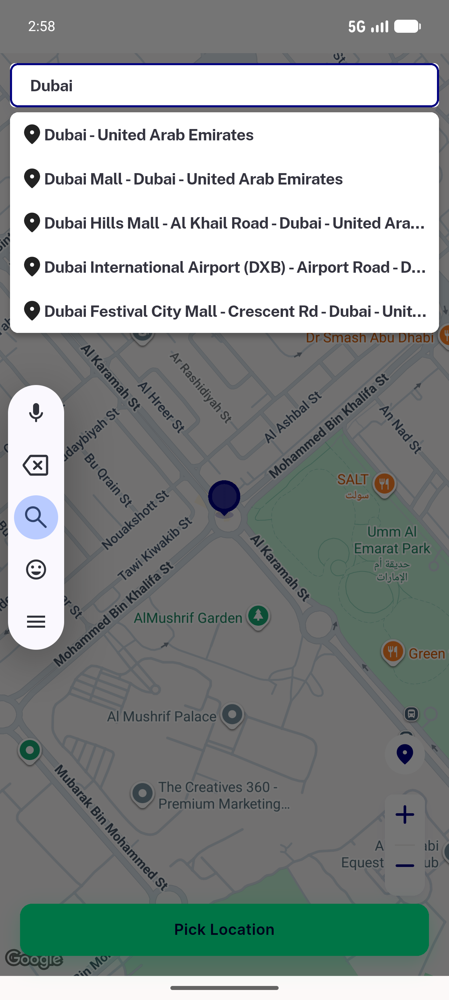
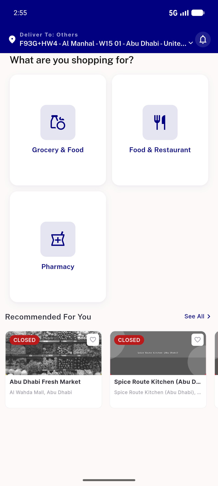
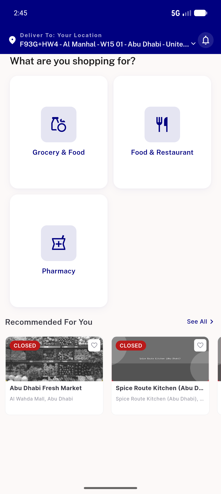
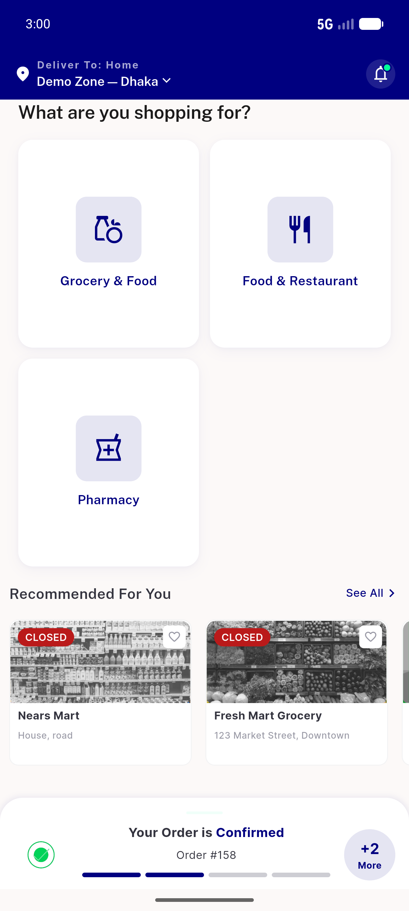
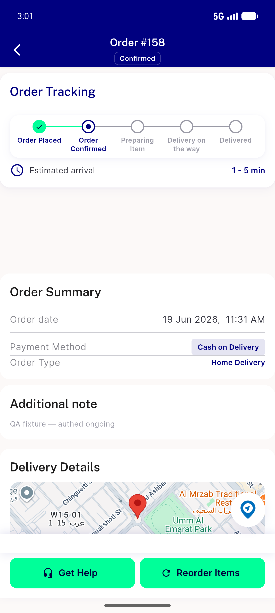

# QA Evidence — NEARS-605

**PASS (regression-zero) — retained ParcelController consumers verified; AC6 sheet + AC7 offline-screen live-render blocked by pre-existing data/config gaps**

**5 screenshot(s).** Click any thumbnail for full resolution.

<table>
<tr>
<td align="center" width="33%"> ac4 location search suggestions</td>
<td align="center" width="33%"> ac5 home loggedin</td>
<td align="center" width="33%"> ac5 home</td>
</tr>
<tr>
<td align="center" width="33%"> ac5 zoneswitch demo</td>
<td align="center" width="33%"> ac6 order details</td>
</tr>
</table>

### Other artifacts
- [`progress.md`](progress.md)

---
*From `nears/docs/qa-evidence/NEARS-605/` · public-repo scrub policy (no live secrets; verified clean).*
