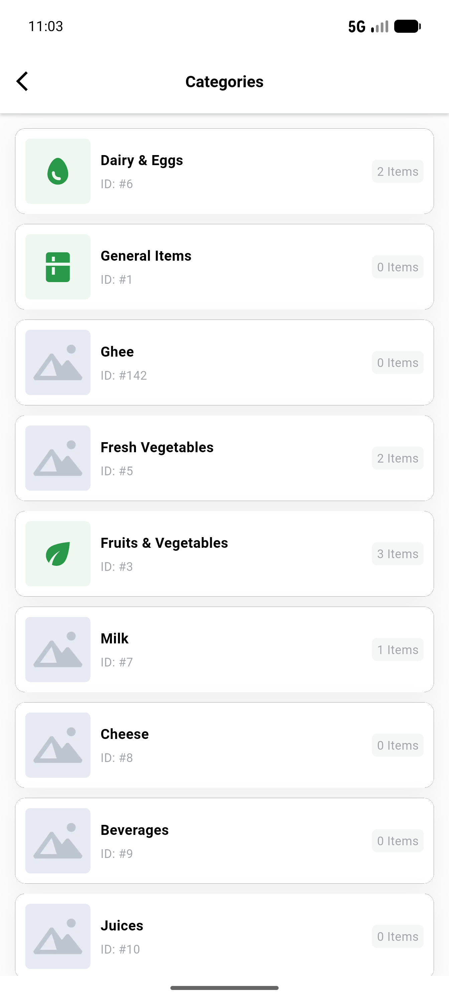
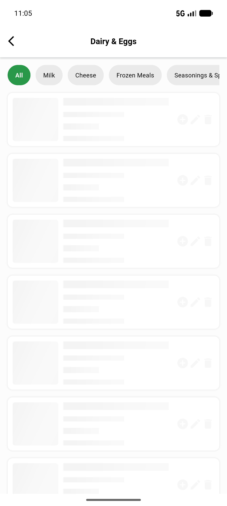
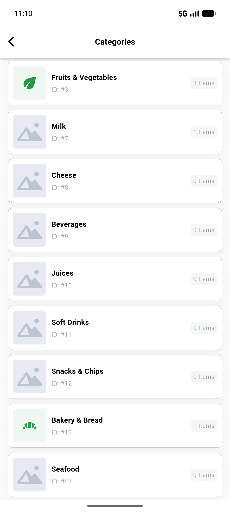
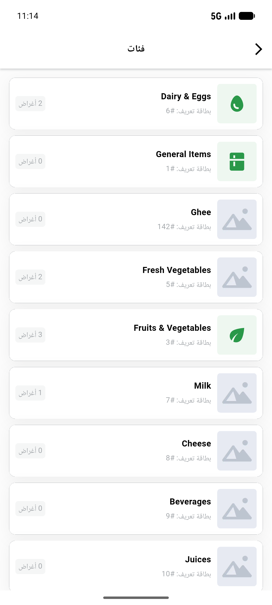

# QA Evidence — NEARS-606

**PASS — VendorApp category icon_key glyphs render live (AC1-AC5); 89/89 tests**

**4 screenshot(s).** Click any thumbnail for full resolution.

<table>
<tr>
<td align="center" width="33%"> categories light</td>
<td align="center" width="33%"> category product screen</td>
<td align="center" width="33%"> ac4 bakery glyph after admin set</td>
</tr>
<tr>
<td align="center" width="33%"> categories rtl arabic</td>
</tr>
</table>

---
*From `nears/docs/qa-evidence/NEARS-606/` · public-repo scrub policy (no live secrets; verified clean).*
