# QA Evidence — NEARS-621

**RE-QA cycle 2 PASS — TB-1/TB-2/TB-4 fixed; rows paint, errors clean (light mode, emulator-5554)**

**18 screenshot(s).** Click any thumbnail for full resolution.

<table>
<tr>
<td align="center" width="33%"><a href="ac12-rtl-header-mirrored-list-blank.png">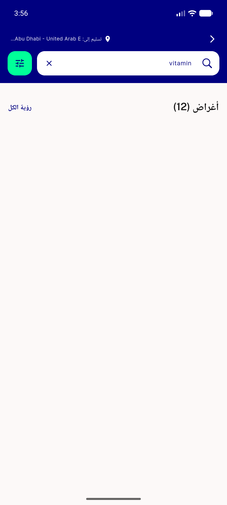</a> ac12 rtl header mirrored list blank</td>
<td align="center" width="33%"><a href="ac12-rtl-milk-zone2.png">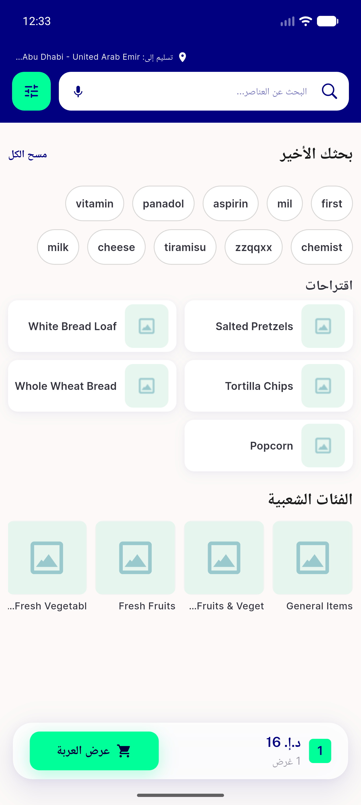</a> ac12 rtl milk zone2</td>
<td align="center" width="33%"><a href="ac12-rtl-results-milk.png">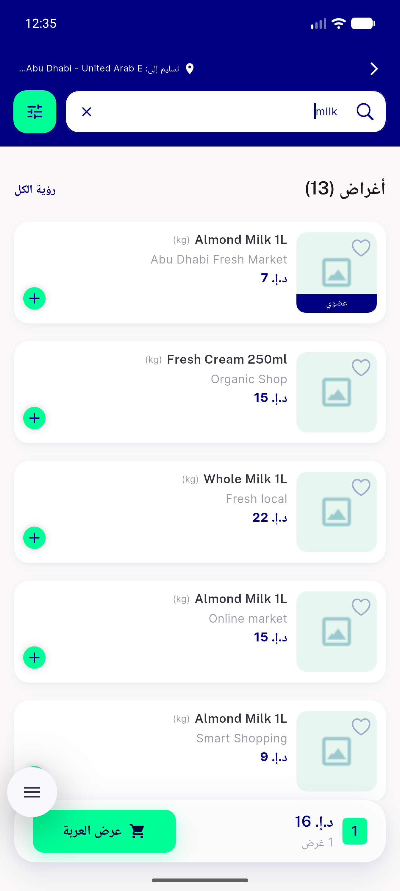</a> ac12 rtl results milk</td>
</tr>
<tr>
<td align="center" width="33%"><a href="ac3-regression-1char-idle.png">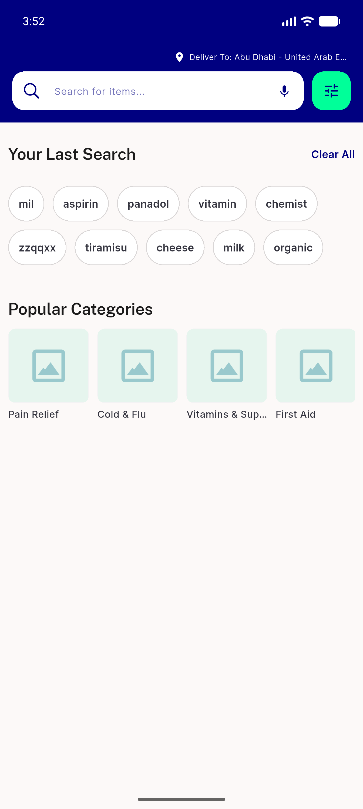</a> ac3 regression 1char idle</td>
<td align="center" width="33%"><a href="ac4-organic-items-header-only.png">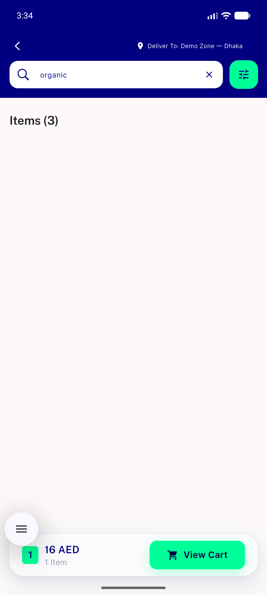</a> ac4 organic items header only</td>
<td align="center" width="33%"> ac5 chemist nodata stores gated</td>
</tr>
<tr>
<td align="center" width="33%"><a href="ac6-tiramisu-blank-no-stores-section.png">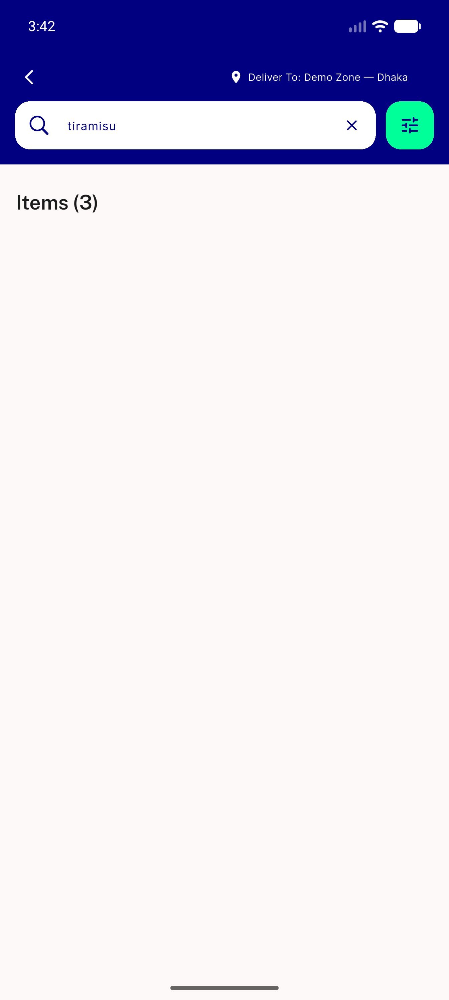</a> ac6 tiramisu blank no stores section</td>
<td align="center" width="33%"><a href="ac6-tiramisu-zone1-food.png">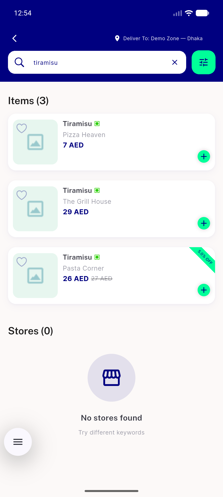</a> ac6 tiramisu zone1 food</td>
<td align="center" width="33%"><a href="ac7-loading-skeleton-renders.png">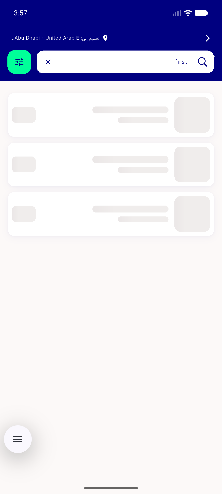</a> ac7 loading skeleton renders</td>
</tr>
<tr>
<td align="center" width="33%"><a href="ac8-network-error-retry.png">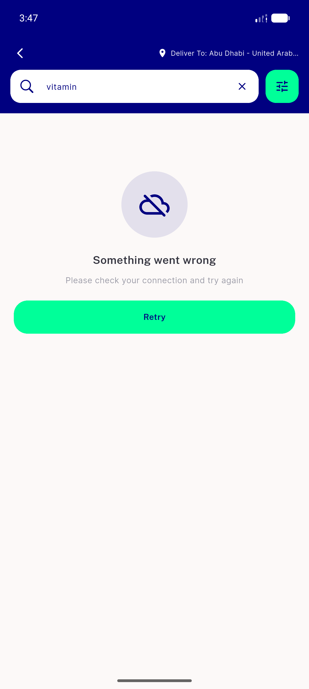</a> ac8 network error retry</td>
<td align="center" width="33%"><a href="both-empty-state-ok.png">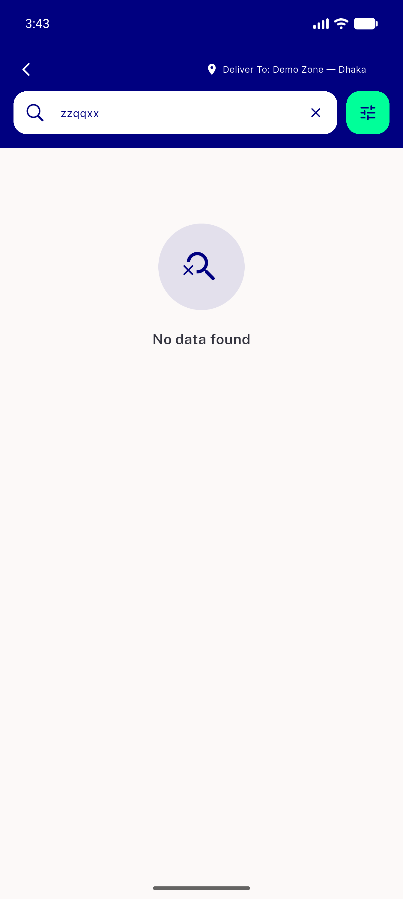</a> both empty state ok</td>
<td align="center" width="33%"><a href="bug-blank-results-list.png">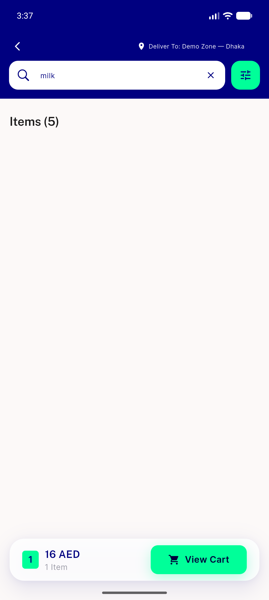</a> bug blank results list</td>
</tr>
<tr>
<td align="center" width="33%"><a href="regression-filter-sheet.png">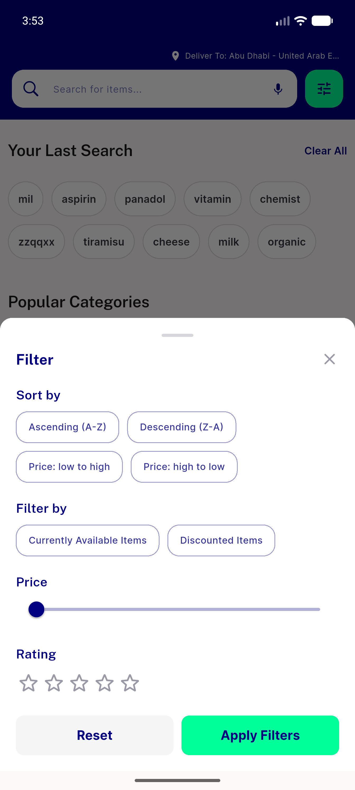</a> regression filter sheet</td>
<td align="center" width="33%"><a href="regression-idle-chips-categories.png">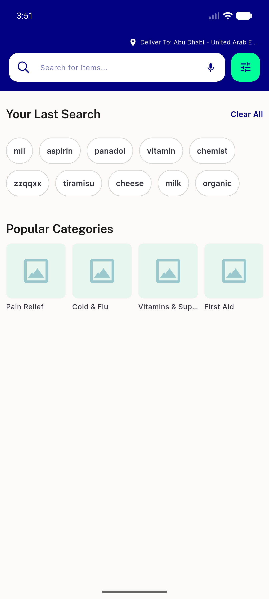</a> regression idle chips categories</td>
<td align="center" width="33%"><a href="regression-voice-search.png">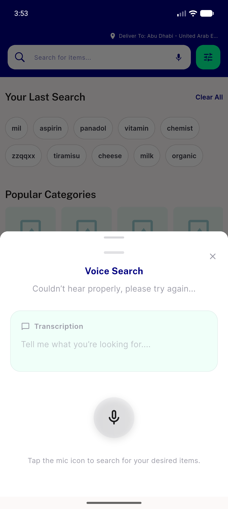</a> regression voice search</td>
</tr>
<tr>
<td align="center" width="33%"><a href="tb1-ac4-organic-zone1.png">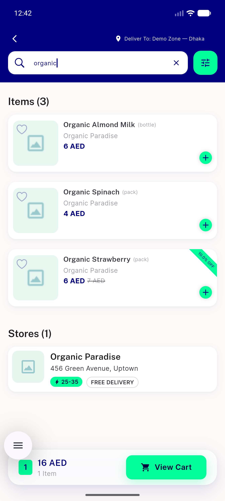</a> tb1 ac4 organic zone1</td>
<td align="center" width="33%"><a href="tb2-chemist-zone2-pharmacy.png">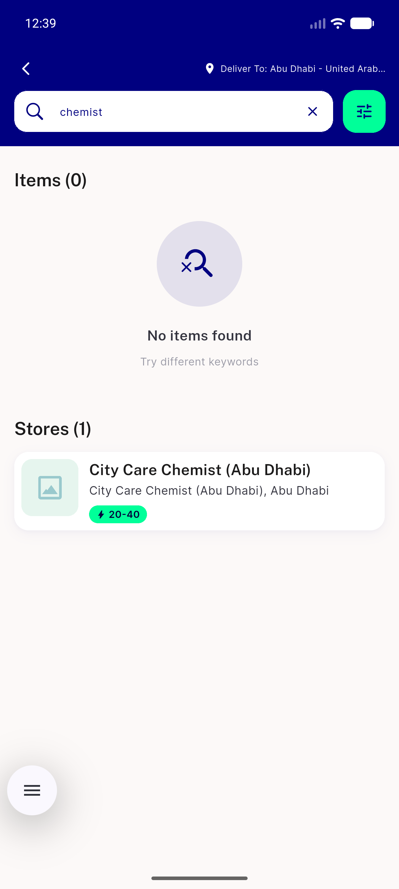</a> tb2 chemist zone2 pharmacy</td>
<td align="center" width="33%"><a href="tb4-clear-to-idle-en.png">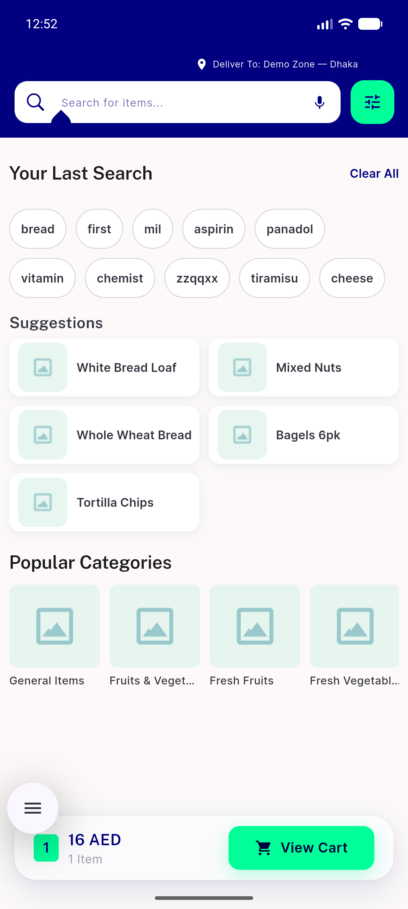</a> tb4 clear to idle en</td>
</tr>
</table>

### Other artifacts
- [`bug-blank-results-list.log`](bug-blank-results-list.log)
- [`bug-cart-count-view-overflow.log`](bug-cart-count-view-overflow.log)
- [`bug-stores-gate-module-scoped.log`](bug-stores-gate-module-scoped.log)
- [`progress.md`](progress.md)

---
*From `nears/docs/qa-evidence/NEARS-621/` · public-repo scrub policy (no live secrets; verified clean).*
