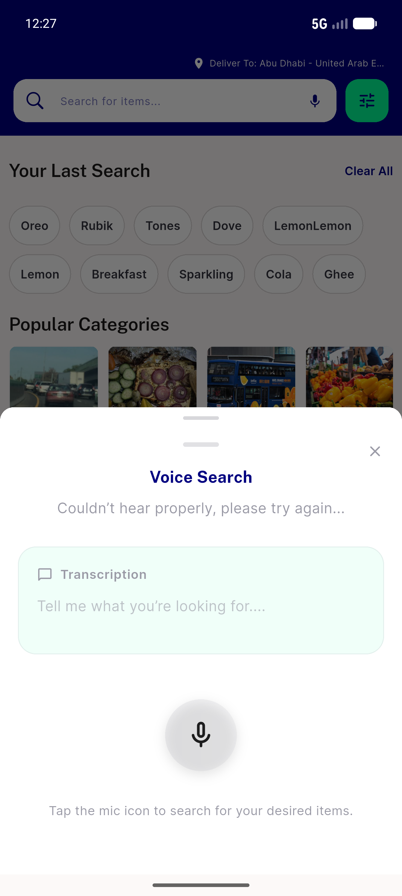
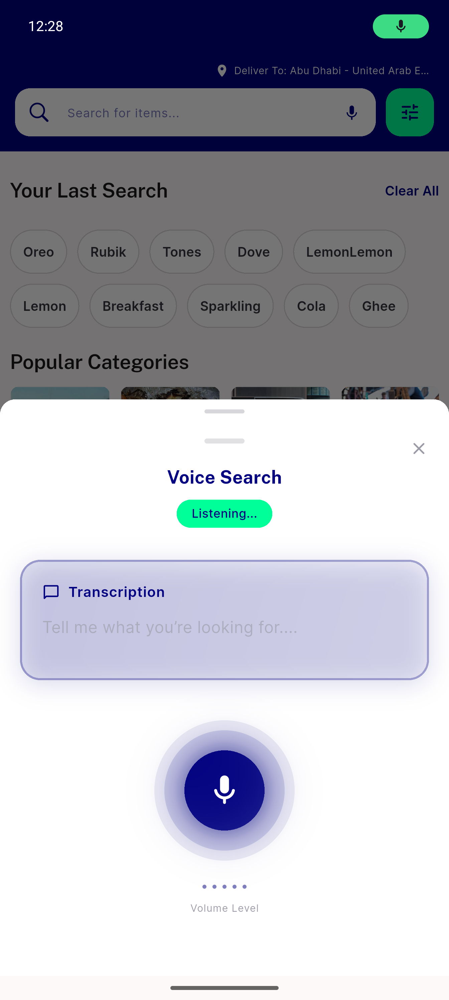
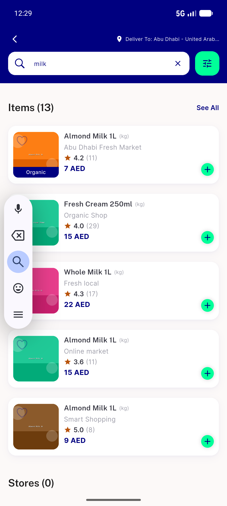

# QA Evidence — NEARS-623

**PASS — listenOptions deprecation chore: app boots clean, voice listen() fires cleanly (native lifecycle x2, no exception), search unbroken; 86/86 search tests green**

**4 screenshot(s).** Click any thumbnail for full resolution.

<table>
<tr>
<td align="center" width="33%"> search idle</td>
<td align="center" width="33%"> voice sheet listening</td>
<td align="center" width="33%"> voice listening active</td>
</tr>
<tr>
<td align="center" width="33%"> search results milk</td>
</tr>
</table>

### Other artifacts
- [`progress.md`](progress.md)

---
*From `nears/docs/qa-evidence/NEARS-623/` · public-repo scrub policy (no live secrets; verified clean).*
