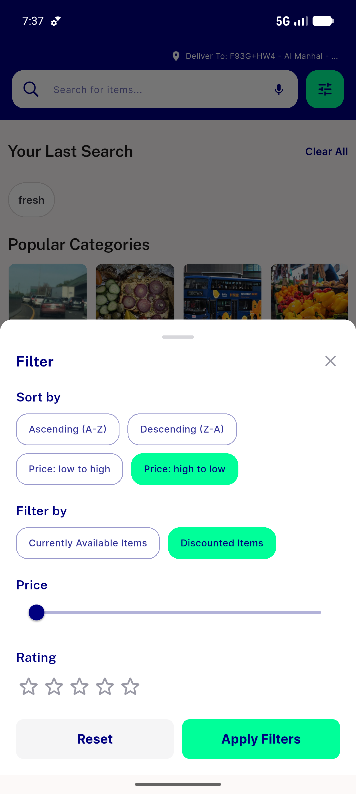
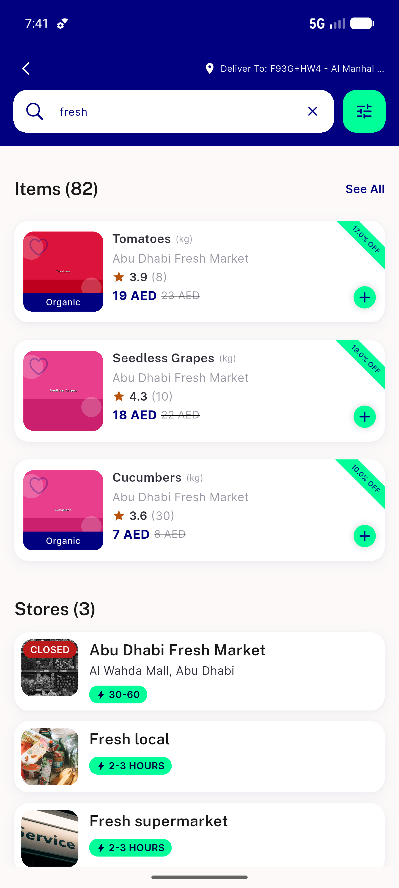
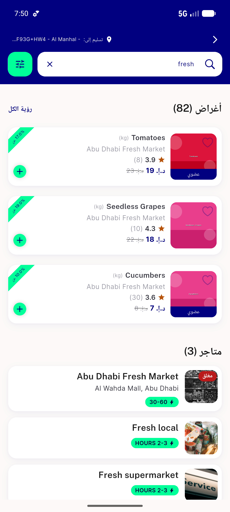
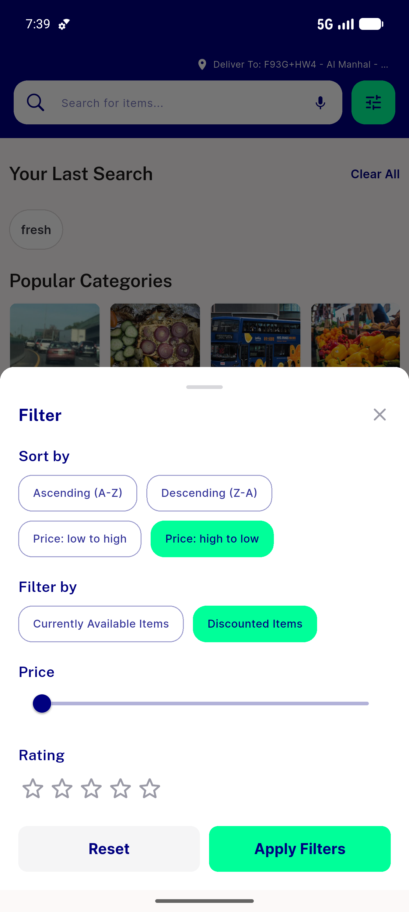
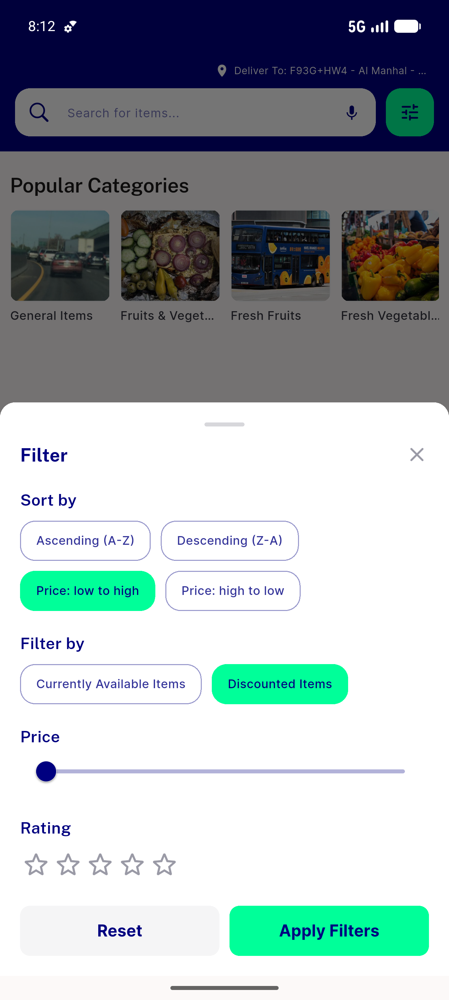
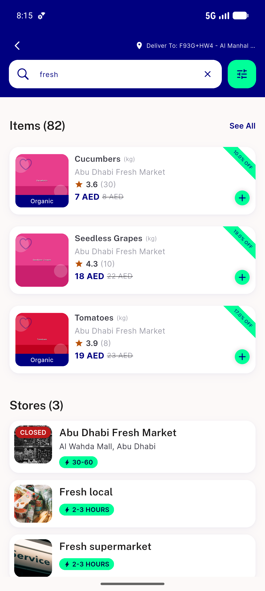
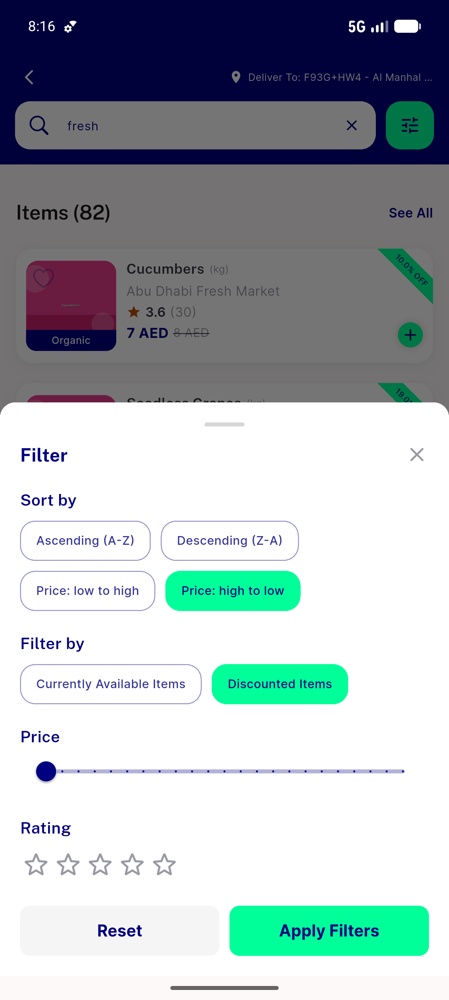
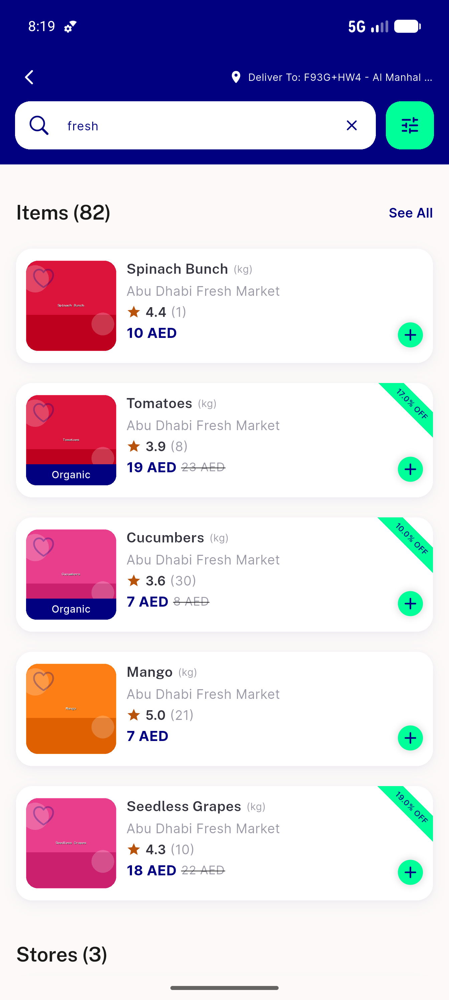

# QA Evidence — NEARS-624

**Re-QA PASS (fix 923d9a6f): mobile filter sheet Apply now dismisses (idle+results); AC1/AC2/AC3a re-confirmed; 1666/0**

**14 screenshot(s).** Click any thumbnail for full resolution.

<table>
<tr>
<td align="center" width="33%"> baseline fresh nofilter</td>
<td align="center" width="33%"> ac1 idle filter selected</td>
<td align="center" width="33%"> ac1 results filtered sorted</td>
</tr>
<tr>
<td align="center" width="33%"> ac3 results inplace sort</td>
<td align="center" width="33%"> ac2 no phantom unfiltered</td>
<td align="center" width="33%"> empty zeromatch idle filter</td>
</tr>
<tr>
<td align="center" width="33%"> ac1 arabic rtl filtered sorted</td>
<td align="center" width="33%"> bug apply not closing sheet</td>
<td align="center" width="33%"> reqa 01 idle filter sheet selected</td>
</tr>
<tr>
<td align="center" width="33%"> reqa 02 idle apply dismissed</td>
<td align="center" width="33%"> reqa 03 ac1 persist results sorted</td>
<td align="center" width="33%"> reqa 04 results filter sheet resort</td>
</tr>
<tr>
<td align="center" width="33%"> reqa 05 ac3a resorted dismissed</td>
<td align="center" width="33%"> reqa 06 ac2 no phantom</td>
</tr>
</table>

---
*From `nears/docs/qa-evidence/NEARS-624/` · public-repo scrub policy (no live secrets; verified clean).*
