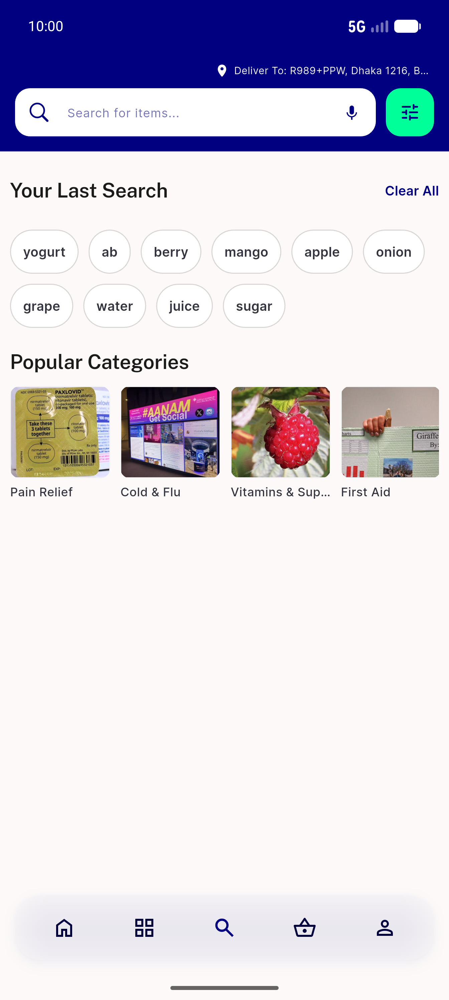
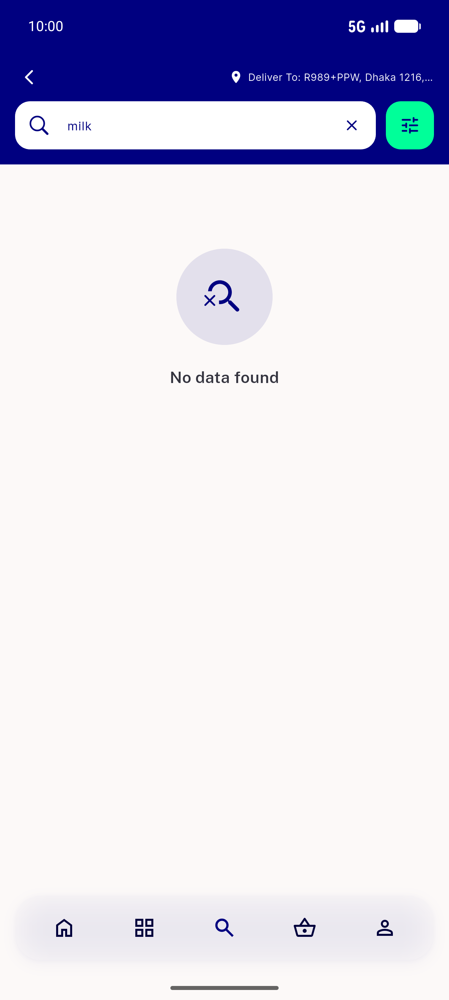
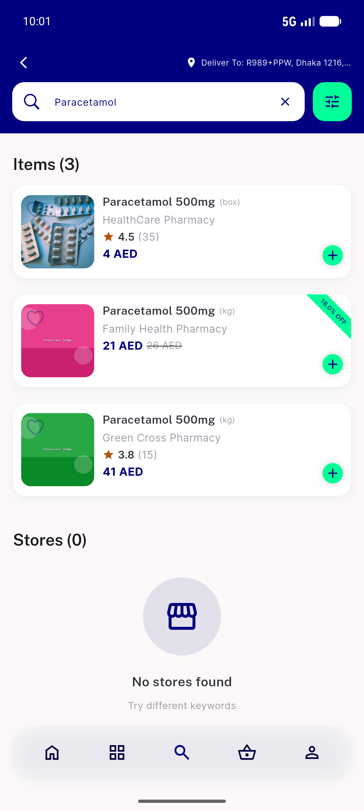
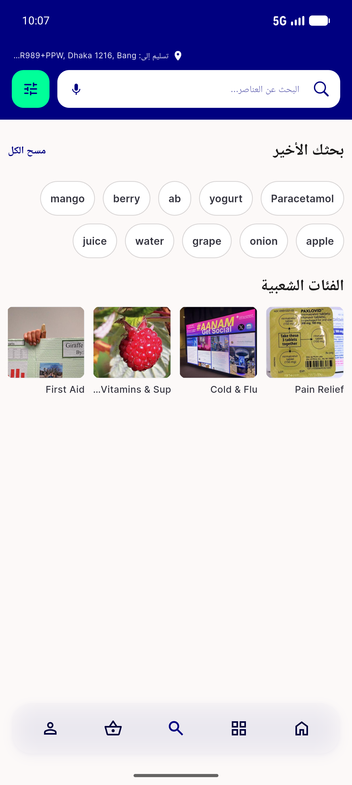
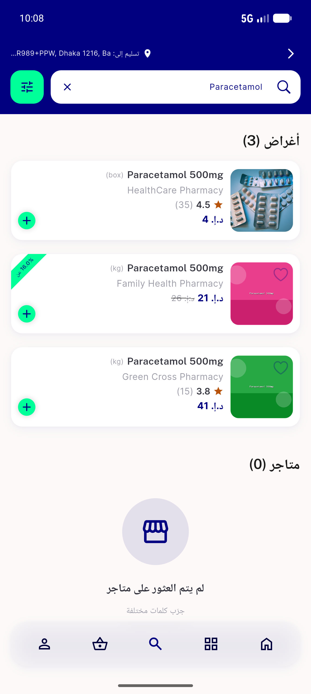

# QA Evidence — NEARS-625

**PASS — SearchScreen initState null-guard (AC1/AC2/AC3 met, emulator-5554, light mode)**

**6 screenshot(s).** Click any thumbnail for full resolution.

<table>
<tr>
<td align="center" width="33%"> home</td>
<td align="center" width="33%"> search idle</td>
<td align="center" width="33%"> search no results</td>
</tr>
<tr>
<td align="center" width="33%"> search typed results</td>
<td align="center" width="33%"> search idle arabic rtl</td>
<td align="center" width="33%"> search results arabic rtl</td>
</tr>
</table>

### Other artifacts
- [`ac1-ac2-widget-tests.log`](ac1-ac2-widget-tests.log)
- [`ac3-backstop.log`](ac3-backstop.log)
- [`progress.md`](progress.md)

---
*From `nears/docs/qa-evidence/NEARS-625/` · public-repo scrub policy (no live secrets; verified clean).*
