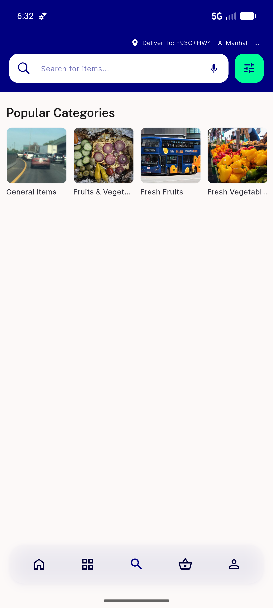
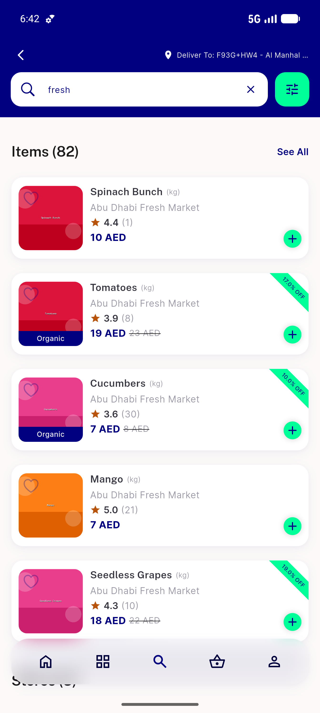
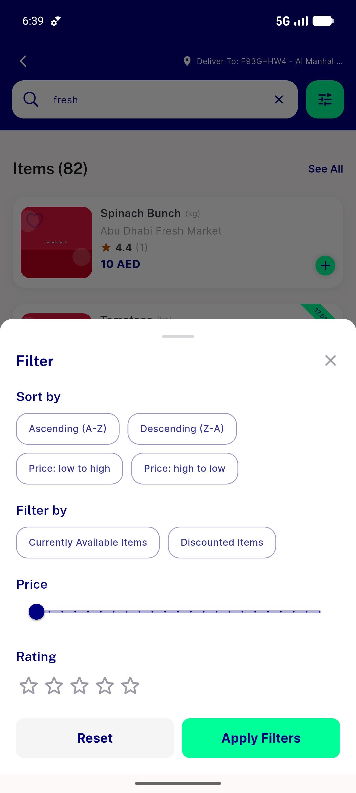

# QA Evidence — NEARS-626

**PASS — search filter icon reachable by label/Key + screen-reader label; no visual change (emulator-5556, sha ab95516d)**

**3 screenshot(s).** Click any thumbnail for full resolution.

<table>
<tr>
<td align="center" width="33%"> ac search idle filter icon</td>
<td align="center" width="33%"> ac1 ac3 search results filter resolved</td>
<td align="center" width="33%"> behavior filter sheet opened via label tap</td>
</tr>
</table>

### Other artifacts
- [`ac1-ac3-label-resolution.log`](ac1-ac3-label-resolution.log)

---
*From `nears/docs/qa-evidence/NEARS-626/` · public-repo scrub policy (no live secrets; verified clean).*
