# QA Evidence — NEARS-628

**PASS — inline Load More pagination (Items demonstrated 31 results; Stores section >5 not reproducible in seed)**

**13 screenshot(s).** Click any thumbnail for full resolution.

<table>
<tr>
<td align="center" width="33%"> AC1 load more button</td>
<td align="center" width="33%"><a href="AC2-appended-rows.png">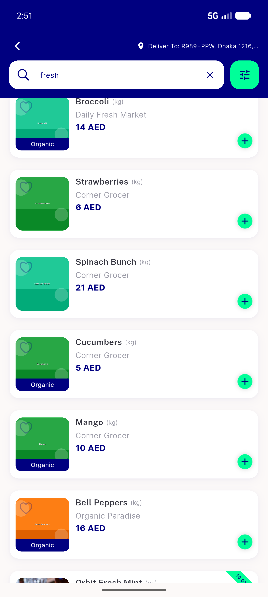</a> AC2 appended rows</td>
<td align="center" width="33%"><a href="AC3-boundary.png">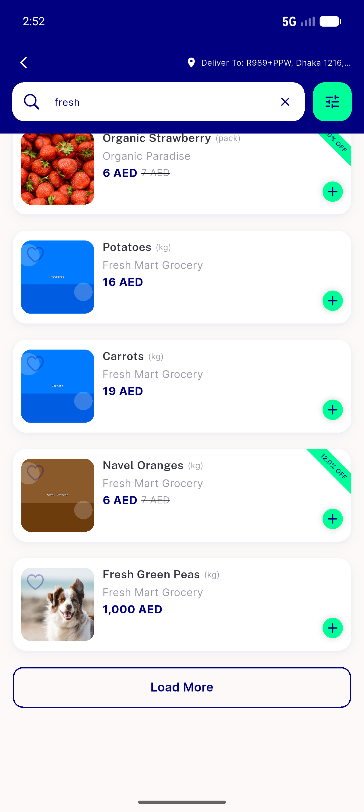</a> AC3 boundary</td>
</tr>
<tr>
<td align="center" width="33%"><a href="AC4-skeleton-loading.png">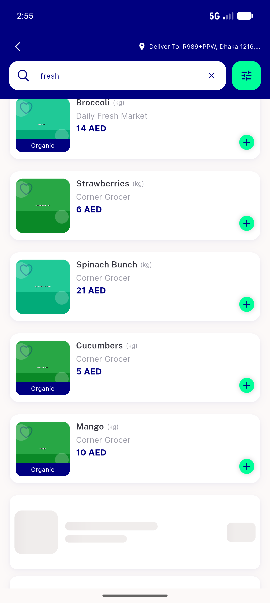</a> AC4 skeleton loading</td>
<td align="center" width="33%"><a href="AC5-all-results-shown.png">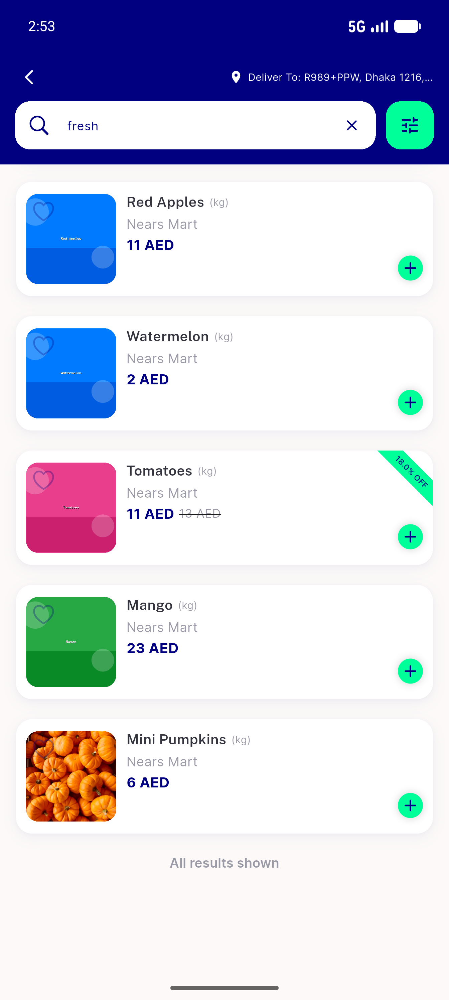</a> AC5 all results shown</td>
<td align="center" width="33%"> AC6 inline error row</td>
</tr>
<tr>
<td align="center" width="33%"><a href="AC6-retry-recovered.png">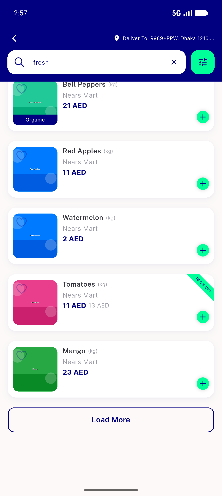</a> AC6 retry recovered</td>
<td align="center" width="33%"><a href="AC7-collapsed-preview.png">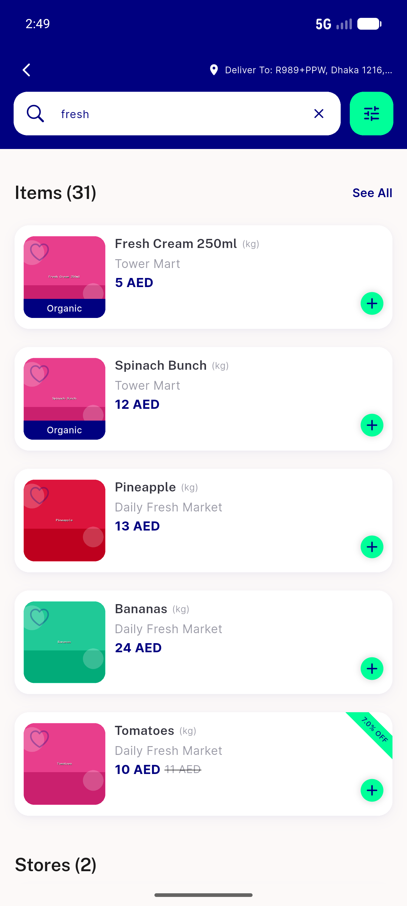</a> AC7 collapsed preview</td>
<td align="center" width="33%"><a href="AC7-fewresult-expand-no-footer.png">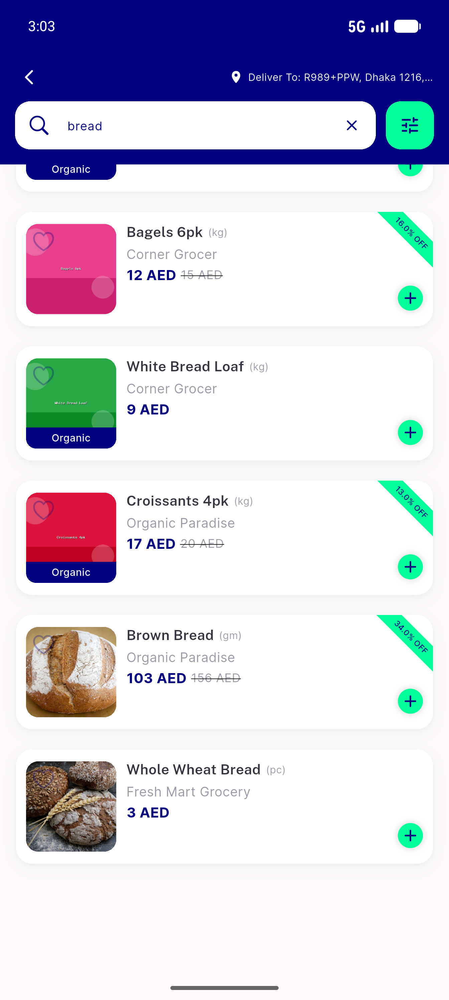</a> AC7 fewresult expand no footer</td>
</tr>
<tr>
<td align="center" width="33%"><a href="CC-rtl-arabic-endlabel.png">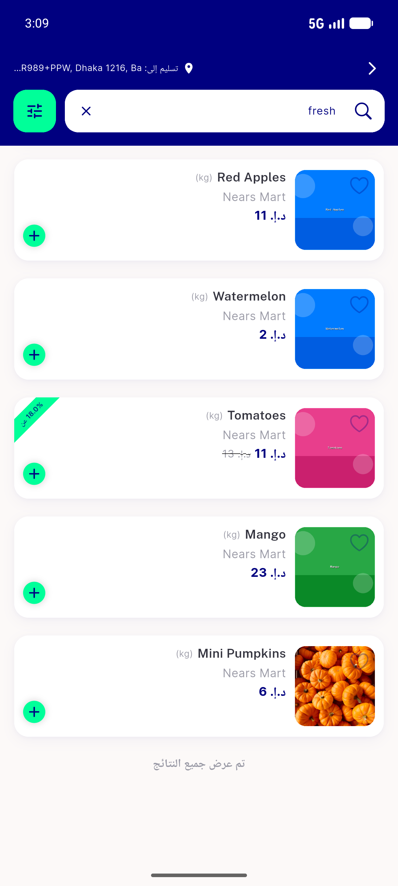</a> CC rtl arabic endlabel</td>
<td align="center" width="33%"><a href="CC-rtl-arabic-error.png">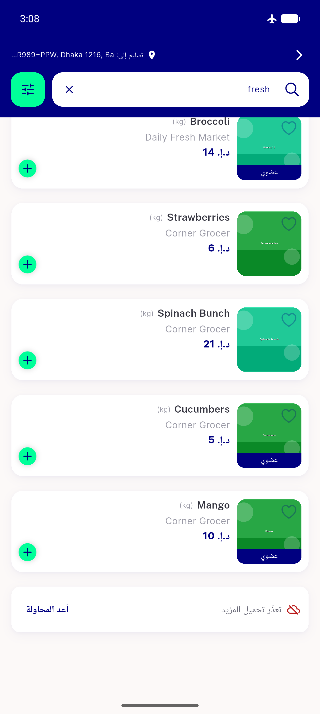</a> CC rtl arabic error</td>
<td align="center" width="33%"><a href="CC-rtl-arabic-loadmore.png">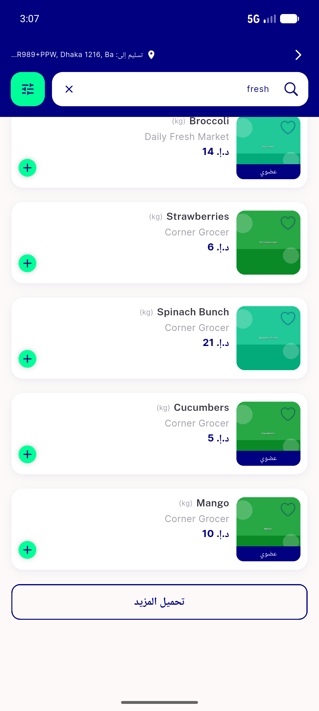</a> CC rtl arabic loadmore</td>
</tr>
<tr>
<td align="center" width="33%"><a href="REG-empty-state.png">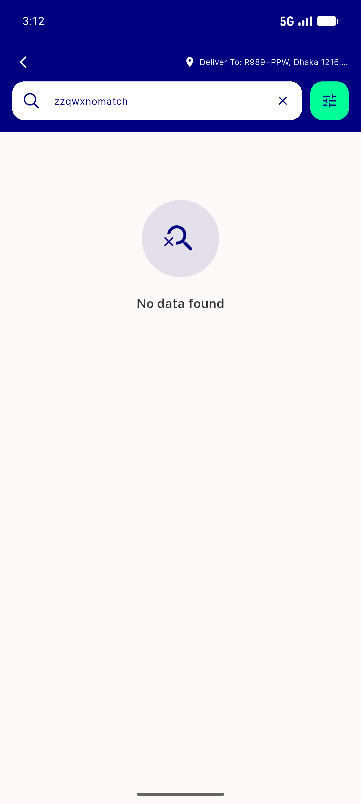</a> REG empty state</td>
</tr>
</table>

---
*From `nears/docs/qa-evidence/NEARS-628/` · public-repo scrub policy (no live secrets; verified clean).*
