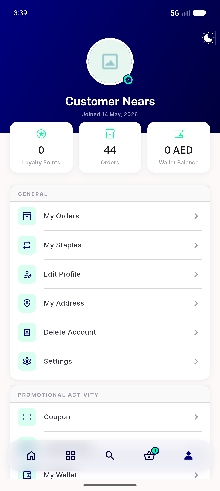
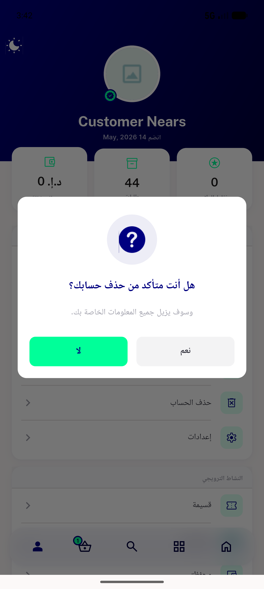
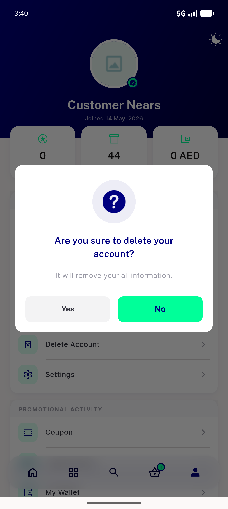
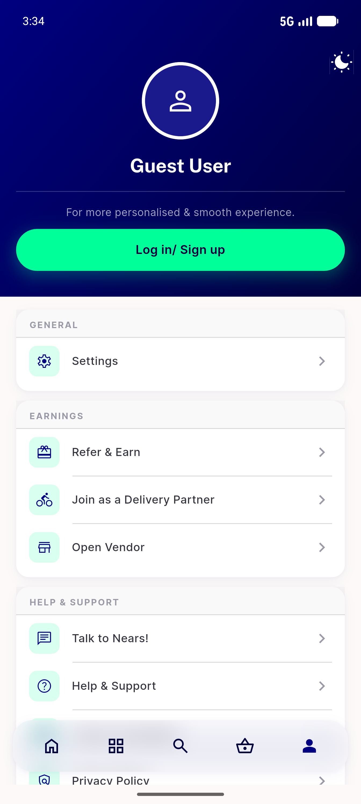
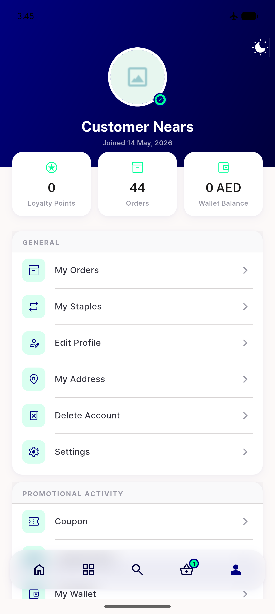

# QA Evidence — NEARS-631

**PASS — Delete Account row reachable in Profile General (AC1-5 verified live on emulator-5554, light mode); deletion safe (203 ongoing-orders + airplane-mode failure, no shared account deleted)**

**5 screenshot(s).** Click any thumbnail for full resolution.

<table>
<tr>
<td align="center" width="33%"> AC1 loggedin delete account row</td>
<td align="center" width="33%"> AC2 confirm dialog ar</td>
<td align="center" width="33%"> AC2 confirm dialog en</td>
</tr>
<tr>
<td align="center" width="33%"> AC4 guest general only settings</td>
<td align="center" width="33%"> AC5 failure toast check</td>
</tr>
</table>

### Other artifacts
- [`AC3-network-layer-remove-account.log`](AC3-network-layer-remove-account.log)
- [`AC5-failure-fail-log.log`](AC5-failure-fail-log.log)

---
*From `nears/docs/qa-evidence/NEARS-631/` · public-repo scrub policy (no live secrets; verified clean).*
