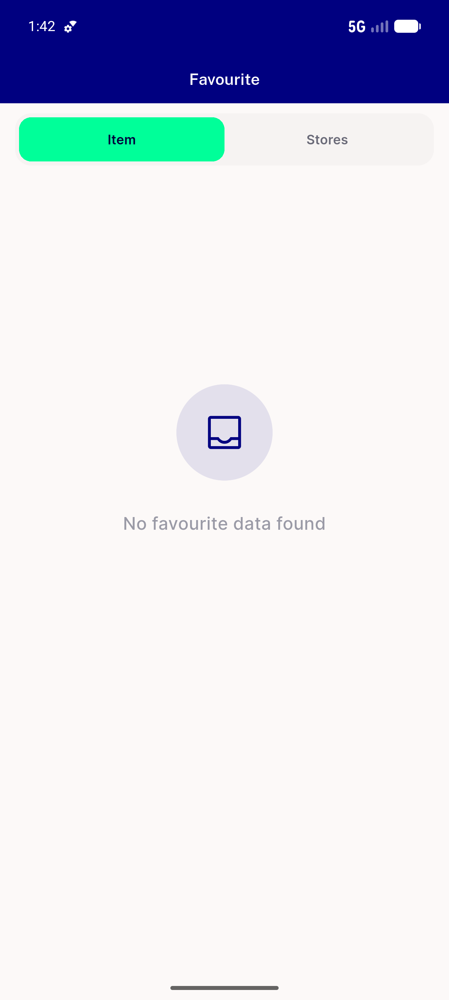
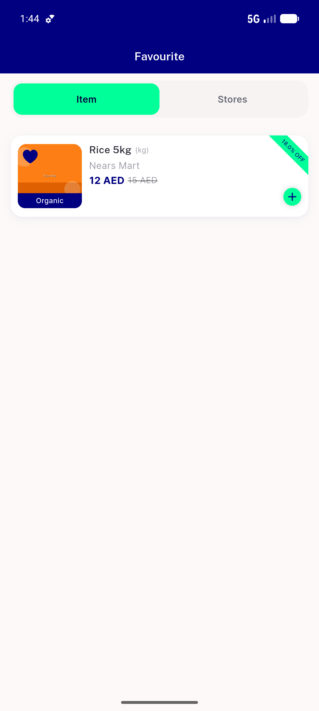
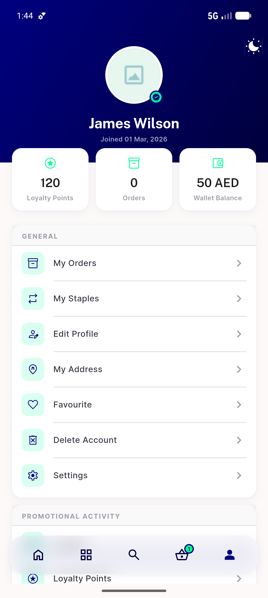
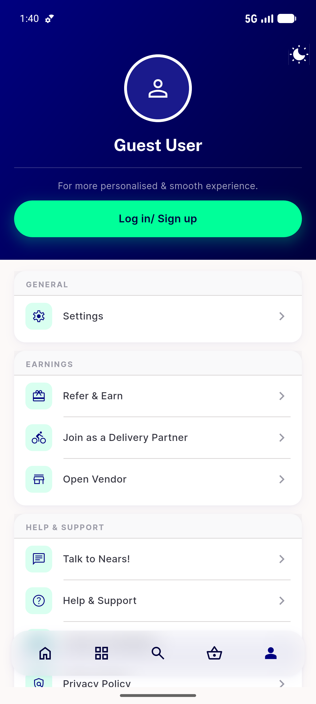
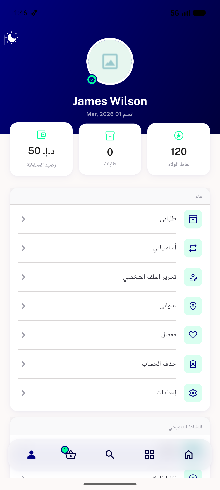

# QA Evidence — NEARS-632

**PASS — Favourite menu entry: 5/5 ACs met, regression clean, 14/14 unit tests, logs clean (emulator-5556, light)**

**6 screenshot(s).** Click any thumbnail for full resolution.

<table>
<tr>
<td align="center" width="33%"> ac1 favourite row general</td>
<td align="center" width="33%"> ac2 favourite screen empty</td>
<td align="center" width="33%"> ac2 favourite screen populated</td>
</tr>
<tr>
<td align="center" width="33%"> ac3 back to profile</td>
<td align="center" width="33%"> ac4 guest no favourite</td>
<td align="center" width="33%"> ac5 rtl arabic favourite</td>
</tr>
</table>

### Other artifacts
- [`progress.md`](progress.md)

---
*From `nears/docs/qa-evidence/NEARS-632/` · public-repo scrub policy (no live secrets; verified clean).*
