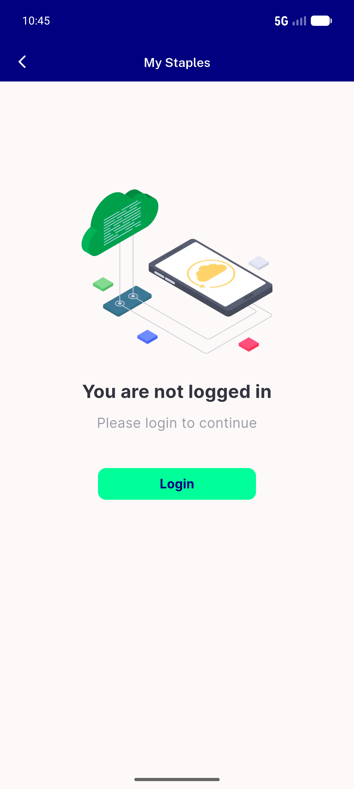
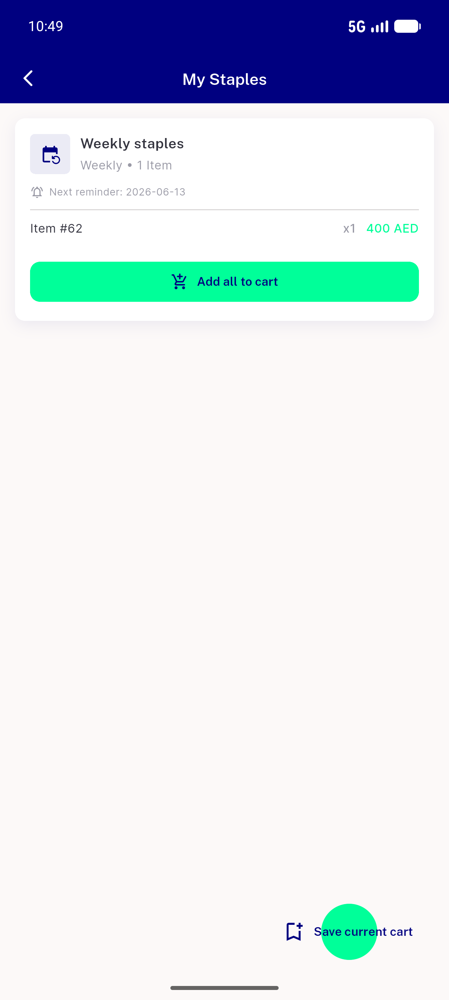
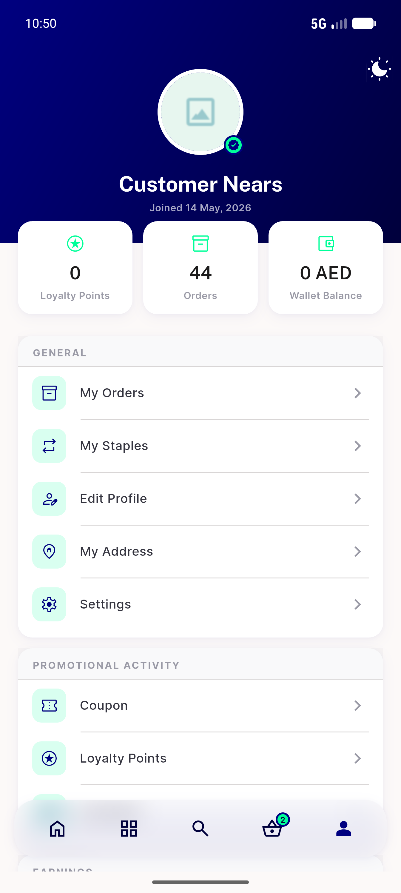

# QA Evidence — NEARS-633

**PASS — Staples guest gate: guest->NotLoggedInScreen+no FAB, authed list+FAB, menu row hide intact (emulator-5554)**

**6 screenshot(s).** Click any thumbnail for full resolution.

<table>
<tr>
<td align="center" width="33%"> ac1 guest staples cart2 no fab</td>
<td align="center" width="33%"> ac1 guest staples notloggedin</td>
<td align="center" width="33%"> ac1 guest staples rtl arabic</td>
</tr>
<tr>
<td align="center" width="33%"> ac2 authed staples list fab</td>
<td align="center" width="33%"> ac3 authed menu has staples</td>
<td align="center" width="33%"> ac3 guest menu no staples</td>
</tr>
</table>

### Other artifacts
- [`progress.md`](progress.md)

---
*From `nears/docs/qa-evidence/NEARS-633/` · public-repo scrub policy (no live secrets; verified clean).*
