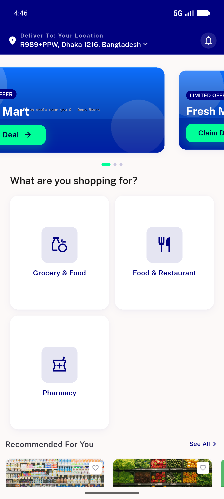
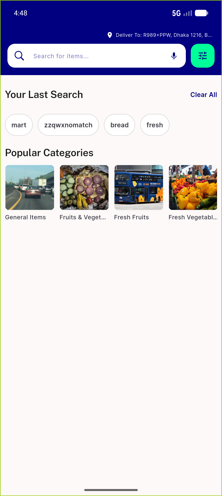
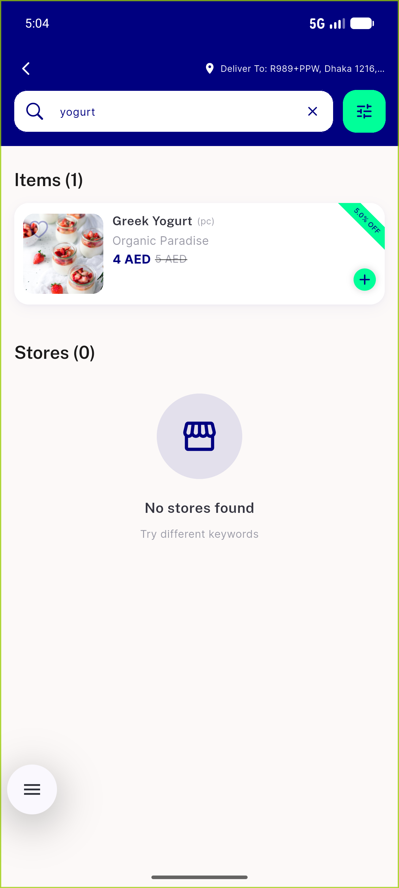

# QA Evidence — NEARS-634

**PASS — search submit fires exactly ONE offset=1 unified call (in-flight dedup verified live)**

**3 screenshot(s).** Click any thumbnail for full resolution.

<table>
<tr>
<td align="center" width="33%"> nav home</td>
<td align="center" width="33%"> nav search</td>
<td align="center" width="33%"> results fresh</td>
</tr>
</table>

### Other artifacts
- [`network-count-evidence.log`](network-count-evidence.log)

---
*From `nears/docs/qa-evidence/NEARS-634/` · public-repo scrub policy (no live secrets; verified clean).*
