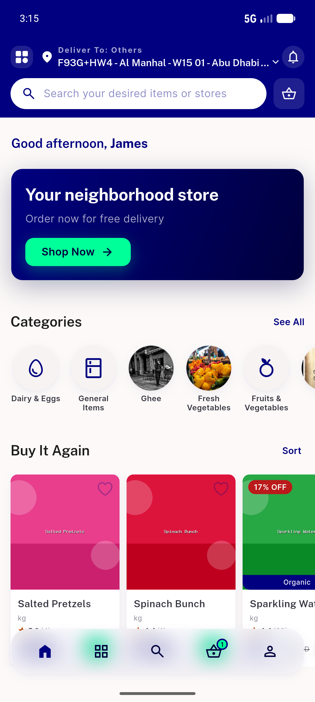
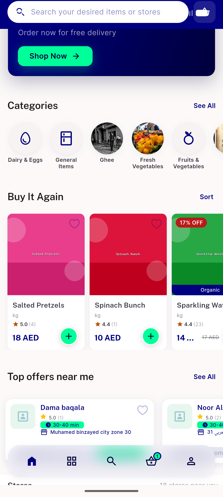
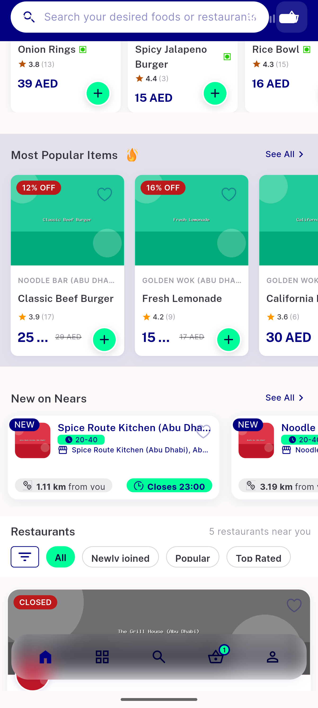
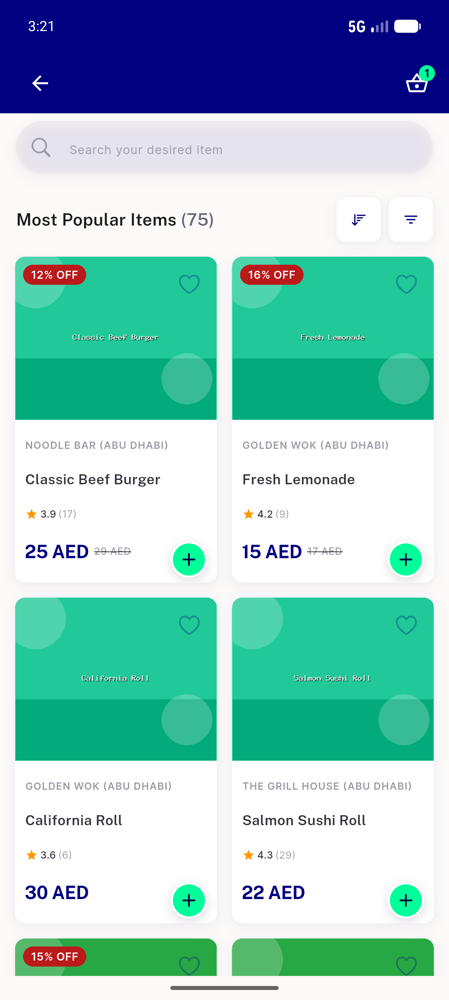
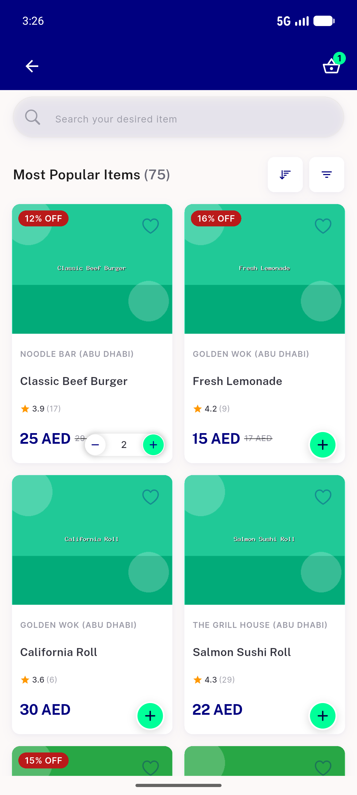
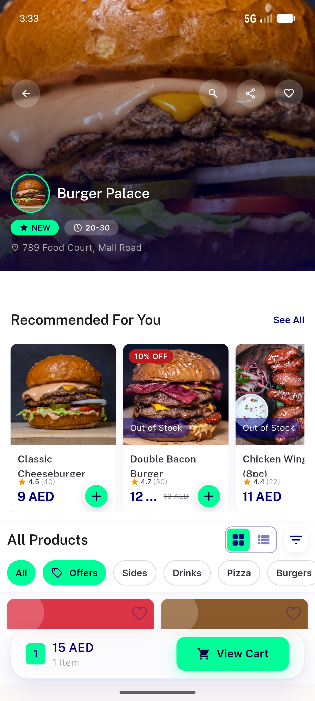
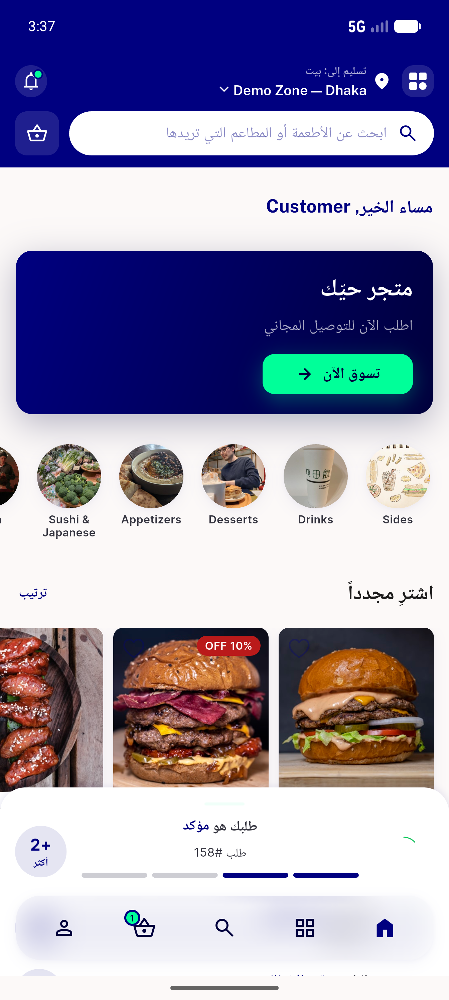

# QA Evidence — NEARS-645

**PASS — ItemCard DLS alignment verified on emulator-5556, 3 rails + RTL + OOS; 1649/0 tests**

**9 screenshot(s).** Click any thumbnail for full resolution.

<table>
<tr>
<td align="center" width="33%"> module home top</td>
<td align="center" width="33%"> buyitagain plus</td>
<td align="center" width="33%"> most popular rail</td>
</tr>
<tr>
<td align="center" width="33%"> item view all</td>
<td align="center" width="33%"> stepper state</td>
<td align="center" width="33%"> incart stepper</td>
</tr>
<tr>
<td align="center" width="33%"> store recommended oos</td>
<td align="center" width="33%"> rtl arabic store recommended</td>
<td align="center" width="33%"> rtl card detail</td>
</tr>
</table>

### Other artifacts
- [`bug-icon-family-inconsistency.log`](bug-icon-family-inconsistency.log)
- [`bug-incart-minus-tappable-NOTREPRO.log`](bug-incart-minus-tappable-NOTREPRO.log)
- [`bug-oos-plus-active-addable.log`](bug-oos-plus-active-addable.log)

---
*From `nears/docs/qa-evidence/NEARS-645/` · public-repo scrub policy (no live secrets; verified clean).*
