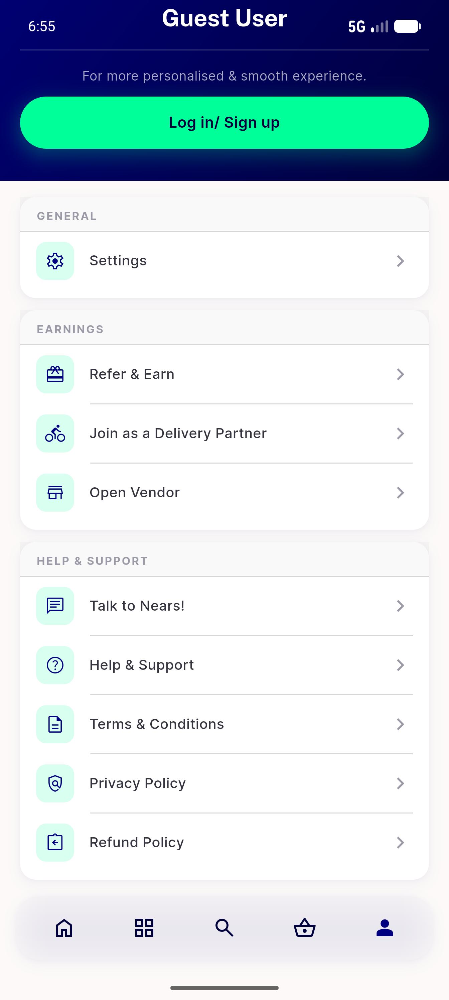
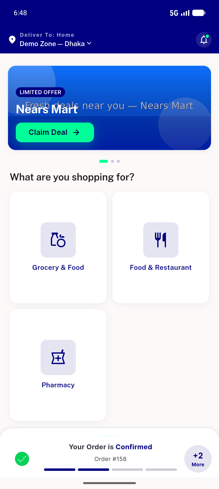
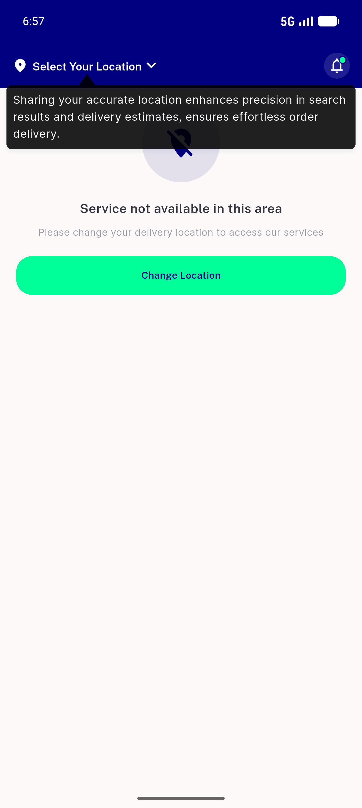
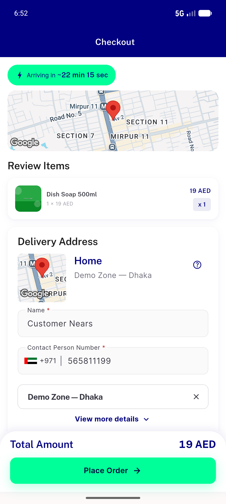
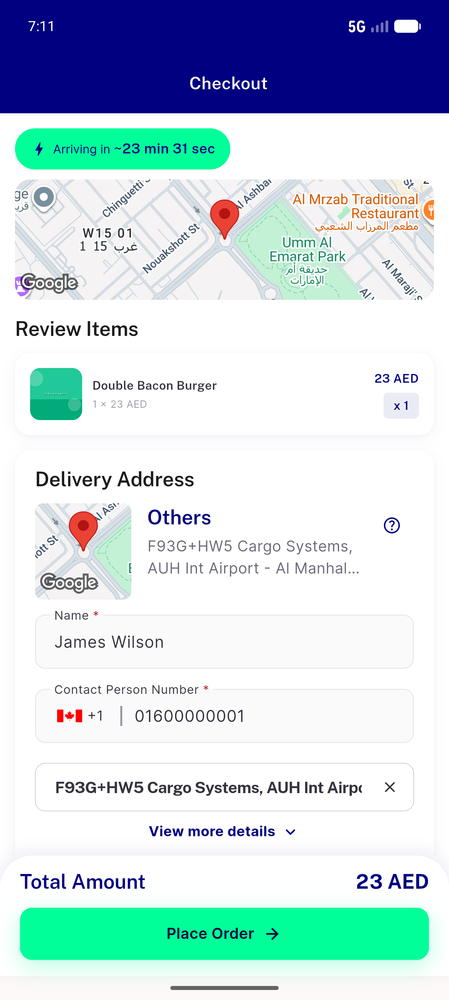

# QA Evidence — NEARS-660

**PASS — logout clears userAddress PII + resets API header to guest/no-zone; cross-user zone bleed fixed (emulator-5554, com.izzes.nears, feat/NEARS-660-logout-clear-address @6cd242f7)**

**5 screenshot(s).** Click any thumbnail for full resolution.

<table>
<tr>
<td align="center" width="33%"> ac1 absent guest profile</td>
<td align="center" width="33%"> ac1 present A zone1 home</td>
<td align="center" width="33%"> ac2 B no zone bleed select location</td>
</tr>
<tr>
<td align="center" width="33%"> ac5 checkout prefill A 1</td>
<td align="center" width="33%"> ac5 checkout prefill B after cycle</td>
</tr>
</table>

### Other artifacts
- [`ac1-absent-after-logout.log`](ac1-absent-after-logout.log)
- [`ac1-present-prefs.log`](ac1-present-prefs.log)
- [`ac2-B-session-zone-clean.log`](ac2-B-session-zone-clean.log)
- [`bug-getzone-emptycoords-fail.log`](bug-getzone-emptycoords-fail.log)
- [`bug-paymentfailed-parse-warn.log`](bug-paymentfailed-parse-warn.log)
- [`progress.md`](progress.md)

---
*From `nears/docs/qa-evidence/NEARS-660/` · public-repo scrub policy (no live secrets; verified clean).*
