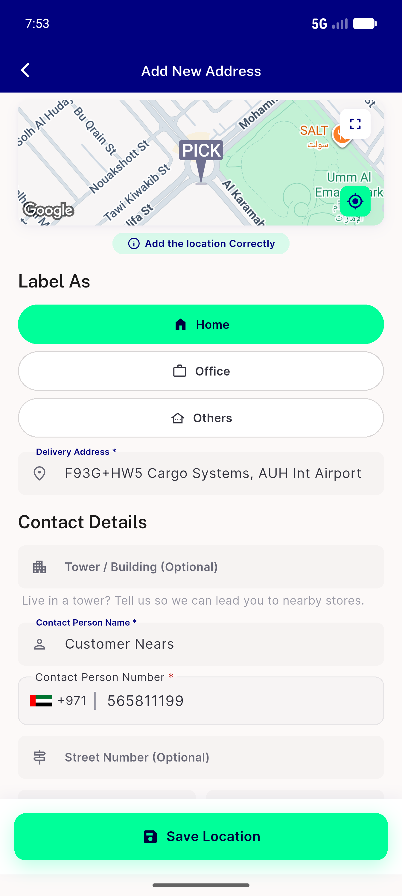
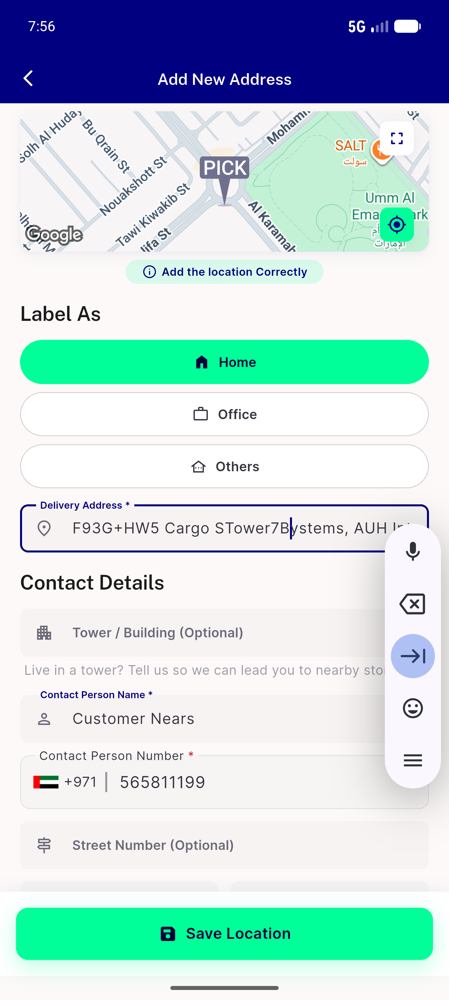

# QA Evidence — NEARS-661

**PASS — CustomTextField setState-after-dispose fix: 0 assertions over focus->pop cycles (LTR+RTL), focus rebuild + text entry intact**

**4 screenshot(s).** Click any thumbnail for full resolution.

<table>
<tr>
<td align="center" width="33%"> signin screen</td>
<td align="center" width="33%"> add address form</td>
<td align="center" width="33%"> field focused text</td>
</tr>
<tr>
<td align="center" width="33%"> edit profile rtl</td>
</tr>
</table>

### Other artifacts
- [`ac1-ac3-no-dispose-assertion.log`](ac1-ac3-no-dispose-assertion.log)

---
*From `nears/docs/qa-evidence/NEARS-661/` · public-repo scrub policy (no live secrets; verified clean).*
