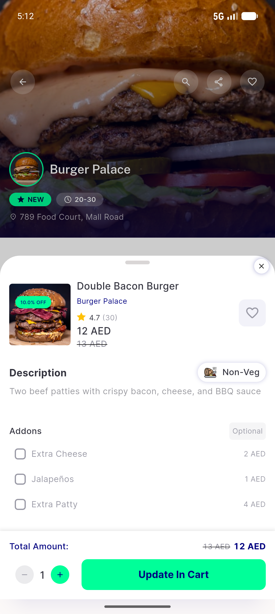
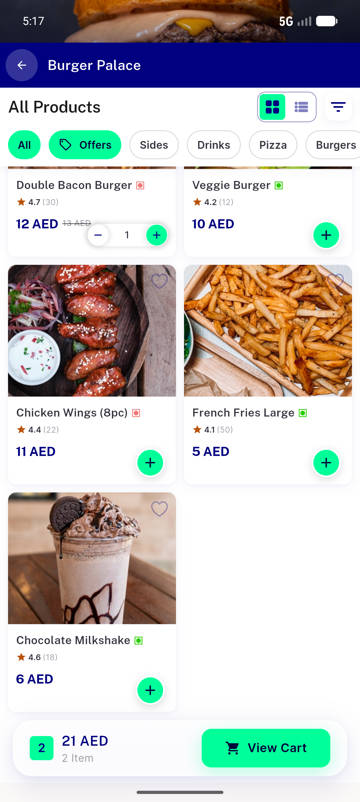
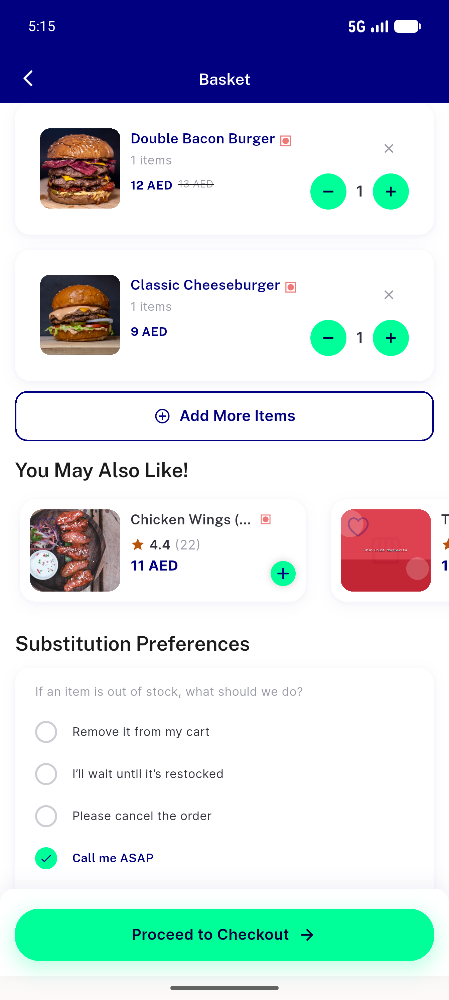
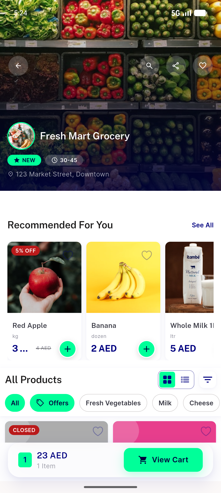
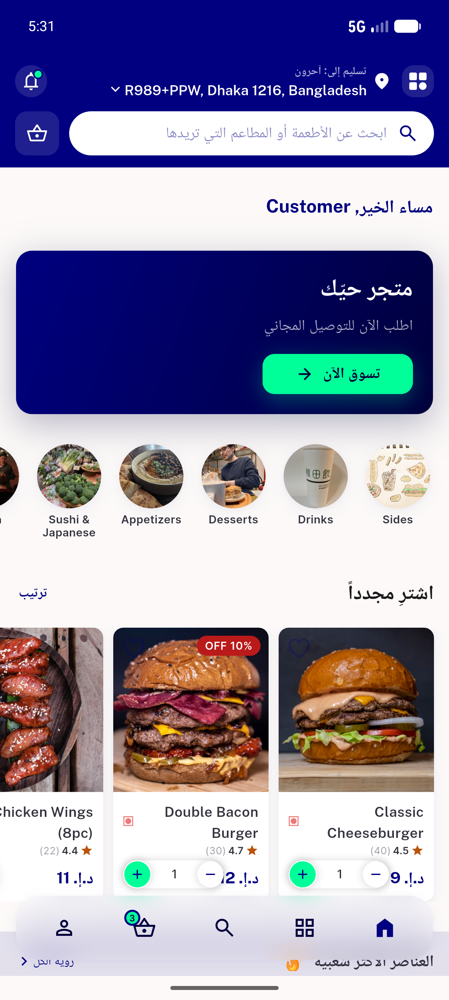
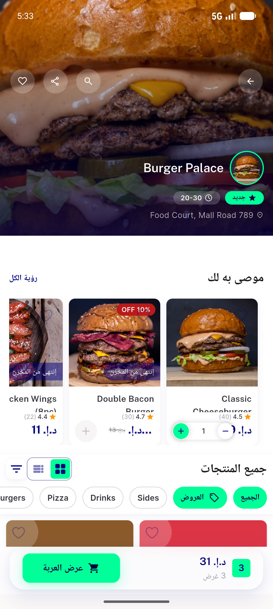
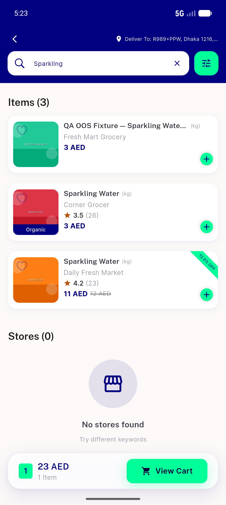
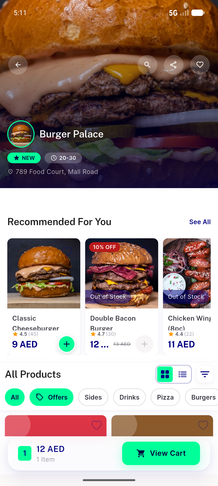

# QA Evidence — NEARS-662

**PASS NEARS-662+663: OOS ItemCard '+' inert grey (DLS NearsIcon) — live on UserApp emulator-5554**

**9 screenshot(s).** Click any thumbnail for full resolution.

<table>
<tr>
<td align="center" width="33%"> ac2 after tap oos</td>
<td align="center" width="33%"> ac3 instock added</td>
<td align="center" width="33%"> ac4 itemwidget grid</td>
</tr>
<tr>
<td align="center" width="33%"> cart contents</td>
<td align="center" width="33%"> freshmart store</td>
<td align="center" width="33%"> rtl itemcards</td>
</tr>
<tr>
<td align="center" width="33%"> rtl store recommended2</td>
<td align="center" width="33%"> search sparkling</td>
<td align="center" width="33%"> store recommended</td>
</tr>
</table>

### Other artifacts
- [`progress.md`](progress.md)

---
*From `nears/docs/qa-evidence/NEARS-662/` · public-repo scrub policy (no live secrets; verified clean).*
