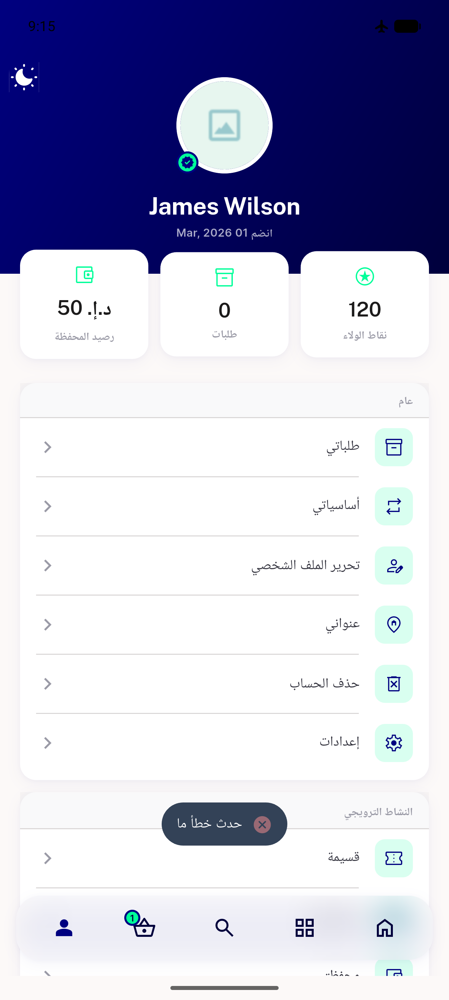
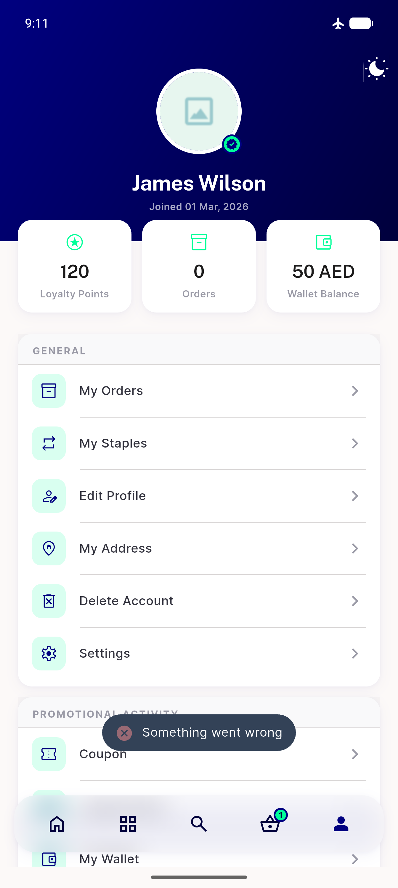
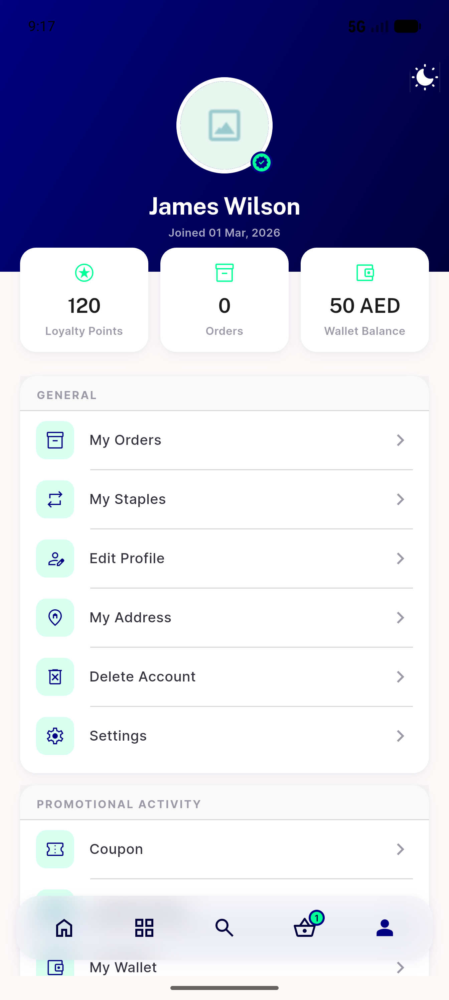

# QA Evidence — NEARS-664

**PASS — delete-account transport-throw now toasts (EN+AR) + [FAIL] log**

**3 screenshot(s).** Click any thumbnail for full resolution.

<table>
<tr>
<td align="center" width="33%"> ac1 ar error toast</td>
<td align="center" width="33%"> ac1 en error toast</td>
<td align="center" width="33%"> regression profile screen</td>
</tr>
</table>

### Other artifacts
- [`ac2-fail-log-remove-account.log`](ac2-fail-log-remove-account.log)

---
*From `nears/docs/qa-evidence/NEARS-664/` · public-repo scrub policy (no live secrets; verified clean).*
