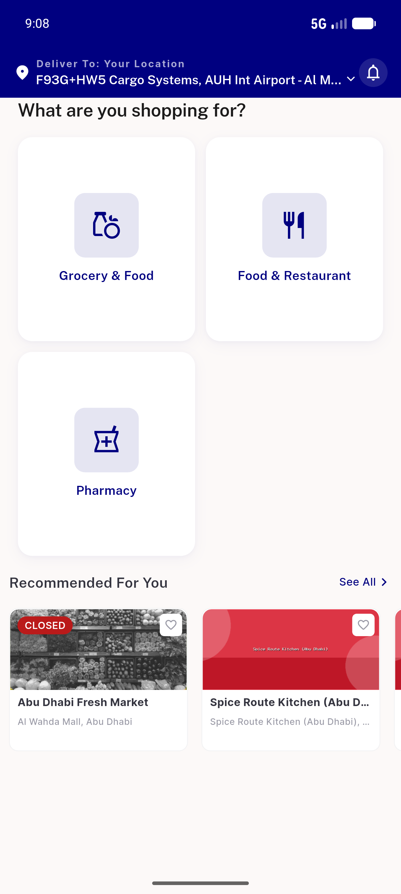

# QA Evidence — NEARS-665

**PASS — login analytics method=email on-device (was hardcoded phone)**

**1 screenshot(s).** Click any thumbnail for full resolution.

<table>
<tr>
<td align="center" width="33%"> ac1 logged in home</td>
</tr>
</table>

### Other artifacts
- [`ac1-email-login-method.log`](ac1-email-login-method.log)

---
*From `nears/docs/qa-evidence/NEARS-665/` · public-repo scrub policy (no live secrets; verified clean).*
