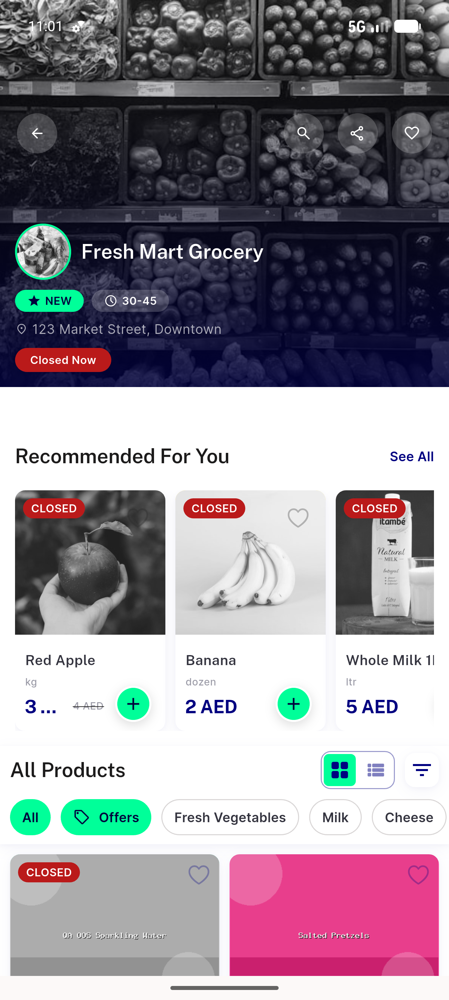
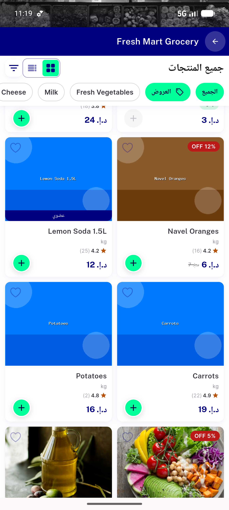
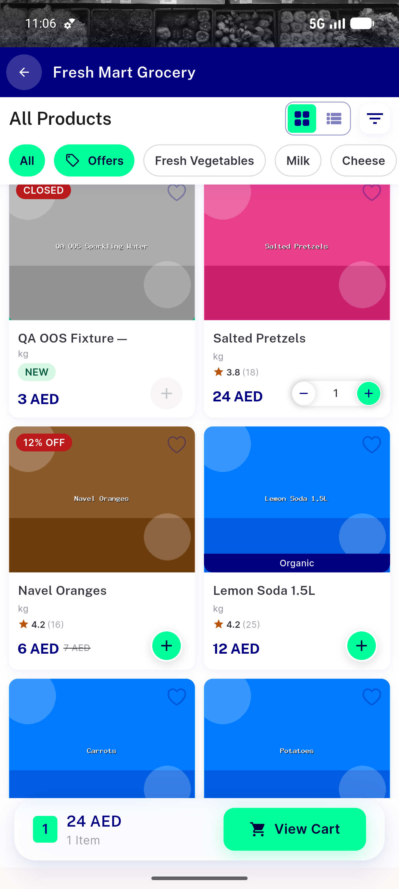

# QA Evidence — NEARS-668

**PASS — ItemCard module.stock OOS gate + 44dp/NEARS-630 + dead-field removal (668/669/670), light mode, emulator-5556**

**6 screenshot(s).** Click any thumbnail for full resolution.

<table>
<tr>
<td align="center" width="33%"> ac1 oos fixture store grid</td>
<td align="center" width="33%"> ac11 most popular rail</td>
<td align="center" width="33%"> ac2 food zero stock active</td>
</tr>
<tr>
<td align="center" width="33%"> ac6 rtl closed badge 2</td>
<td align="center" width="33%"> ac6 rtl closed badge</td>
<td align="center" width="33%"> ac8 stepper in cart</td>
</tr>
</table>

### Other artifacts
- [`progress.md`](progress.md)

---
*From `nears/docs/qa-evidence/NEARS-668/` · public-repo scrub policy (no live secrets; verified clean).*
