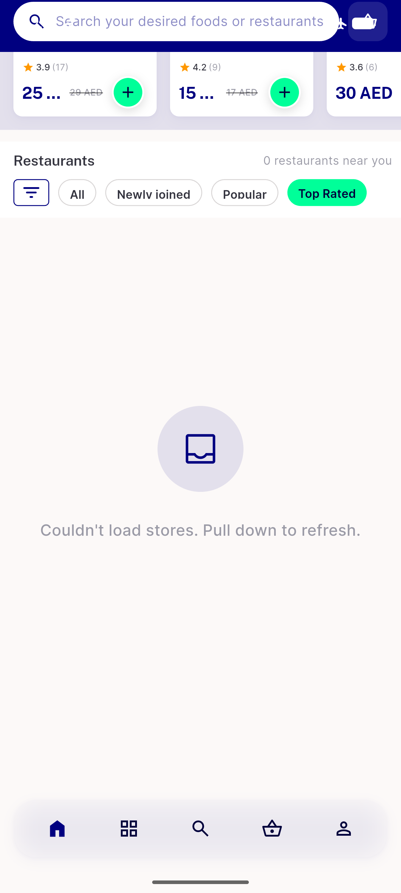
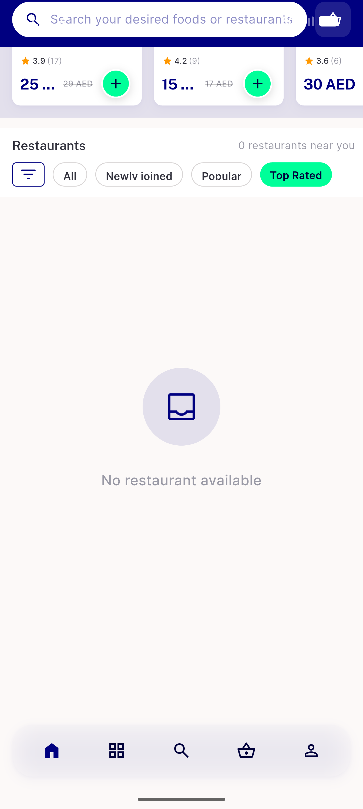
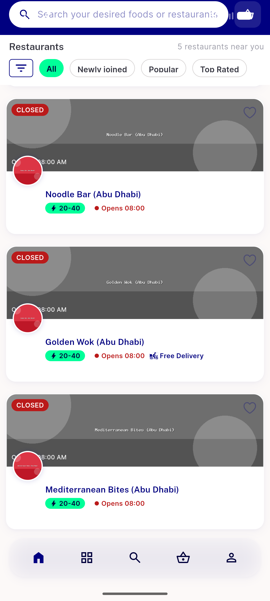
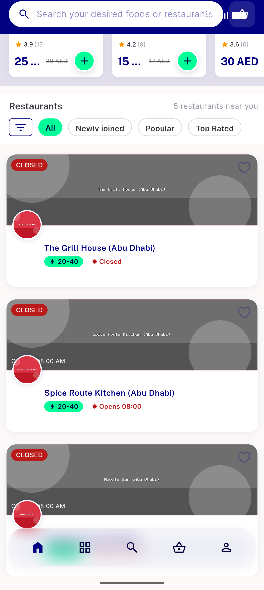
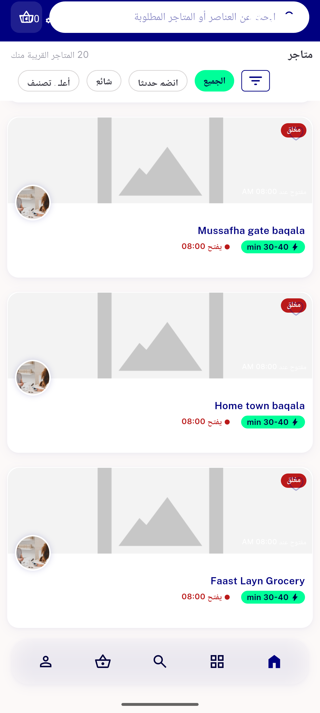

# QA Evidence — NEARS-671

**PASS — all-stores cold-cache fetch failure degrades to no-data (retry copy), no infinite skeleton**

**9 screenshot(s).** Click any thumbnail for full resolution.

<table>
<tr>
<td align="center" width="33%"> AC1 AC2 AC3 rail nodata failcopy</td>
<td align="center" width="33%"> AC2 AR RTL failcopy</td>
<td align="center" width="33%"> AC2 emptyzone copy online</td>
</tr>
<tr>
<td align="center" width="33%"> AC4 603 coldfetch online loaded</td>
<td align="center" width="33%"> AC4 home online populated</td>
<td align="center" width="33%"> AC4 rail loaded online</td>
</tr>
<tr>
<td align="center" width="33%"> AC5 recovered stores grid</td>
<td align="center" width="33%"> NOTE offline coldlaunch upstream oops</td>
<td align="center" width="33%"> REG grocery rail pagination</td>
</tr>
</table>

---
*From `nears/docs/qa-evidence/NEARS-671/` · public-repo scrub policy (no live secrets; verified clean).*
