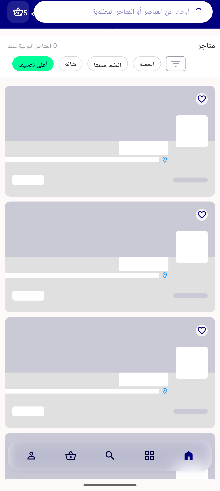
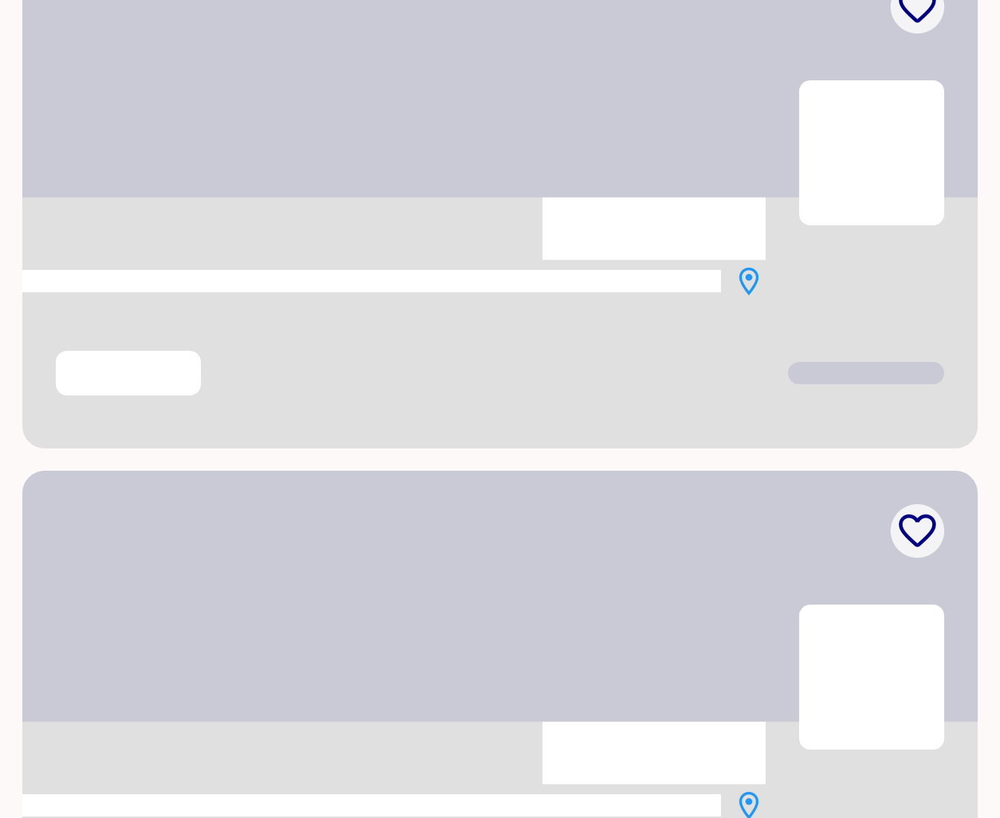
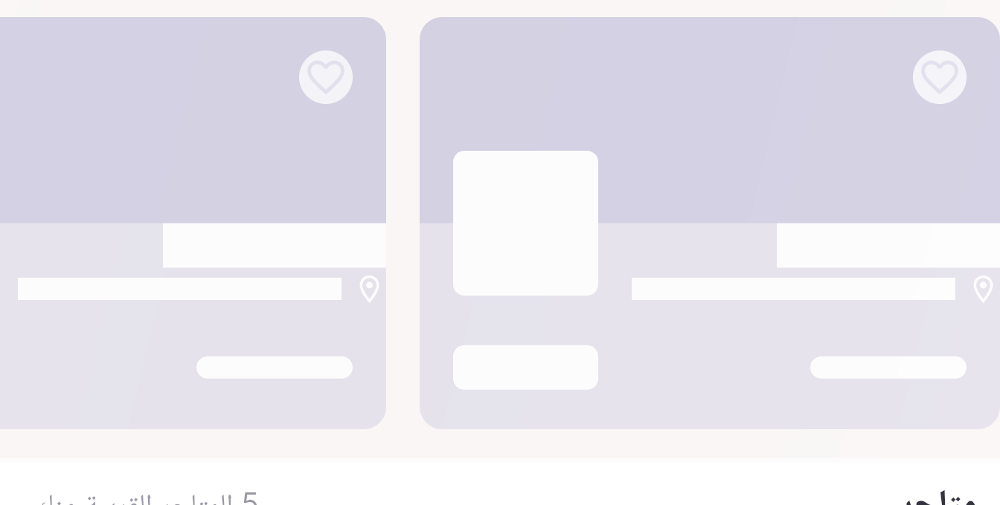
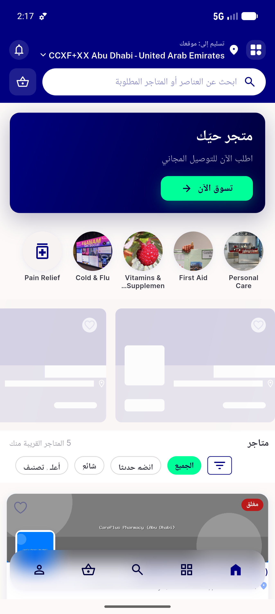

# QA Evidence — NEARS-672

**PASS — NewOnShimmerView RTL mirror verified (widget test 3/3 + live RTL store-list shimmer avatar on start/right edge); analyze 0 new**

**4 screenshot(s).** Click any thumbnail for full resolution.

<table>
<tr>
<td align="center" width="33%"> ac1 newonshimmer rtl fullframe</td>
<td align="center" width="33%"> ac1 newonshimmer rtl mirrored</td>
<td align="center" width="33%"> followup webnewonshimmer rtl avatar left</td>
</tr>
<tr>
<td align="center" width="33%"> followup webnewonshimmer rtl fullframe</td>
</tr>
</table>

### Other artifacts
- [`progress.md`](progress.md)
- [`widget-test-output.log`](widget-test-output.log)

---
*From `nears/docs/qa-evidence/NEARS-672/` · public-repo scrub policy (no live secrets; verified clean).*
