# QA Evidence — NEARS-673

**PASS — clear-on-logout PII sweep verified on emulator-5556; A->B account switch, zero A residue; 15/15 unit tests**

**18 screenshot(s).** Click any thumbnail for full resolution.

<table>
<tr>
<td align="center" width="33%"><a href="AC1-userA-checkout.png">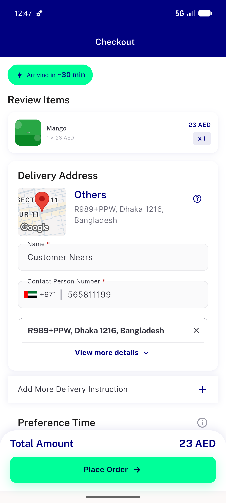</a> AC1 userA checkout</td>
<td align="center" width="33%"><a href="AC2-userA-addresses.png">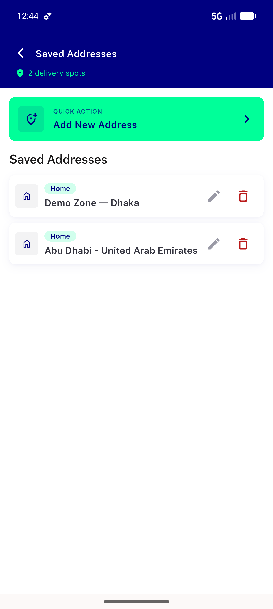</a> AC2 userA addresses</td>
<td align="center" width="33%"><a href="AC2-userB-addresses-only-B.png">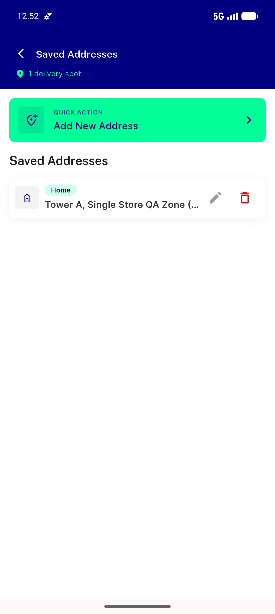</a> AC2 userB addresses only B</td>
</tr>
<tr>
<td align="center" width="33%"><a href="AC3-userB-wallet-fresh.png">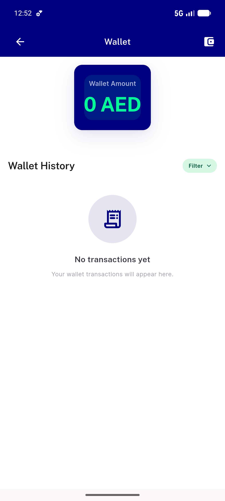</a> AC3 userB wallet fresh</td>
<td align="center" width="33%"><a href="AC3-wallet-fresh.png">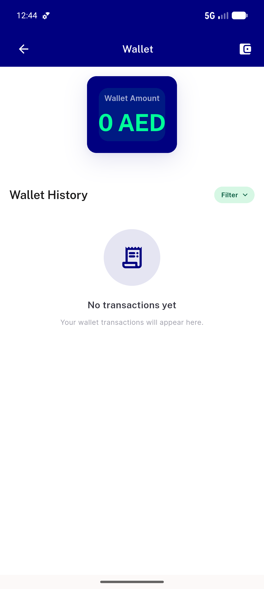</a> AC3 wallet fresh</td>
<td align="center" width="33%"><a href="AC4-baseline-signin-fresh.png">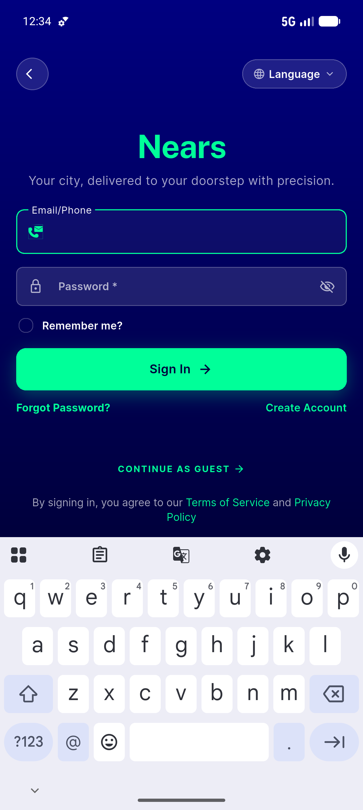</a> AC4 baseline signin fresh</td>
</tr>
<tr>
<td align="center" width="33%"><a href="AC4-signin-empty-after-logout.png">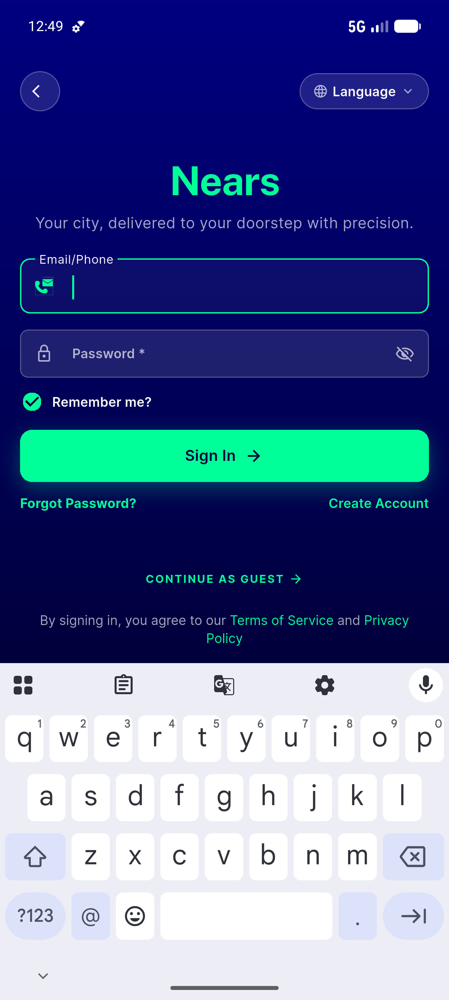</a> AC4 signin empty after logout</td>
<td align="center" width="33%"><a href="AC5-userA-map-picker.png">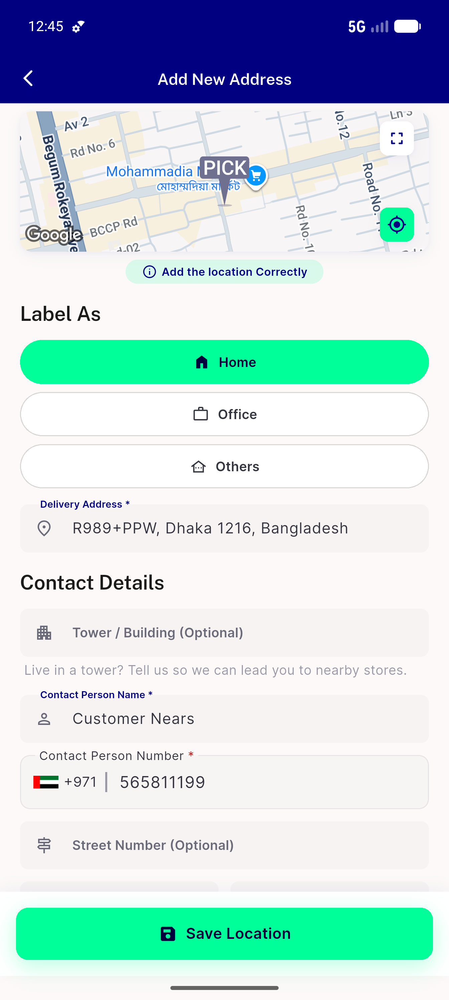</a> AC5 userA map picker</td>
<td align="center" width="33%"><a href="REG-guest-after-logout-registration-renders.png">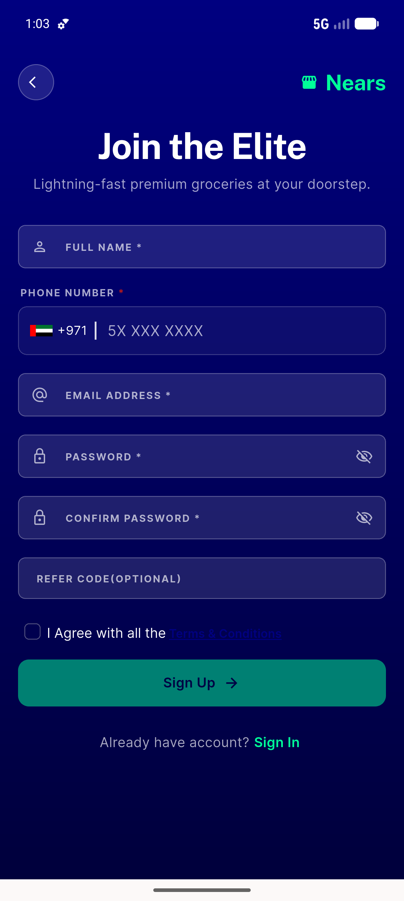</a> REG guest after logout registration renders</td>
</tr>
<tr>
<td align="center" width="33%"> REG userA relogin data restored</td>
<td align="center" width="33%"><a href="SEC1-userA-order160-detail-PII.png">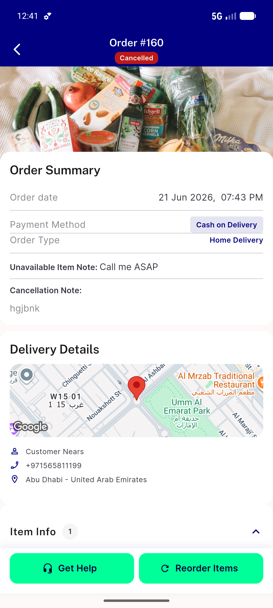</a> SEC1 userA order160 detail PII</td>
<td align="center" width="33%"><a href="SEC1-userA-orders.png">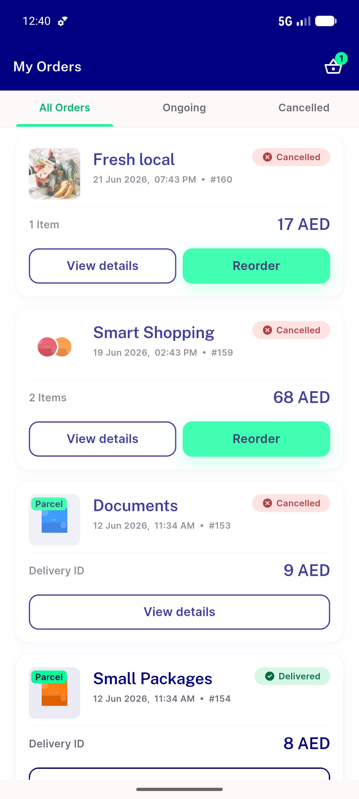</a> SEC1 userA orders</td>
</tr>
<tr>
<td align="center" width="33%"><a href="SEC1-userB-orders-empty.png">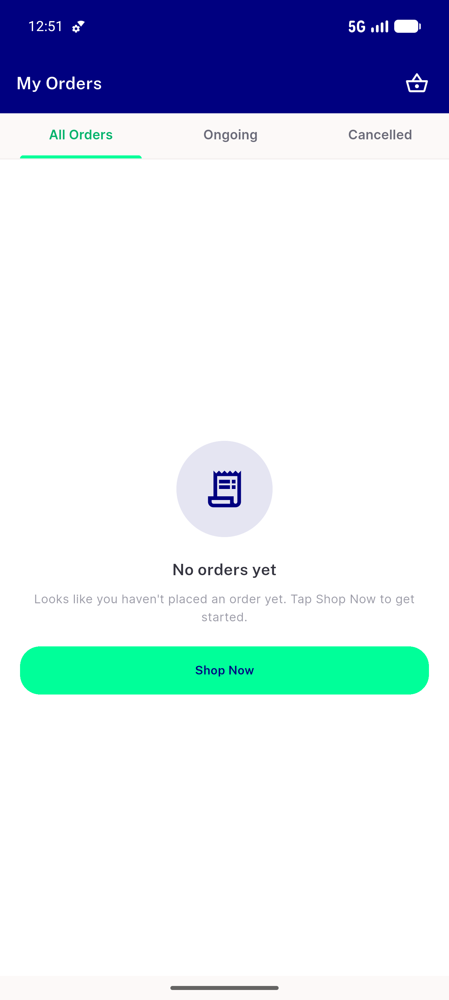</a> SEC1 userB orders empty</td>
<td align="center" width="33%"><a href="SEC2-userB-profile-no-A-identity.png">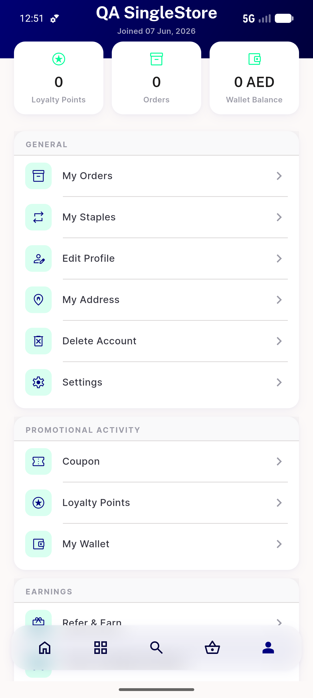</a> SEC2 userB profile no A identity</td>
<td align="center" width="33%"><a href="SEC3-userA-search-history-suggestions.png">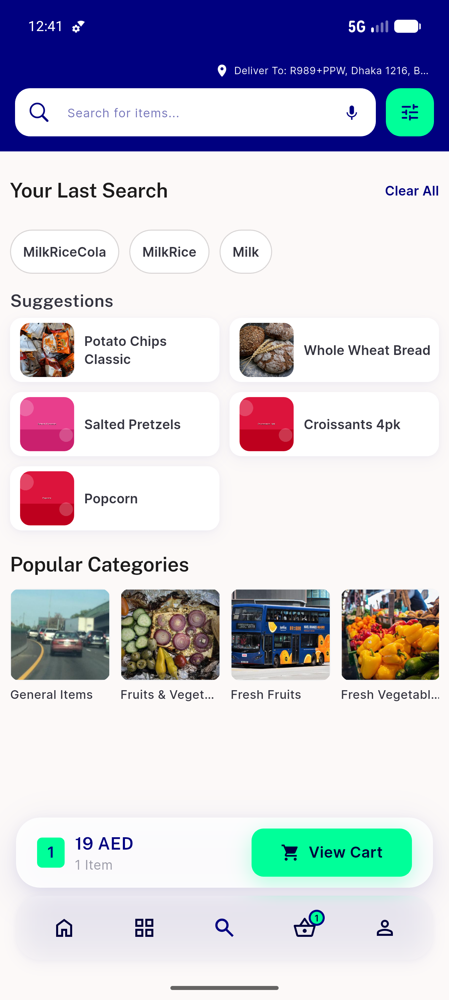</a> SEC3 userA search history suggestions</td>
</tr>
<tr>
<td align="center" width="33%"><a href="SEC3-userB-search-no-history.png">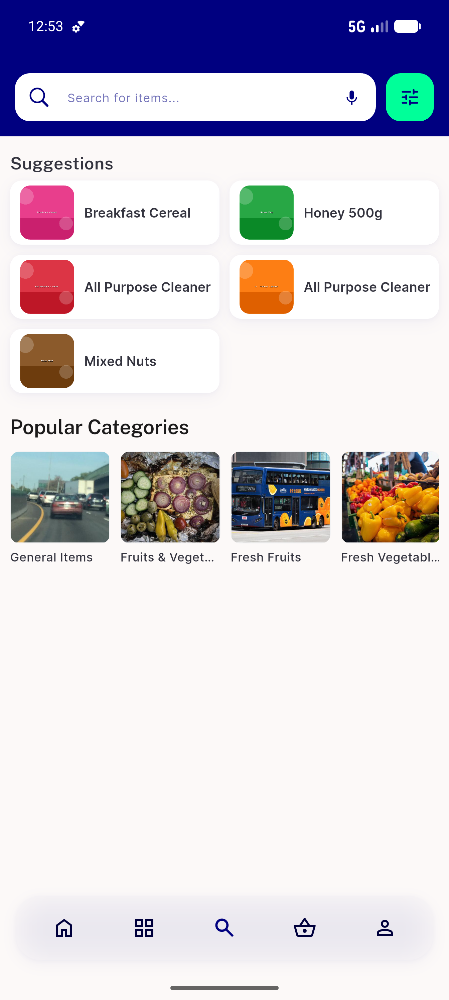</a> SEC3 userB search no history</td>
<td align="center" width="33%"><a href="userA-loggedin-home.png">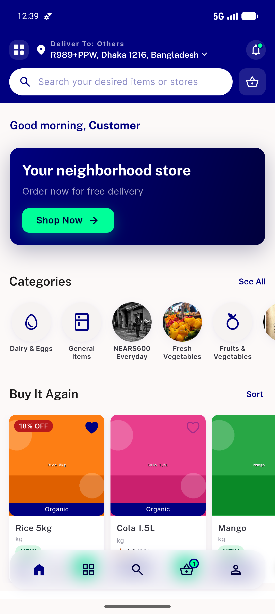</a> userA loggedin home</td>
<td align="center" width="33%"><a href="userA-profile-menu.png">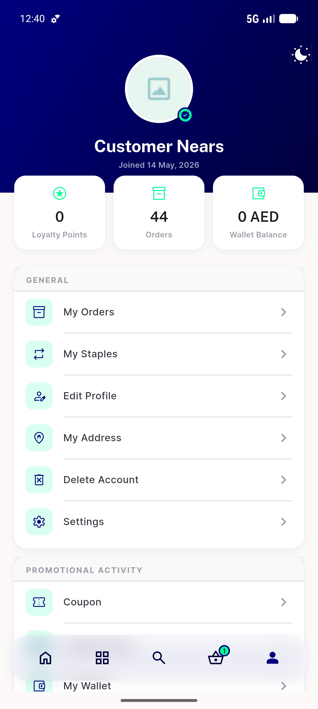</a> userA profile menu</td>
</tr>
</table>

### Other artifacts
- [`AC3-4-5-SEC3-prefs-cleared-after-logout.log`](AC3-4-5-SEC3-prefs-cleared-after-logout.log)
- [`progress.md`](progress.md)

---
*From `nears/docs/qa-evidence/NEARS-673/` · public-repo scrub policy (no live secrets; verified clean).*
