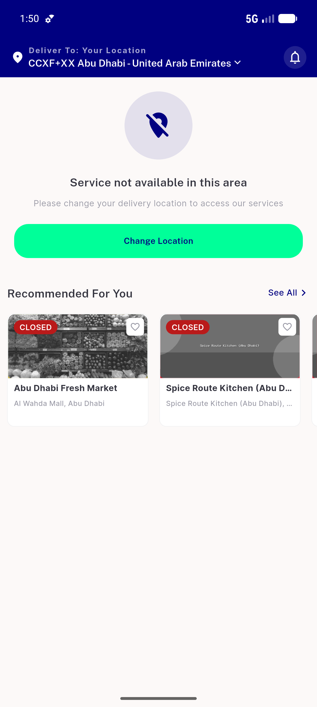
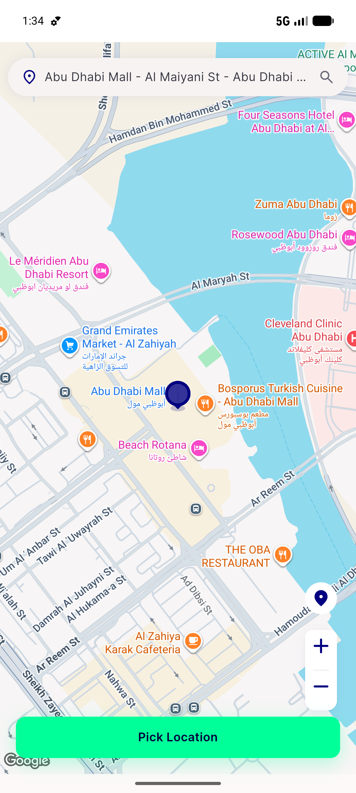
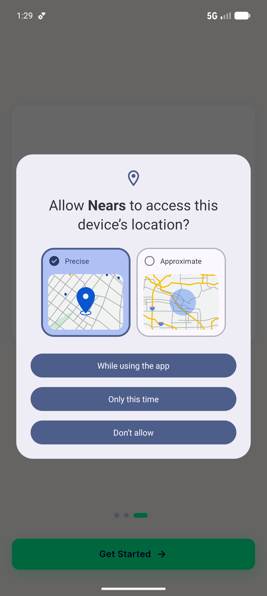

# QA Evidence — NEARS-674

**PASS — get-zone empty-coords -> [INFO], real-coords/transport failure -> [FAIL] (emulator-5554, light)**

**5 screenshot(s).** Click any thumbnail for full resolution.

<table>
<tr>
<td align="center" width="33%"> ac1 emptycoords info</td>
<td align="center" width="33%"> ac5 home loaded loggedin</td>
<td align="center" width="33%"> ac5 pickmap inzone abudhabi</td>
</tr>
<tr>
<td align="center" width="33%"> probe after onboarding</td>
<td align="center" width="33%"> regression store profile clean</td>
</tr>
</table>

### Other artifacts
- [`ac1-emptycoords-info.log`](ac1-emptycoords-info.log)
- [`ac3-realcoords-fail-still-fires.log`](ac3-realcoords-fail-still-fires.log)
- [`progress.md`](progress.md)

---
*From `nears/docs/qa-evidence/NEARS-674/` · public-repo scrub policy (no live secrets; verified clean).*
