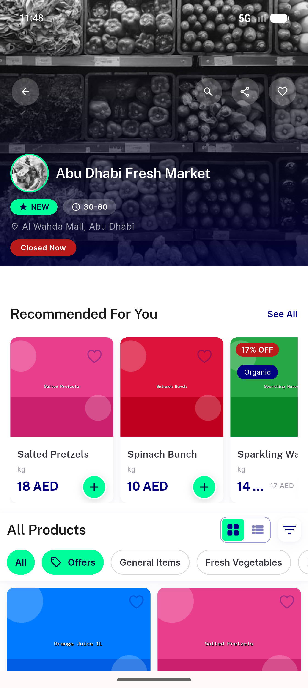
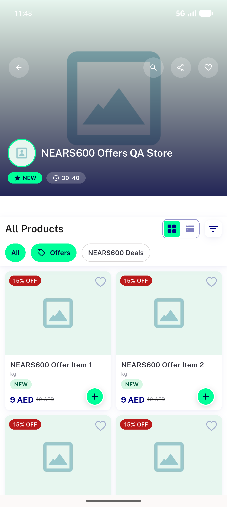
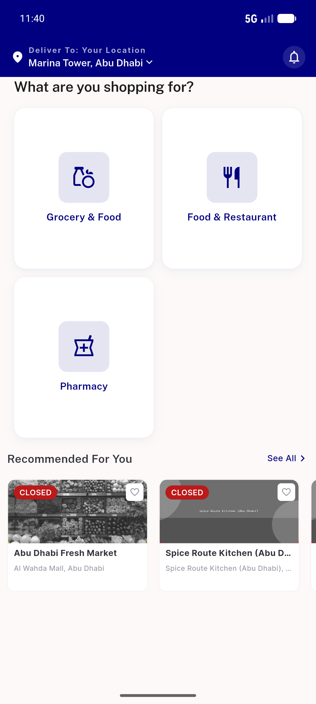
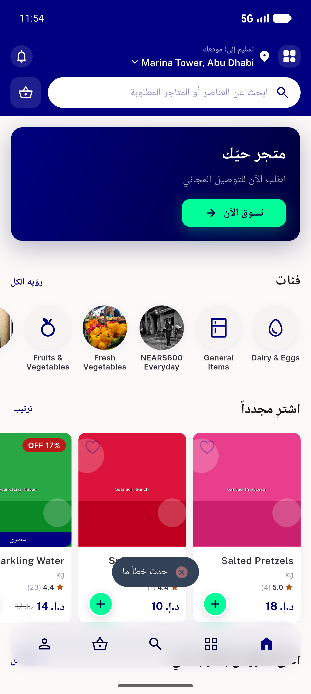
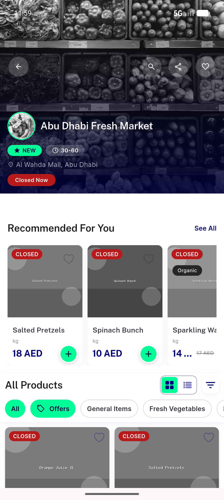

# QA Evidence — NEARS-680

**PASS — deep-link store FormatException fixed; crash repro + malformed fallback + in-app regression all clean (emulator-5554, com.izzes.nears, feat/NEARS-680-deeplink-store-id @29edab92)**

**6 screenshot(s).** Click any thumbnail for full resolution.

<table>
<tr>
<td align="center" width="33%"> ac1a store id8 opened</td>
<td align="center" width="33%"> ac1b store 4117 no crash</td>
<td align="center" width="33%"> ac2a landed home en</td>
</tr>
<tr>
<td align="center" width="33%"> ac2b no id home</td>
<td align="center" width="33%"> ac2 arabic toast rtl</td>
<td align="center" width="33%"> ac3 inapp store opened</td>
</tr>
</table>

---
*From `nears/docs/qa-evidence/NEARS-680/` · public-repo scrub policy (no live secrets; verified clean).*
