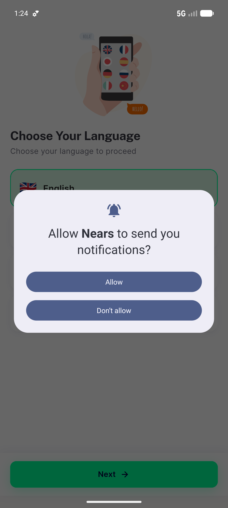

# QA Evidence — NEARS-681

**PASS — no-cache boot no WARN; cached zone_ids[2.0] double boots clean + zone restored (emulator-5554, light)**

**2 screenshot(s).** Click any thumbnail for full resolution.

<table>
<tr>
<td align="center" width="33%"> ac1 firstrun coldboot</td>
<td align="center" width="33%"> ac2 coldboot zoneids double home</td>
</tr>
</table>

### Other artifacts
- [`ac1-no-cache-boot-clean.log`](ac1-no-cache-boot-clean.log)
- [`ac2-coldboot-zoneids-double.log`](ac2-coldboot-zoneids-double.log)
- [`bug-sibling-forceunwrap-warn.log`](bug-sibling-forceunwrap-warn.log)
- [`followup-sibling-forceunwrap-warn.log`](followup-sibling-forceunwrap-warn.log)

---
*From `nears/docs/qa-evidence/NEARS-681/` · public-repo scrub policy (no live secrets; verified clean).*
