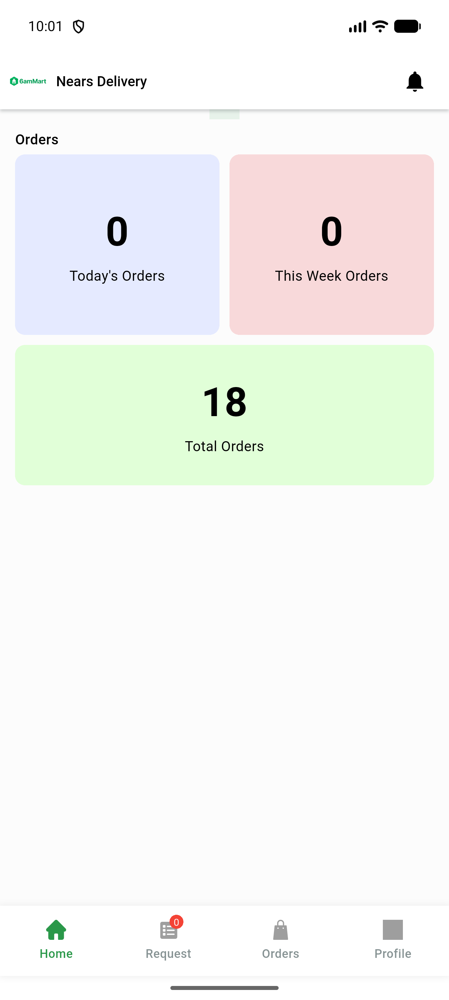

# QA Evidence — NEARS-686

**PASS — cached-location boot-log hygiene (no-cache boot warn-free; saved-address relaunch applies cached zone 400)**

**3 screenshot(s).** Click any thumbnail for full resolution.

<table>
<tr>
<td align="center" width="33%"> ac1 guest home no warn</td>
<td align="center" width="33%"> ac1 guest screen</td>
<td align="center" width="33%"> ac2 saved address home</td>
</tr>
</table>

### Other artifacts
- [`ac1-no-cache-boot.log`](ac1-no-cache-boot.log)
- [`ac2-saved-address-relaunch.log`](ac2-saved-address-relaunch.log)
- [`progress.md`](progress.md)

---
*From `nears/docs/qa-evidence/NEARS-686/` · public-repo scrub policy (no live secrets; verified clean).*
