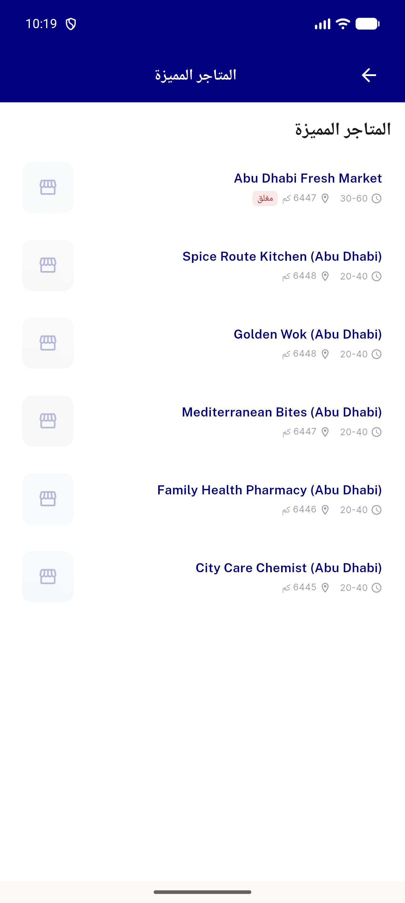
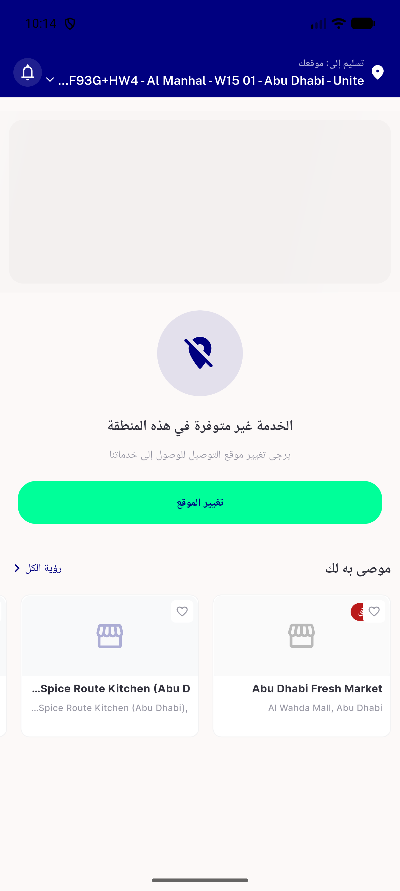
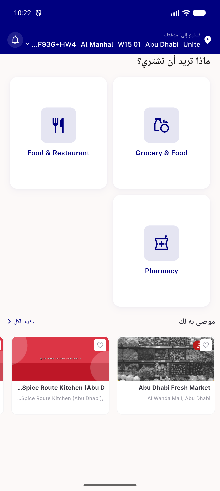

# QA Evidence — NEARS-687

**PASS — WebNewOnShimmerView RTL mirror (widget test 3/3 + live Arabic RTL home); heart untouched NEARS-672 parity**

**4 screenshot(s).** Click any thumbnail for full resolution.

<table>
<tr>
<td align="center" width="33%"> ac4 arabic rtl allstores</td>
<td align="center" width="33%"> ac4 arabic rtl home loading</td>
<td align="center" width="33%"> ac4 arabic rtl home</td>
</tr>
<tr>
<td align="center" width="33%"> ac4 english ltr home reference</td>
</tr>
</table>

### Other artifacts
- [`ac4-rtl-widget-test.log`](ac4-rtl-widget-test.log)

---
*From `nears/docs/qa-evidence/NEARS-687/` · public-repo scrub policy (no live secrets; verified clean).*
