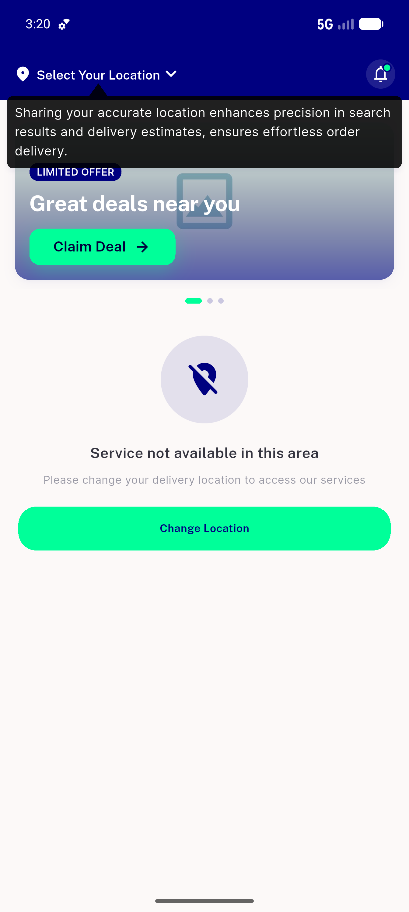

# QA Evidence — NEARS-689

**PASS (verify-only): bottom-nav a11y labels shipped (NEARS-501/587) satisfy corrected ACs — 5 tabs labelled, uifind resolves all, nav renders normal (light)**

**5 screenshot(s).** Click any thumbnail for full resolution.

<table>
<tr>
<td align="center" width="33%"> popup state</td>
<td align="center" width="33%"> home full</td>
<td align="center" width="33%"> after dismiss</td>
</tr>
<tr>
<td align="center" width="33%"> guest home</td>
<td align="center" width="33%"> bottom nav visible</td>
</tr>
</table>

### Other artifacts
- [`semantics-nav-labels.txt`](semantics-nav-labels.txt)

---
*From `nears/docs/qa-evidence/NEARS-689/` · public-repo scrub policy (no live secrets; verified clean).*
