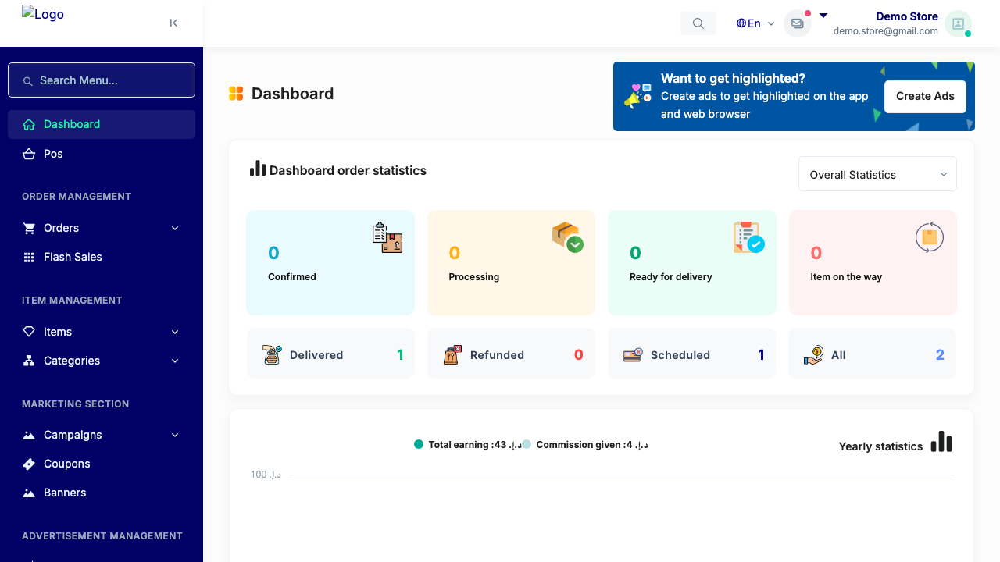
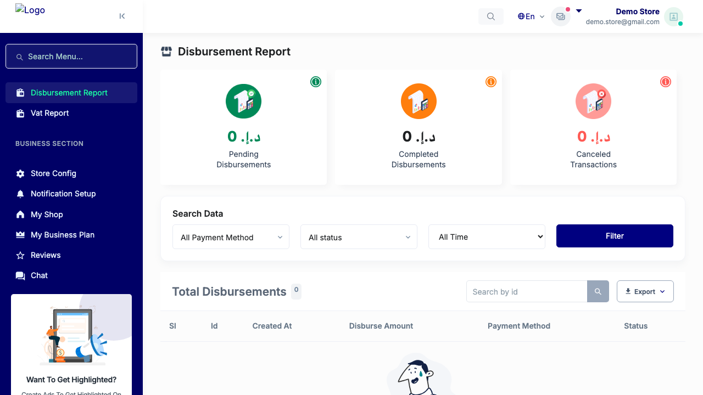
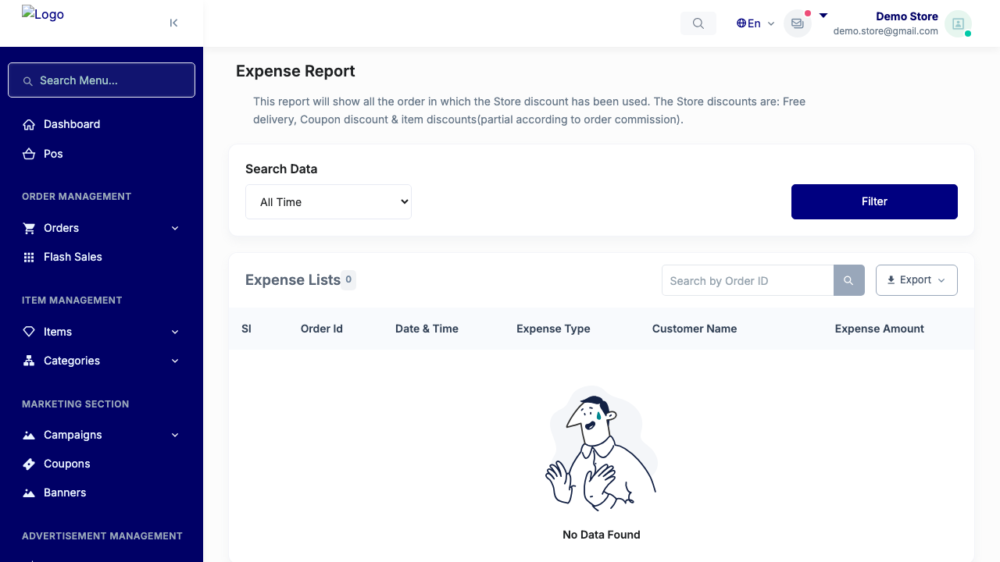
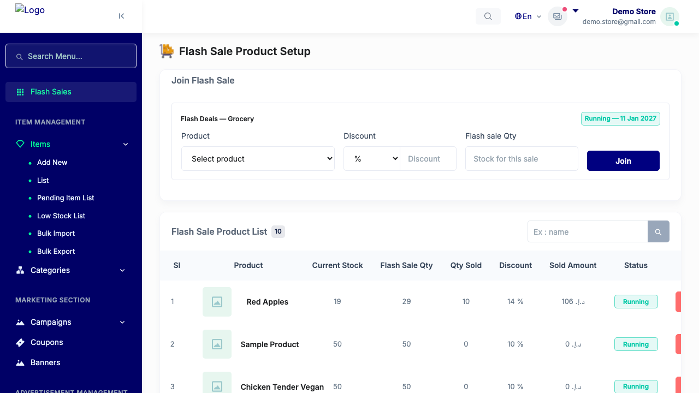
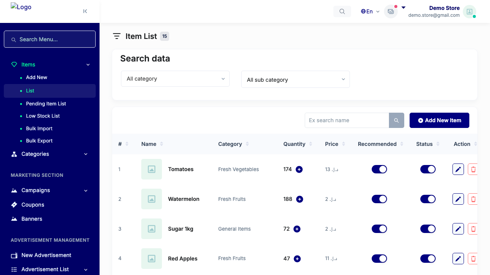
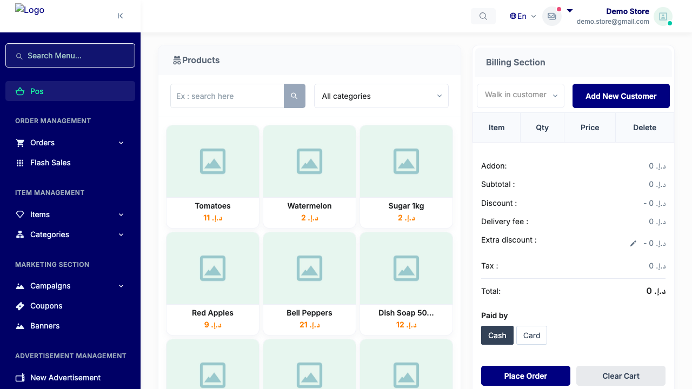
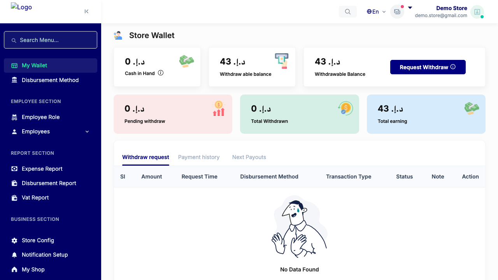

# QA Evidence — NEARS-702

**PASS — store-panel null-guard: 6 store-panel pages render 200 (incl flash-sale/active), no spurious redirect; phpunit 4/4**

**8 screenshot(s).** Click any thumbnail for full resolution.

<table>
<tr>
<td align="center" width="33%"> ac4 dashboard</td>
<td align="center" width="33%"> ac4 disbursement report</td>
<td align="center" width="33%"> ac4 expense report</td>
</tr>
<tr>
<td align="center" width="33%"> ac4 flash sale active</td>
<td align="center" width="33%"> ac4 items</td>
<td align="center" width="33%"> ac4 pos</td>
</tr>
<tr>
<td align="center" width="33%"> ac4 reports</td>
<td align="center" width="33%"> ac4 wallet</td>
</tr>
</table>

---
*From `nears/docs/qa-evidence/NEARS-702/` · public-repo scrub policy (no live secrets; verified clean).*
