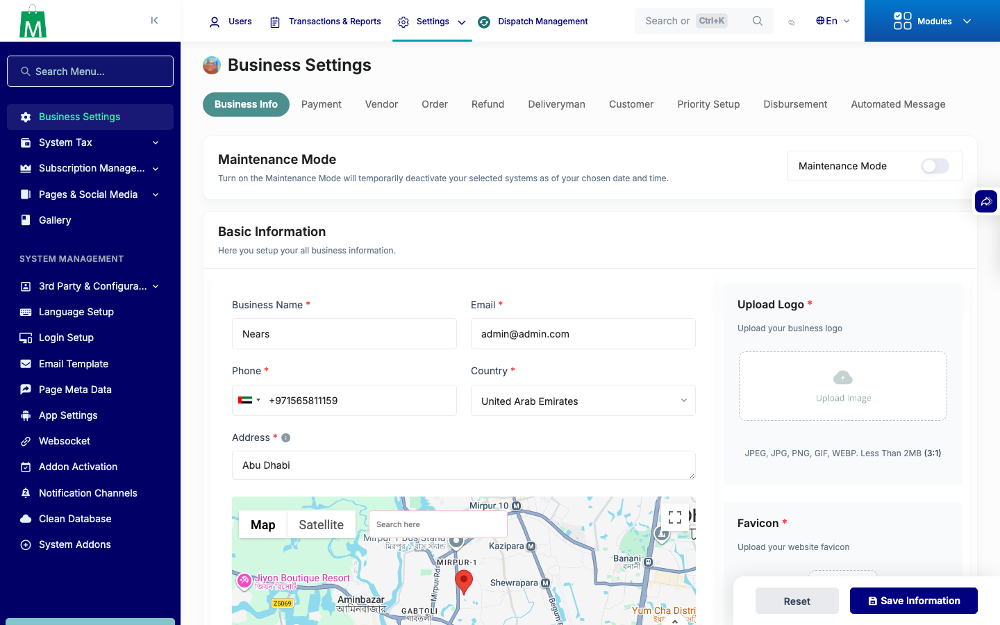
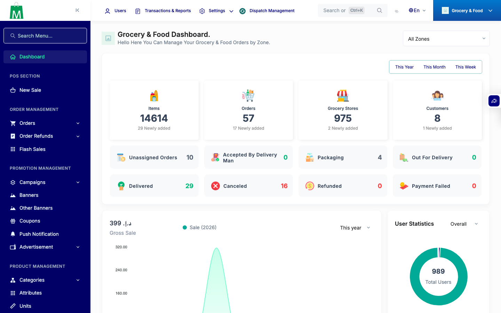
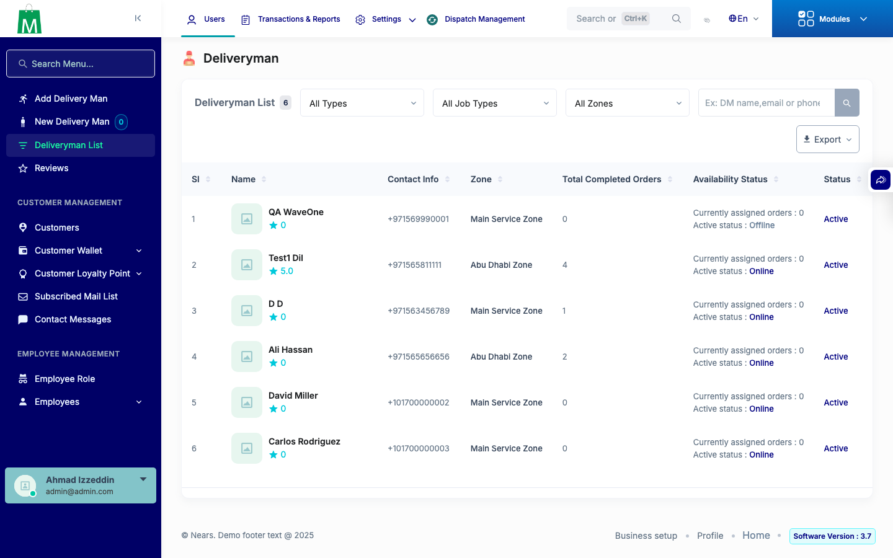
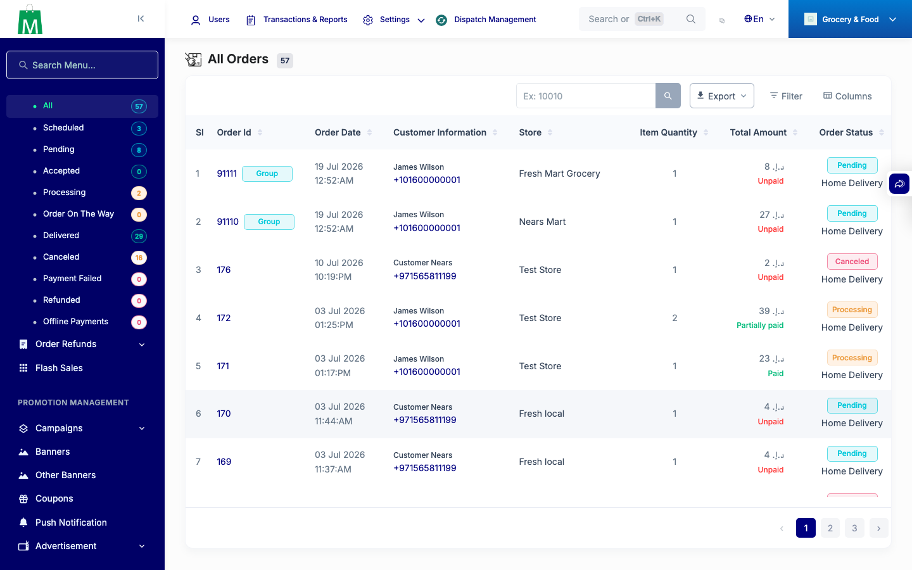
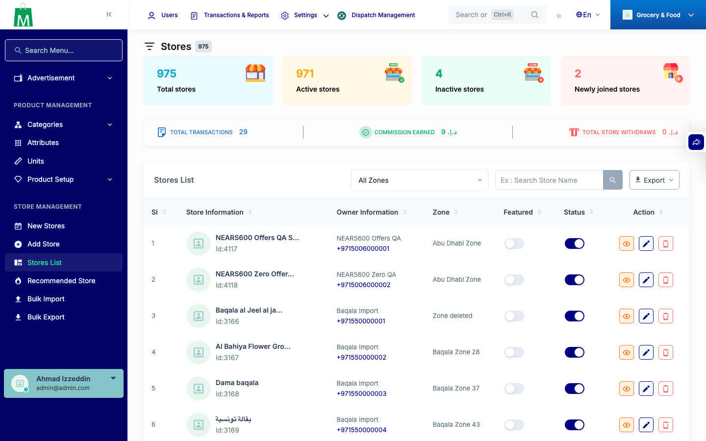

# QA Evidence — NEARS-703

**PASS — admin null-guard + dead CSS shape refs verified live on 5 pages (port 8001)**

**5 screenshot(s).** Click any thumbnail for full resolution.

<table>
<tr>
<td align="center" width="33%"> ac business setup</td>
<td align="center" width="33%"> ac dashboard</td>
<td align="center" width="33%"> ac delivery man</td>
</tr>
<tr>
<td align="center" width="33%"> ac order list</td>
<td align="center" width="33%"> ac store list</td>
</tr>
</table>

---
*From `nears/docs/qa-evidence/NEARS-703/` · public-repo scrub policy (no live secrets; verified clean).*
