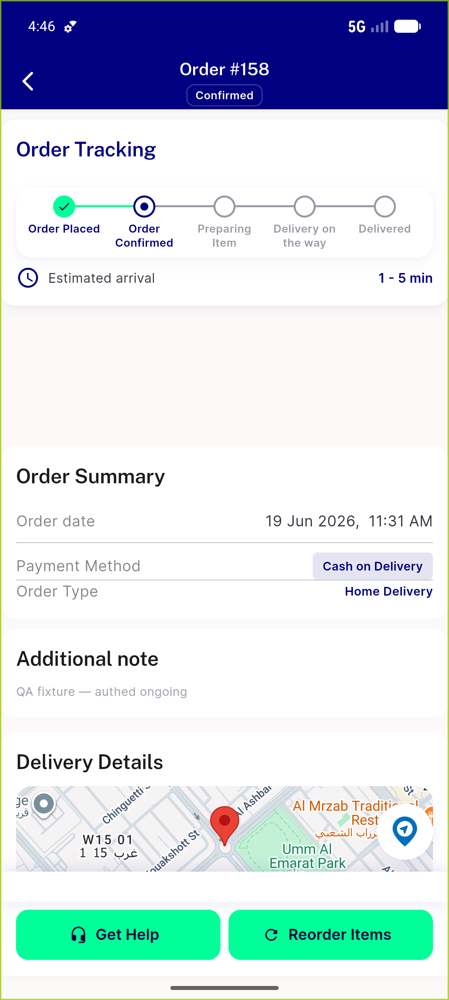
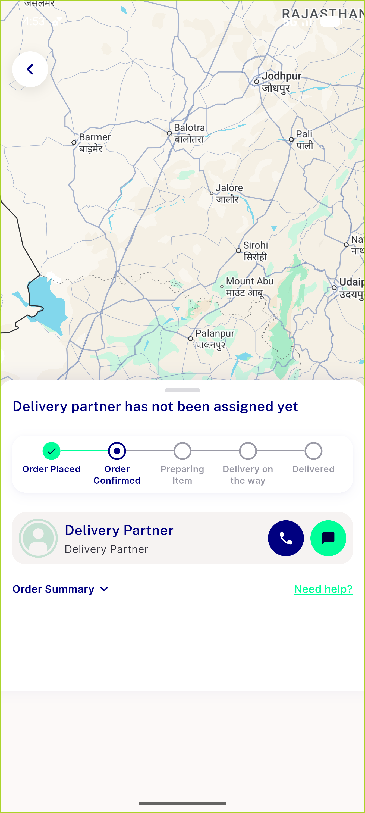

# QA Evidence — NEARS-704

**PASS — socket backoff 1/2/4/8/16/30 cap, 8-attempt ceiling + single abandon, dispose cancels Timer, PII-safe [ERR], happy-path connect clean**

**2 screenshot(s).** Click any thumbnail for full resolution.

<table>
<tr>
<td align="center" width="33%"> order details</td>
<td align="center" width="33%"> tracking screen connected</td>
</tr>
</table>

### Other artifacts
- [`AC1-AC2-AC5-backoff.log`](AC1-AC2-AC5-backoff.log)
- [`AC3-happypath.log`](AC3-happypath.log)
- [`AC4-pii-safe.log`](AC4-pii-safe.log)
- [`backoff-FINAL.txt`](backoff-FINAL.txt)
- [`dispose-regression.txt`](dispose-regression.txt)
- [`happypath.txt`](happypath.txt)
- [`regression-dispose-cancel.log`](regression-dispose-cancel.log)

---
*From `nears/docs/qa-evidence/NEARS-704/` · public-repo scrub policy (no live secrets; verified clean).*
