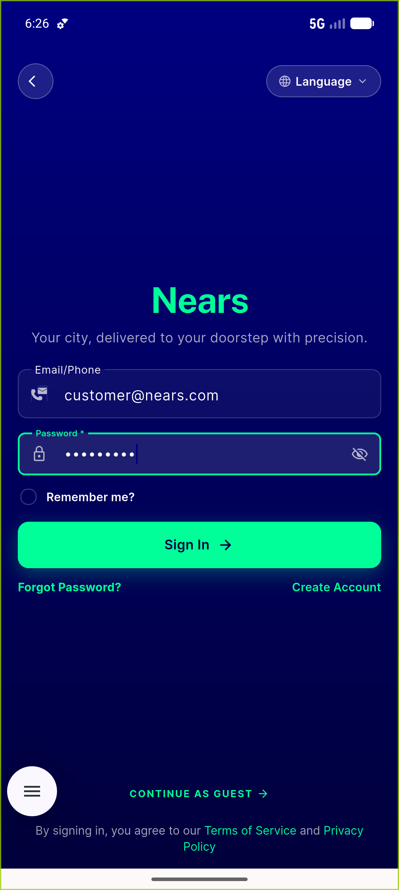
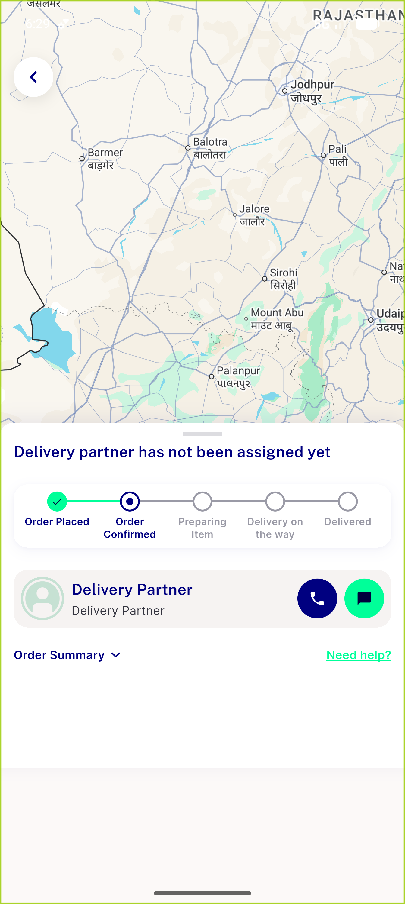
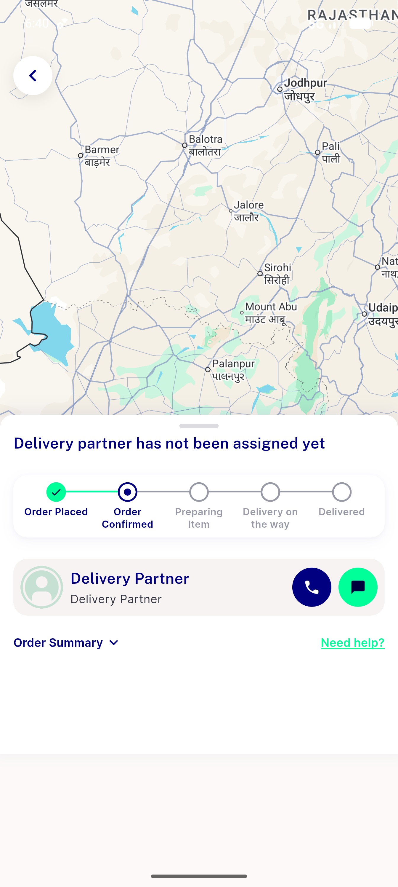
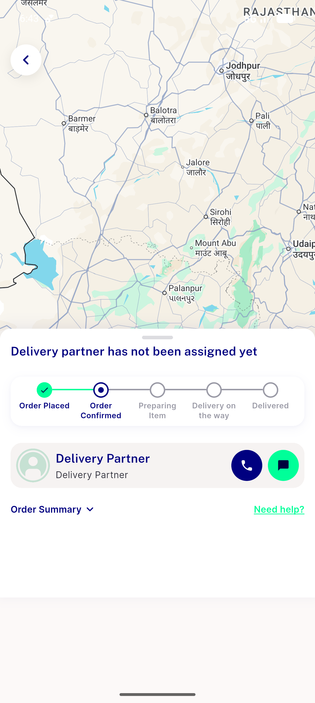

# QA Evidence — NEARS-710

**PASS - Pusher init guard: AC1 skip+poll, AC2 empty-url [FAIL] abort+poll, AC3 valid-url connect path**

**4 screenshot(s).** Click any thumbnail for full resolution.

<table>
<tr>
<td align="center" width="33%"> 00c login state</td>
<td align="center" width="33%"> tracking ac1 polling map</td>
<td align="center" width="33%"> tracking ac2 empty url</td>
</tr>
<tr>
<td align="center" width="33%"> tracking ac3 valid url</td>
</tr>
</table>

### Other artifacts
- [`ac1-pusher-skip.log`](ac1-pusher-skip.log)
- [`ac2-empty-url-abort.log`](ac2-empty-url-abort.log)
- [`ac3-valid-url-connect.log`](ac3-valid-url-connect.log)

---
*From `nears/docs/qa-evidence/NEARS-710/` · public-repo scrub policy (no live secrets; verified clean).*
