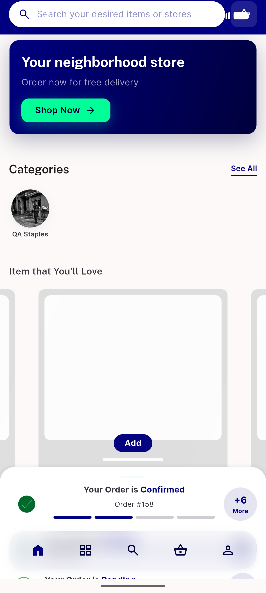
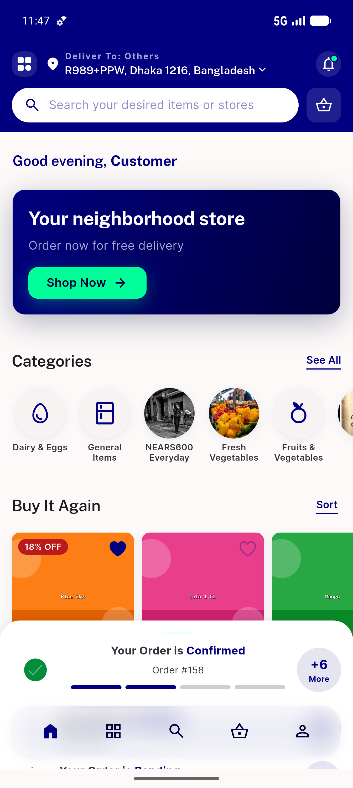
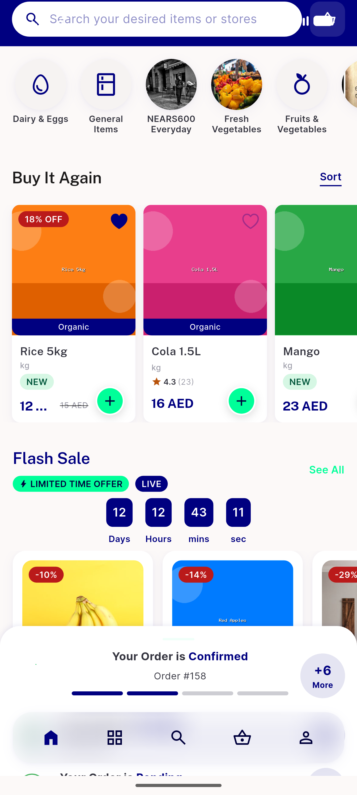
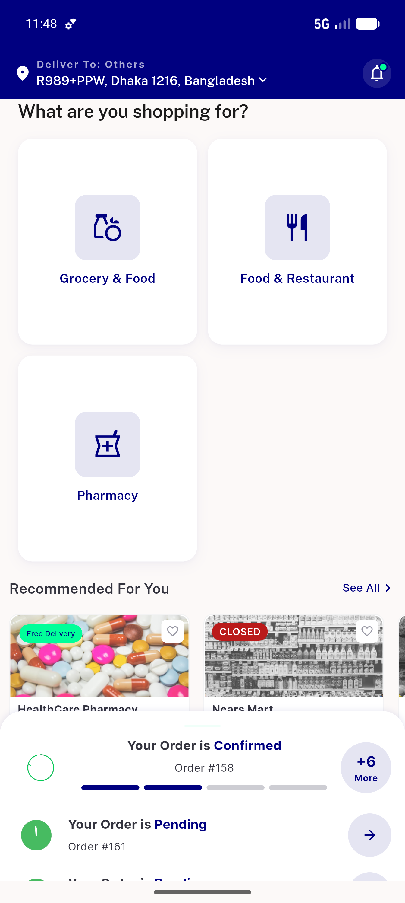
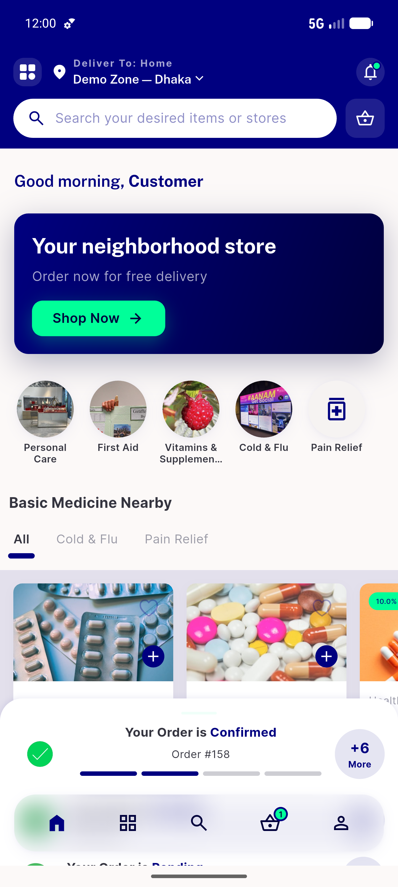
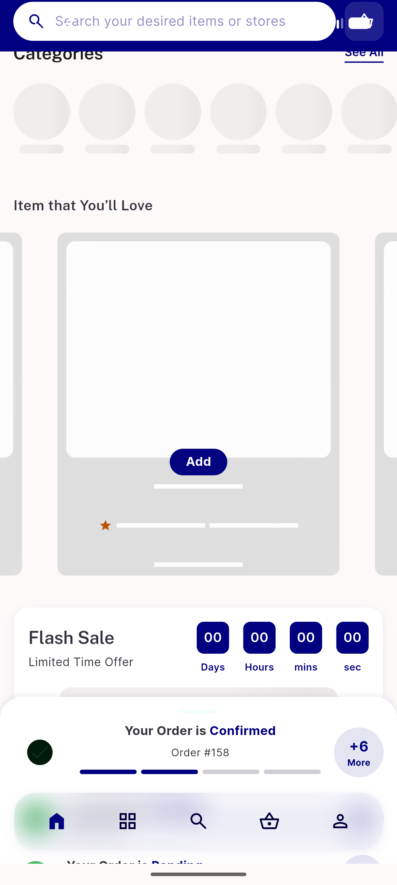

# QA Evidence — NEARS-717

**PASS — flash-sale rail self-hides on no-sale (live zone-3 grocery), with-sale renders (live zone-1), refresh completes, no TypeError; 14/14 unit**

**6 screenshot(s).** Click any thumbnail for full resolution.

<table>
<tr>
<td align="center" width="33%"> ac1 nosale rail self hidden zone3</td>
<td align="center" width="33%"> ac4 refresh completed home</td>
<td align="center" width="33%"> ac5 with sale rail renders</td>
</tr>
<tr>
<td align="center" width="33%"> dashboard sectors</td>
<td align="center" width="33%"> regression pharmacy home</td>
<td align="center" width="33%"> zone3 investigate</td>
</tr>
</table>

---
*From `nears/docs/qa-evidence/NEARS-717/` · public-repo scrub policy (no live secrets; verified clean).*
