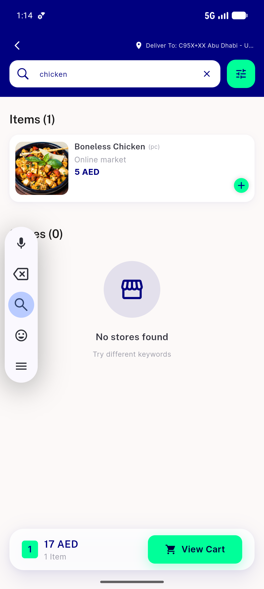
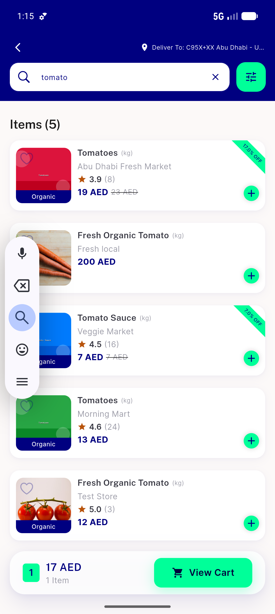
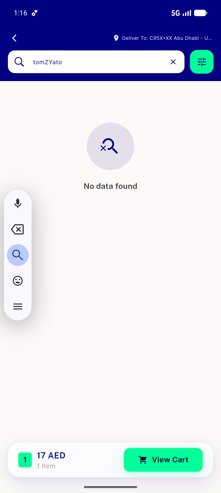
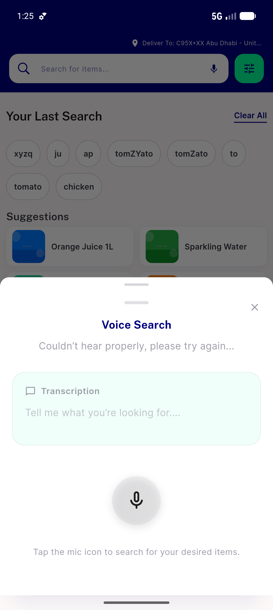
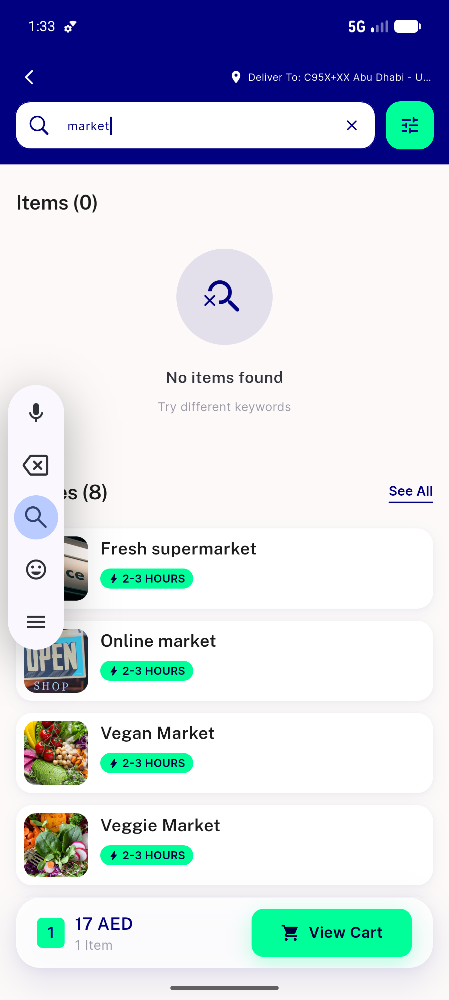
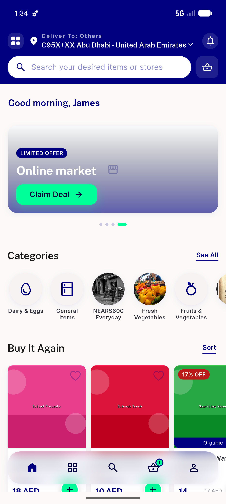
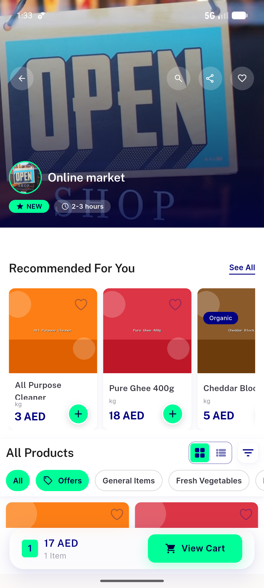

# QA Evidence — NEARS-718

**PASS — search suggestion debounce/min-char/stale-guard/cursor/voice verified live on emulator-5556 (zone 2 Abu Dhabi)**

**7 screenshot(s).** Click any thumbnail for full resolution.

<table>
<tr>
<td align="center" width="33%"> ac1 chicken results</td>
<td align="center" width="33%"> ac2 newest wins tomato</td>
<td align="center" width="33%"> ac3 cursor midstring tomZYato</td>
</tr>
<tr>
<td align="center" width="33%"> ac5 ac6 voice sheet</td>
<td align="center" width="33%"> ac7 two section market</td>
<td align="center" width="33%"> reg idle history categories</td>
</tr>
<tr>
<td align="center" width="33%"> reg store nav online market</td>
</tr>
</table>

### Other artifacts
- [`ac1-ac4-debounce-network-evidence.log`](ac1-ac4-debounce-network-evidence.log)

---
*From `nears/docs/qa-evidence/NEARS-718/` · public-repo scrub policy (no live secrets; verified clean).*
