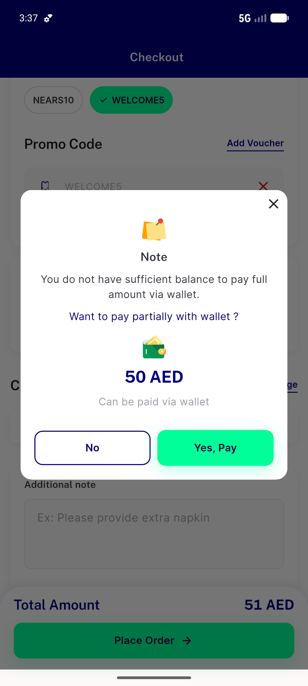
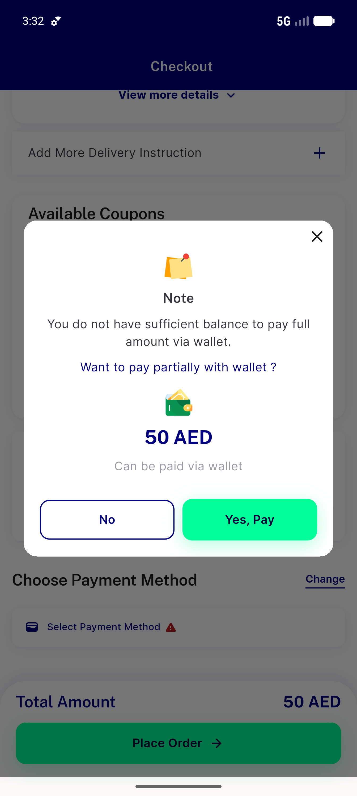
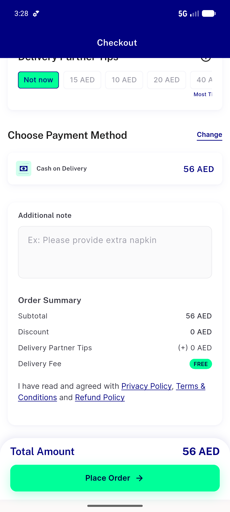

# QA Evidence — NEARS-719

**PASS — coupon wallet-split net-once (subtotal−discount once); AC1-5 live on emulator-5556, 182/182 tests green**

**5 screenshot(s).** Click any thumbnail for full resolution.

<table>
<tr>
<td align="center" width="33%"> ac1 ac4 welcome5 partial total51</td>
<td align="center" width="33%"> ac2 manual apply welcome5 total51</td>
<td align="center" width="33%"> ac3 swap nears10 total50</td>
</tr>
<tr>
<td align="center" width="33%"> ac5 toggle off total56</td>
<td align="center" width="33%"> checkout baseline subtotal56</td>
</tr>
</table>

---
*From `nears/docs/qa-evidence/NEARS-719/` · public-repo scrub policy (no live secrets; verified clean).*
