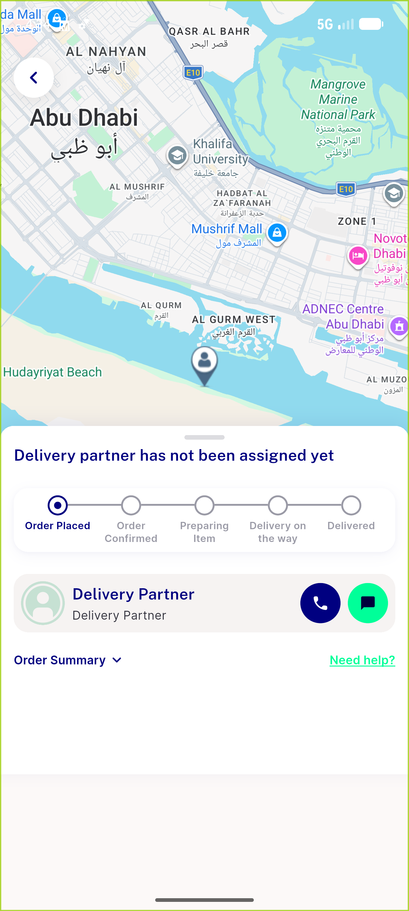
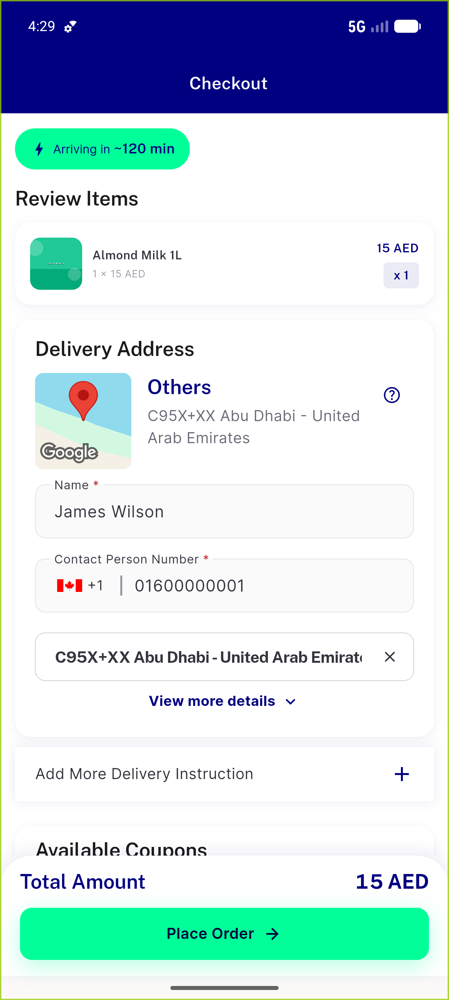
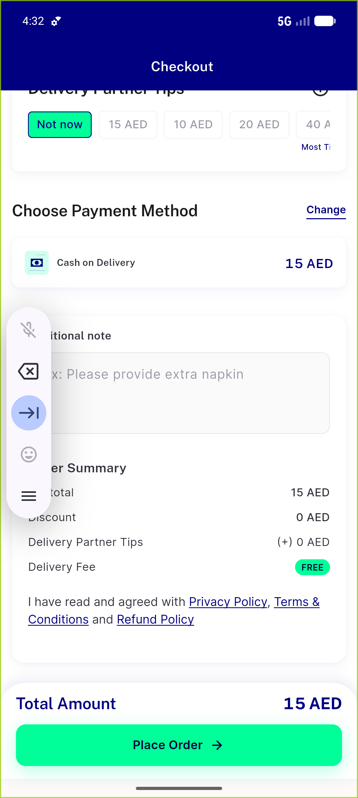

# QA Evidence — NEARS-720

**PASS — double-submit guard verified live (1 order on double-tap) + single-tap happy path + 3 guard tests green**

**4 screenshot(s).** Click any thumbnail for full resolution.

<table>
<tr>
<td align="center" width="33%"> ac1 ac2 track order 167</td>
<td align="center" width="33%"> ac1 checkout null zoneids gps address</td>
<td align="center" width="33%"> ac2 checkout cod selected</td>
</tr>
<tr>
<td align="center" width="33%"> ac2 single tap track order 168</td>
</tr>
</table>

### Other artifacts
- [`ac1-double-tap-one-order.log`](ac1-double-tap-one-order.log)
- [`ac3-validation-failure-cta-reset.log`](ac3-validation-failure-cta-reset.log)

---
*From `nears/docs/qa-evidence/NEARS-720/` · public-repo scrub policy (no live secrets; verified clean).*
