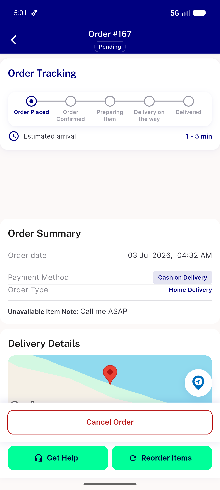
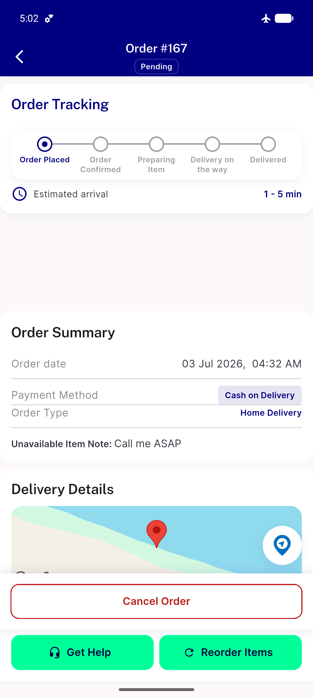
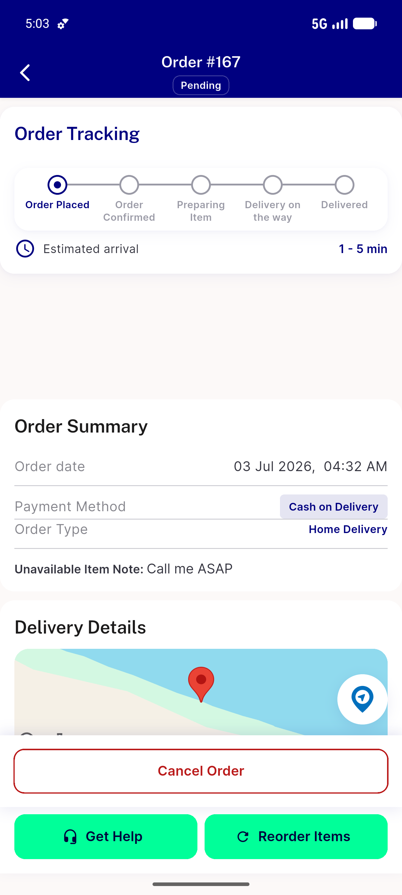
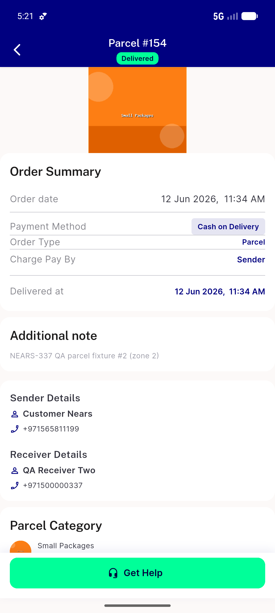

# QA Evidence — NEARS-721

**PASS — order-tracking poll survives transient failure; no Timer-zone crash, no map freeze, auto-recovers; terminal + not-found regressions intact**

**5 screenshot(s).** Click any thumbnail for full resolution.

<table>
<tr>
<td align="center" width="33%"> ac1 baseline map render</td>
<td align="center" width="33%"> ac1 outage map persists</td>
<td align="center" width="33%"> ac1 recovered after restore</td>
</tr>
<tr>
<td align="center" width="33%"> ac3 canceled terminal</td>
<td align="center" width="33%"> ac3 delivered terminal</td>
</tr>
</table>

### Other artifacts
- [`ac1-ac5-poll-crash-absence.log`](ac1-ac5-poll-crash-absence.log)
- [`ac2-genuine-404-contract.log`](ac2-genuine-404-contract.log)
- [`bug-offline-geocode-nosuchmethod.log`](bug-offline-geocode-nosuchmethod.log)
- [`progress.md`](progress.md)

---
*From `nears/docs/qa-evidence/NEARS-721/` · public-repo scrub policy (no live secrets; verified clean).*
