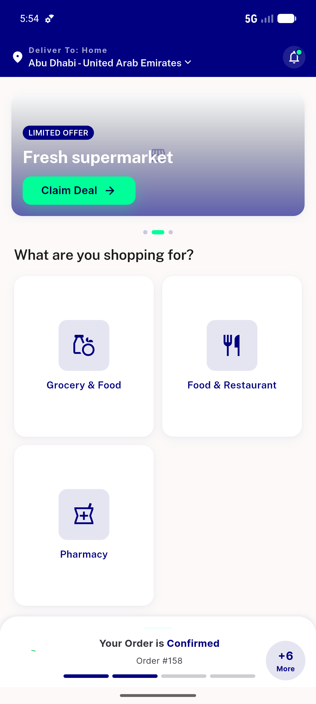
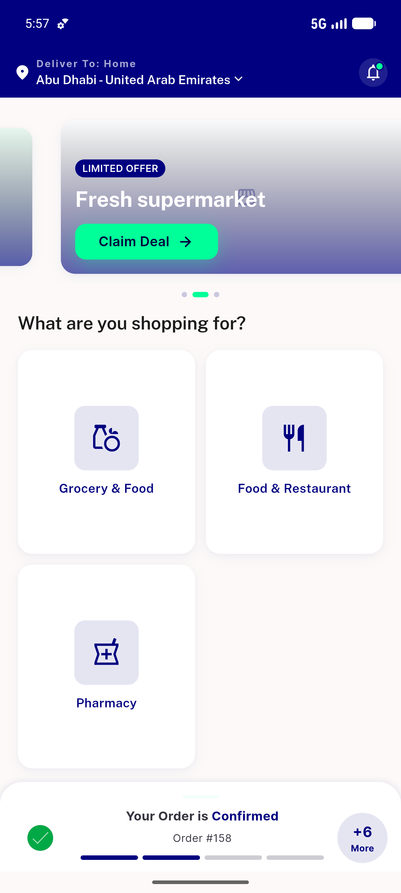

# QA Evidence — NEARS-723

**PASS (build under test fix/NEARS-723-guest-loader) — guest my-location stuck-loader fix: automated widget-tests 3/3 + full checkout 119/119 green, code-path try/finally + 4 zoneId guards verified, live getZone success/failure server conditions proven; live guest UI unreachable (guest_checkout_status=0, DoR gap, DB left read-only)**

**2 screenshot(s).** Click any thumbnail for full resolution.

<table>
<tr>
<td align="center" width="33%"> home state</td>
<td align="center" width="33%"> home newcode clean</td>
</tr>
</table>

### Other artifacts
- [`getzone-live-responses.log`](getzone-live-responses.log)
- [`progress.md`](progress.md)

---
*From `nears/docs/qa-evidence/NEARS-723/` · public-repo scrub policy (no live secrets; verified clean).*
