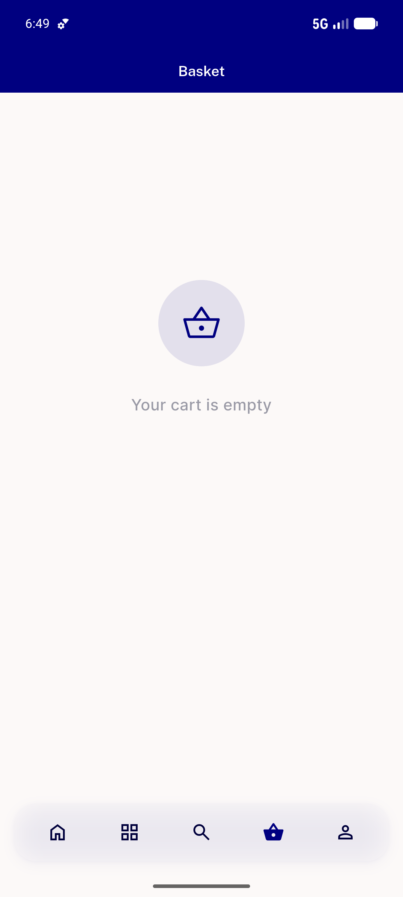
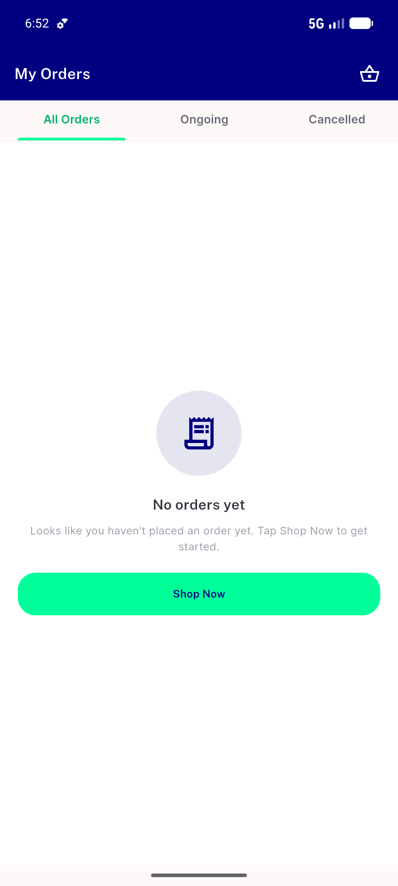

# QA Evidence — NEARS-726

**PASS — module-match RangeError guard: automated 202 green (8 new guard tests), live Basket renders clean (no RangeError), non-empty cross-zone cart un-inducible (pre-existing cart/add 403)**

**4 screenshot(s).** Click any thumbnail for full resolution.

<table>
<tr>
<td align="center" width="33%"> home zone2</td>
<td align="center" width="33%"> basket empty guest</td>
<td align="center" width="33%"> basket loggedin</td>
</tr>
<tr>
<td align="center" width="33%"> basket final smoke</td>
</tr>
</table>

### Other artifacts
- [`bug-cartadd-403-preexisting.log`](bug-cartadd-403-preexisting.log)

---
*From `nears/docs/qa-evidence/NEARS-726/` · public-repo scrub policy (no live secrets; verified clean).*
