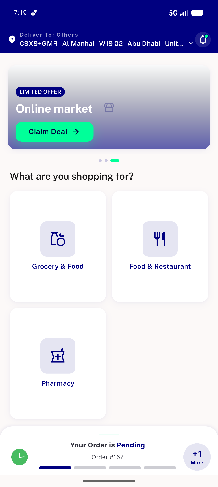

# QA Evidence — NEARS-728

**PASS — checkLocationActive() null-safe: unusable saved address no longer crashes dashboard init (light mode)**

**2 screenshot(s).** Click any thumbnail for full resolution.

<table>
<tr>
<td align="center" width="33%"> ac1 unusable address no crash</td>
<td align="center" width="33%"> ac2 usable address happy path</td>
</tr>
</table>

---
*From `nears/docs/qa-evidence/NEARS-728/` · public-repo scrub policy (no live secrets; verified clean).*
