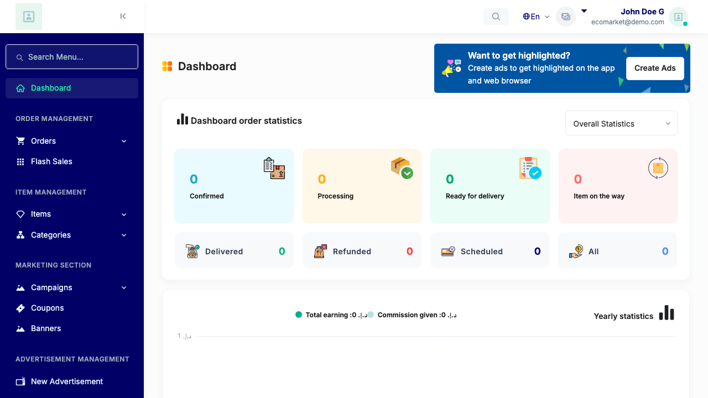
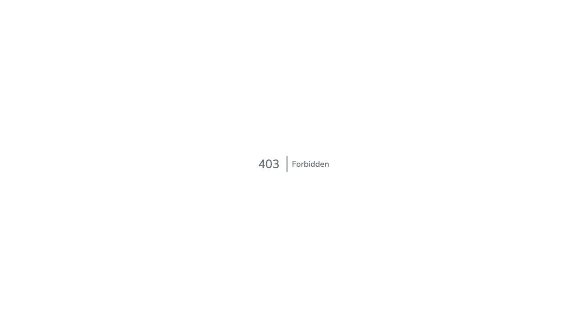
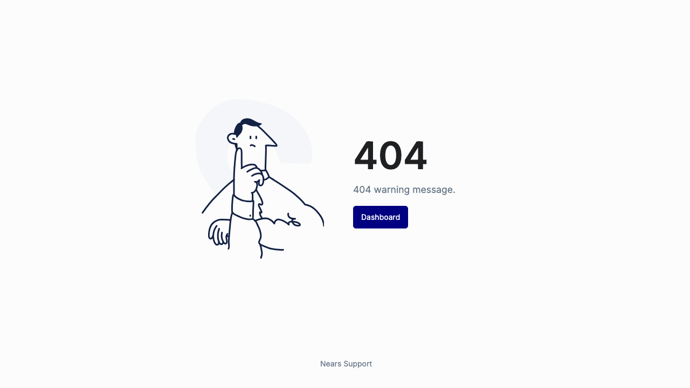
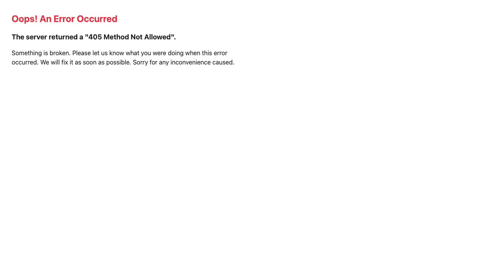
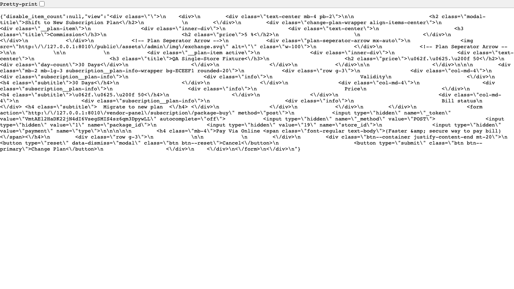
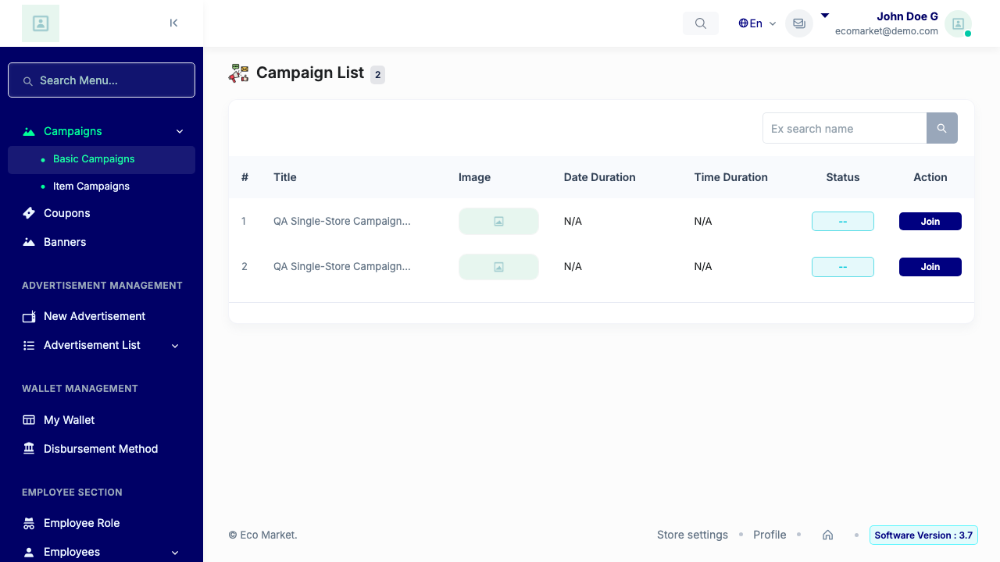

# QA Evidence — NEARS-729

**PASS — Store-Panel IDOR sweep: 7/7 cross-store attacks rejected (403/404/405/422), zero state change on victim store 21, own-store paths OK, phpunit 22/22**

**6 screenshot(s).** Click any thumbnail for full resolution.

<table>
<tr>
<td align="center" width="33%"> storeA dashboard</td>
<td align="center" width="33%"> 751 packageview cross 403</td>
<td align="center" width="33%"> 751 invoice cross 404</td>
</tr>
<tr>
<td align="center" width="33%"> 733 old get 405</td>
<td align="center" width="33%"> 751 own packageview ok</td>
<td align="center" width="33%"> 733 campaign list form</td>
</tr>
</table>

### Other artifacts
- [`progress.md`](progress.md)

---
*From `nears/docs/qa-evidence/NEARS-729/` · public-repo scrub policy (no live secrets; verified clean).*
